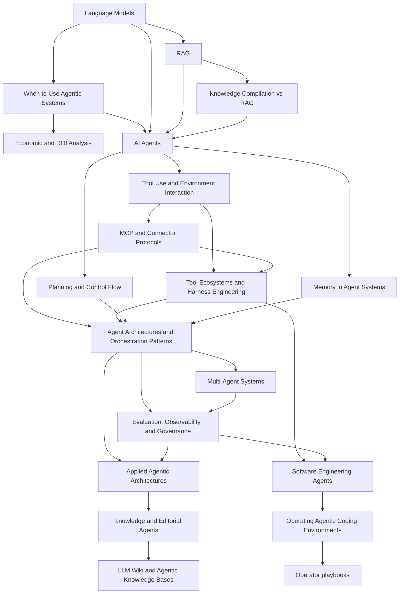

# Agentic Systems Index

This index organizes the branch around a shared core plus two specializations: `Software Engineering Agents` for coding-agent work over repos, and `Applied Agentic Architectures` for proposal, pilot, and production-target design.

> [!INFO] Start here
> Use this branch if you want to move from `Language Models`, with or without `RAG`, into systems that can plan, use tools, persist state, and act over an environment.

> [!NOTE] Part of the vault
> This is the advanced systems branch under [[Home]]. If you need more foundations first, enter through [[Machine Learning Index]] or [[Deep Learning & NLP Index]].

## Why It Matters
Agentic systems are now a practical design space, not just a research curiosity. They sit between standard software workflows and more open-ended autonomous behavior, which makes them relevant for engineering, internal education, and `Data Strategy`.

## Three Main Groups
| Group | What It Covers | Use It When |
| :--- | :--- | :--- |
| `00 Core` | shared trunk for agent concepts, tools, memory, orchestration, evaluation, and economics | you need the common language and design baseline before specializing |
| `10 Software Engineering Agents` | specialization for coding agents working over repos, terminals, CI, PRs, and review workflows | you want to design or operate agents that ship software changes safely |
| `20 Applied Agentic Architectures` | specialization for architecture proposals, pilot designs, approvals, validation, and production-target evolution | you need to map a real use case into a candidate agent system and stress-test the design |

> [!IMPORTANT] Read the branch as `core -> choose specialization`
> The branch is not meant to be read as one long line from `core` into software engineering, then operator playbooks, then applied architectures. Read the shared core first, then choose the specialization that matches the job.

## Study Map

> [!IMPORTANT] Three entry routes
> This branch is intentionally layered. Use the audience table below to pick the right starting note, then read the shared core before committing to a specialization.

## Best Route By Audience
| Audience | Start Here | Do Not Start Here If | Then Go To |
| :--- | :--- | :--- | :--- |
| `Learner` | [[020 AI Agents\|AI Agents]] for the shared core | you still need the ML or LLM prerequisites, or the problem is mainly data preparation or model selection | shared core -> one specialization -> the other only if needed |
| `Builder` | [[020 AI Agents\|AI Agents]] for the shared core, then [[010 Software Engineering Agents\|Software Engineering Agents]] or [[010 Applied Agentic Architectures\|Applied Agentic Architectures]] | the real problem is still data readiness, baseline modeling, or a plain LLM or `RAG` app with no tool or control-flow complexity | shared core -> software-engineering specialization or applied-architectures specialization |
| `Data Strategy` | [[010 When to Use Agentic Systems\|When to Use Agentic Systems]] -> [[015 Economic and ROI Analysis for Agentic Systems\|Economic and ROI Analysis for Agentic Systems]] | the organization still needs to settle data readiness, baseline model viability, or whether a simpler workflow is good enough | shared architecture basics -> governance -> [[010 Applied Agentic Architectures\|Applied Agentic Architectures]] |

> [!TIP] Compiled knowledge workspace
> Use [[80 Knowledge Ops/20 Domain Workspaces/05 Agentic Systems/010 Agentic Systems Knowledge Workspace|Agentic Systems Knowledge Workspace]] when you want to ingest new sources, capture draft syntheses, run promotion queues, or maintain the branch as a compounding knowledge base without treating the operational layer as a fourth specialization.

## Prerequisites
> [!TIP] Main prerequisite
> [[Language Models]] is the main prerequisite for this branch. [[RAG (Retrieval Augmented Generation)]] is useful context, but not a hard requirement for a first-pass reading of the agent notes.

## Suggested Learning Paths
### Shared Core First
1. [[020 AI Agents|AI Agents]]
2. [[025 Knowledge Compilation vs RAG|Knowledge Compilation vs RAG]]
3. [[015 Economic and ROI Analysis for Agentic Systems|Economic and ROI Analysis for Agentic Systems]]
4. [[030 Tool Use and Environment Interaction|Tool Use and Environment Interaction]]
5. [[040 MCP and Connector Protocols|MCP and Connector Protocols]]
6. [[050 Tool Ecosystems and Harness Engineering|Tool Ecosystems and Harness Engineering]]
7. [[060 Planning and Control Flow in Agent Systems|Planning and Control Flow in Agent Systems]]
8. [[070 Memory in Agent Systems|Memory in Agent Systems]]
9. [[080 Agent Architectures and Orchestration Patterns|Agent Architectures and Orchestration Patterns]]
10. [[090 Multi-Agent Systems|Multi-Agent Systems]]
11. [[100 Evaluation, Observability, and Governance for Agent Systems|Evaluation, Observability, and Governance for Agent Systems]]

### Then Choose One Specialization
| Reader | Best Specialization | Start Here |
| :--- | :--- | :--- |
| `Data Strategy` | `20 Applied Agentic Architectures` | [[010 When to Use Agentic Systems\|When to Use Agentic Systems]] -> [[015 Economic and ROI Analysis for Agentic Systems\|Economic and ROI Analysis for Agentic Systems]] -> [[010 Applied Agentic Architectures\|Applied Agentic Architectures]] |
| Builders working in repos | `10 Software Engineering Agents` | [[010 Software Engineering Agents\|Software Engineering Agents]] |
| Builders shaping proposals or pilots | `20 Applied Agentic Architectures` | [[010 Applied Agentic Architectures\|Applied Agentic Architectures]] |
| Builders maintaining notes, wikis, or research bases | `20 Applied Agentic Architectures` | [[010 Applied Agentic Architectures\|Applied Agentic Architectures]] -> [[085 Knowledge and Editorial Agents\|Knowledge and Editorial Agents]] |
| Learners after the core | choose one specialization and finish it before the other | [[010 Software Engineering Agents\|Software Engineering Agents]] or [[010 Applied Agentic Architectures\|Applied Agentic Architectures]] |

> [!WARNING] Do not start with multi-agent by default
> The current practice literature and official engineering guidance both point in the same direction: start simple, then add planning, memory, or delegation only when the task truly needs them.

## System Shapes At A Glance
| System Shape | Control Flow | State Owner | Typical Stop Rule | Approval Boundary |
| :--- | :--- | :--- | :--- | :--- |
| Workflow | predefined application logic | application or database | fixed business rule completes | business logic or human operator |
| Bounded tool workflow | controller with limited model choice | controller plus session state | tool budget, known completion rule, or approval gate | controller or human reviewer |
| Agent | model-guided dynamic loop under guardrails | agent session state and memory | success signal, budget, timeout, or critic | policy layer plus approvals |
| Multi-agent system | orchestrator plus specialists | shared plus role-local state | supervisor, verifier, or aggregator declares completion | orchestrator, policy layer, and human review |

## Where This Leads
| Next Area | Use It When |
| :--- | :--- |
| [[010 Software Engineering Agents\|Software Engineering Agents]] | you want the coding-agent specialization for repos, CI, PRs, review loops, and operator playbooks |
| [[100 Evaluation, Observability, and Governance for Agent Systems\|Evaluation, Observability, and Governance for Agent Systems]] | you are moving from prototypes into production discipline and control |
| [[010 Applied Agentic Architectures\|Applied Agentic Architectures]] | you need deeper applied patterns for delegation, GUI agents, and proposal-to-production architecture work |
| [[010 Agentic Systems Sources and Research Log\|Agentic Systems Sources and Research Log]] | you need the current research and practice baseline before expanding the branch further |

## V1 Branch Map
### Shared Core
| Note | Role |
| :--- | :--- |
| [[010 When to Use Agentic Systems\|When to Use Agentic Systems]] | executive-first decision note |
| [[015 Economic and ROI Analysis for Agentic Systems\|Economic and ROI Analysis for Agentic Systems]] | business-case and operating-economics note |
| [[020 AI Agents\|AI Agents]] | branch foundation |
| [[025 Knowledge Compilation vs RAG\|Knowledge Compilation vs RAG]] | bridge between retrieval and durable compiled knowledge |
| [[030 Tool Use and Environment Interaction\|Tool Use and Environment Interaction]] | tool schemas, permissions, and reusable tool or app surfaces |
| [[040 MCP and Connector Protocols\|MCP and Connector Protocols]] | protocol and product-surface layer for reusable integrations |
| [[050 Tool Ecosystems and Harness Engineering\|Tool Ecosystems and Harness Engineering]] | harness layer for skills, subagents, hooks, permissions, and isolation |
| [[060 Planning and Control Flow in Agent Systems\|Planning and Control Flow in Agent Systems]] | control loops, planning, replanning |
| [[070 Memory in Agent Systems\|Memory in Agent Systems]] | state and memory layers |
| [[080 Agent Architectures and Orchestration Patterns\|Agent Architectures and Orchestration Patterns]] | design patterns |
| [[090 Multi-Agent Systems\|Multi-Agent Systems]] | delegation and coordination |
| [[100 Evaluation, Observability, and Governance for Agent Systems\|Evaluation, Observability, and Governance for Agent Systems]] | deployment discipline |

### Specialization Hubs
| Hub | Role |
| :--- | :--- |
| [[010 Software Engineering Agents\|Software Engineering Agents]] | specialization for repo, terminal, CI, PR, and validation-heavy software work |
| [[010 Applied Agentic Architectures\|Applied Agentic Architectures]] | specialization for proposal architectures, architecture probes, pilot design, and production-target framing |
| [[010 Agentic Systems Sources and Research Log\|Agentic Systems Sources and Research Log]] | research baseline and recency tracking across the whole branch |

## Software Engineering Agents Track
> [!NOTE] Track contract
> These stage tables are specialization routes on top of the shared branch core. Read the core handoff notes before treating the track as a self-contained path.

| Stage | Notes | Outcome |
| :--- | :--- | :--- |
| Core handoff | [[020 AI Agents\|AI Agents]], [[030 Tool Use and Environment Interaction\|Tool Use and Environment Interaction]], [[100 Evaluation, Observability, and Governance for Agent Systems\|Evaluation, Observability, and Governance for Agent Systems]] | shared trunk required before the specialization track |
| Apprenticeship | [[010 Software Engineering Agents\|Software Engineering Agents]], [[020 Repo Operating Model for Coding Agents\|Repo Operating Model for Coding Agents]], [[030 Approvals, Permissions, and Sandboxing for Coding Agents\|Approvals, Permissions, and Sandboxing for Coding Agents]] | operate a bounded coding agent safely in one repo |
| Advanced | [[040 CI, Pull Requests, and Human Review for Coding Agents\|CI, Pull Requests, and Human Review for Coding Agents]], [[050 Evaluating Software Engineering Agents\|Evaluating Software Engineering Agents]], [[060 Building Coding Agent Harnesses\|Building Coding Agent Harnesses]] | design and validate a coding-agent workflow for a team |
| Mastery | [[070 Long-Running and Background Coding Agents\|Long-Running and Background Coding Agents]], [[080 Operating Coding Agents in Teams\|Operating Coding Agents in Teams]], [[050 Tool Ecosystems and Harness Engineering\|Tool Ecosystems and Harness Engineering]], [[010 Applied Agentic Architectures\|Applied Agentic Architectures]], [[090 Multi-Agent Systems\|Multi-Agent Systems]] | build or govern coding-agent systems as production infrastructure |

## Software Engineering Operator Playbooks
> [!NOTE] Internal subline only
> `Operator Playbooks` is not a fourth branch category. It is an internal subline inside `Software Engineering Agents` for setting up and running real tool environments such as `Claude Code`, `Codex`, and `OpenCode`.

| Stage | Notes | Outcome |
| :--- | :--- | :--- |
| Core handoff | [[010 Software Engineering Agents\|Software Engineering Agents]], [[030 Tool Use and Environment Interaction\|Tool Use and Environment Interaction]], [[050 Tool Ecosystems and Harness Engineering\|Tool Ecosystems and Harness Engineering]], [[090 Operating Agentic Coding Environments\|Operating Agentic Coding Environments]] | understand the domain, tool surface, and operating stack before optimizing tools |
| Setup | [[120 Writing Effective CLAUDE and AGENTS Contracts\|Writing Effective CLAUDE and AGENTS Contracts]], [[100 Claude Code Setup and Repo Contracts\|Claude Code Setup and Repo Contracts]], [[110 Codex Setup and Repo Contracts\|Codex Setup and Repo Contracts]], [[115 OpenCode Setup and Repo Contracts\|OpenCode Setup and Repo Contracts]] | establish repo contracts and safe defaults across the main coding-agent surfaces |
| Workflow | [[130 Skills, Commands, and Hooks in Practice\|Skills, Commands, and Hooks in Practice]], [[135 Building Effective Skills for Claude\|Building Effective Skills for Claude]], [[140 Context Engineering and Session Hygiene for Coding Agents\|Context Engineering and Session Hygiene for Coding Agents]], [[150 Parallel Sessions, Worktrees, and Multi-Agent Workflows\|Parallel Sessions, Worktrees, and Multi-Agent Workflows]] | run one or more sessions cleanly with less context drift, stronger skills, and lower merge friction |
| Mastery | [[160 Tool Design and MCP Integration in Practice\|Tool Design and MCP Integration in Practice]], [[170 Eval Hygiene for Agentic Coding Systems\|Eval Hygiene for Agentic Coding Systems]], [[060 Building Coding Agent Harnesses\|Building Coding Agent Harnesses]], [[080 Operating Coding Agents in Teams\|Operating Coding Agents in Teams]] | treat the environment, not only the model, as engineering infrastructure |

## Applied Agentic Architectures Track
| Stage | Notes | Outcome |
| :--- | :--- | :--- |
| Core handoff | [[020 AI Agents\|AI Agents]], [[030 Tool Use and Environment Interaction\|Tool Use and Environment Interaction]], [[050 Tool Ecosystems and Harness Engineering\|Tool Ecosystems and Harness Engineering]], [[080 Agent Architectures and Orchestration Patterns\|Agent Architectures and Orchestration Patterns]], [[100 Evaluation, Observability, and Governance for Agent Systems\|Evaluation, Observability, and Governance for Agent Systems]] | shared trunk required before the specialization track |
| Apprenticeship | [[010 Applied Agentic Architectures\|Applied Agentic Architectures]], [[020 Architecture Design Methods for Agent Systems\|Architecture Design Methods for Agent Systems]], [[030 Human-in-the-Loop and Approval Flows\|Human-in-the-Loop and Approval Flows]] | design sound proposals and reject unnecessary complexity |
| Advanced | [[040 Validation and Eval Design for Agent Architectures\|Validation and Eval Design for Agent Architectures]], [[050 Proposal-to-Production for Agent Systems\|Proposal-to-Production for Agent Systems]], [[060 Orchestration Trade-offs and Pattern Selection\|Orchestration Trade-offs and Pattern Selection]], [[065 Delegation and Role Specialization\|Delegation and Role Specialization]], [[085 Knowledge and Editorial Agents\|Knowledge and Editorial Agents]], [[090 LLM Wiki and Agentic Knowledge Bases\|LLM Wiki and Agentic Knowledge Bases]] | move a design into pilot with real promotion criteria, including compiled knowledge systems when the artifact itself matters |
| Mastery | [[070 Reliability, Checkpoints, and Recovery in Agent Systems\|Reliability, Checkpoints, and Recovery in Agent Systems]], [[075 Computer Use and GUI Agents\|Computer Use and GUI Agents]], [[085 Knowledge and Editorial Agents\|Knowledge and Editorial Agents]], [[090 LLM Wiki and Agentic Knowledge Bases\|LLM Wiki and Agentic Knowledge Bases]], [[095 Editorial Review Loops for AI-Maintained Knowledge\|Editorial Review Loops for AI-Maintained Knowledge]], [[100 Applied Agentic Architecture Case Studies\|Applied Agentic Architecture Case Studies]], [[080 Agent Architectures and Orchestration Patterns\|Agent Architectures and Orchestration Patterns]], [[090 Multi-Agent Systems\|Multi-Agent Systems]], [[100 Evaluation, Observability, and Governance for Agent Systems\|Evaluation, Observability, and Governance for Agent Systems]] | review, govern, and evolve architectures in production |

## Folder Map
| Folder | Role |
| :--- | :--- |
| `05 Agentic Systems/00 Core` | shared conceptual trunk for the branch |
| `05 Agentic Systems/10 Software Engineering Agents` | software-engineering specialization hub and overview note |
| `05 Agentic Systems/10 Software Engineering Agents/10 Coding Agent Systems` | coding-agent system design, review, harness, and team-operation notes |
| `05 Agentic Systems/10 Software Engineering Agents/20 Operator Playbooks` | internal subline for setup and operating playbooks for `Claude Code`, `Codex`, and `OpenCode` |
| `05 Agentic Systems/20 Applied Agentic Architectures` | architecture-design track from proposal to production |
| `05 Agentic Systems/90 Research and Roadmap` | source log, research watchlist, and roadmap-oriented material |
| `80 Knowledge Ops/20 Domain Workspaces/05 Agentic Systems` | operational workspace for ingest, drafts, candidate syntheses, lint, and supervised promotion into canon |

## Future Roadmap
### Phase 3
- `Long-Running and Background Agents`
- `Agent Memory Architectures`
- `Benchmarks and Evaluation Design for Agents`
- `Simulation Environments for Agent Testing`
- `Failure Taxonomy for Multi-Agent Systems`

### Phase 4
- `Debate, Reflection, and Self-Critique Patterns`
- `Enterprise Governance for Agent Ecosystems`
- `Framework and Platform Landscape`

> [!TIP] How to use the roadmap
> The practical expansion set is now part of the branch. Phases 3 and 4 should only be written once the current nucleus is stable and the source log has been refreshed.

## Related Notes
- Prerequisites: [[Language Models]]
- Context: [[RAG (Retrieval Augmented Generation)]], [[Attention]]
- Related: [[Deep Learning & NLP Index]], [[Machine Learning Index]], [[010 Agentic Systems Sources and Research Log|Agentic Systems Sources and Research Log]]

## Sources
- See [[010 Agentic Systems Sources and Research Log|Agentic Systems Sources and Research Log]] for the full research baseline, including canonical papers, surveys, and current official docs.

## Last Reviewed
- 2026-04-21
