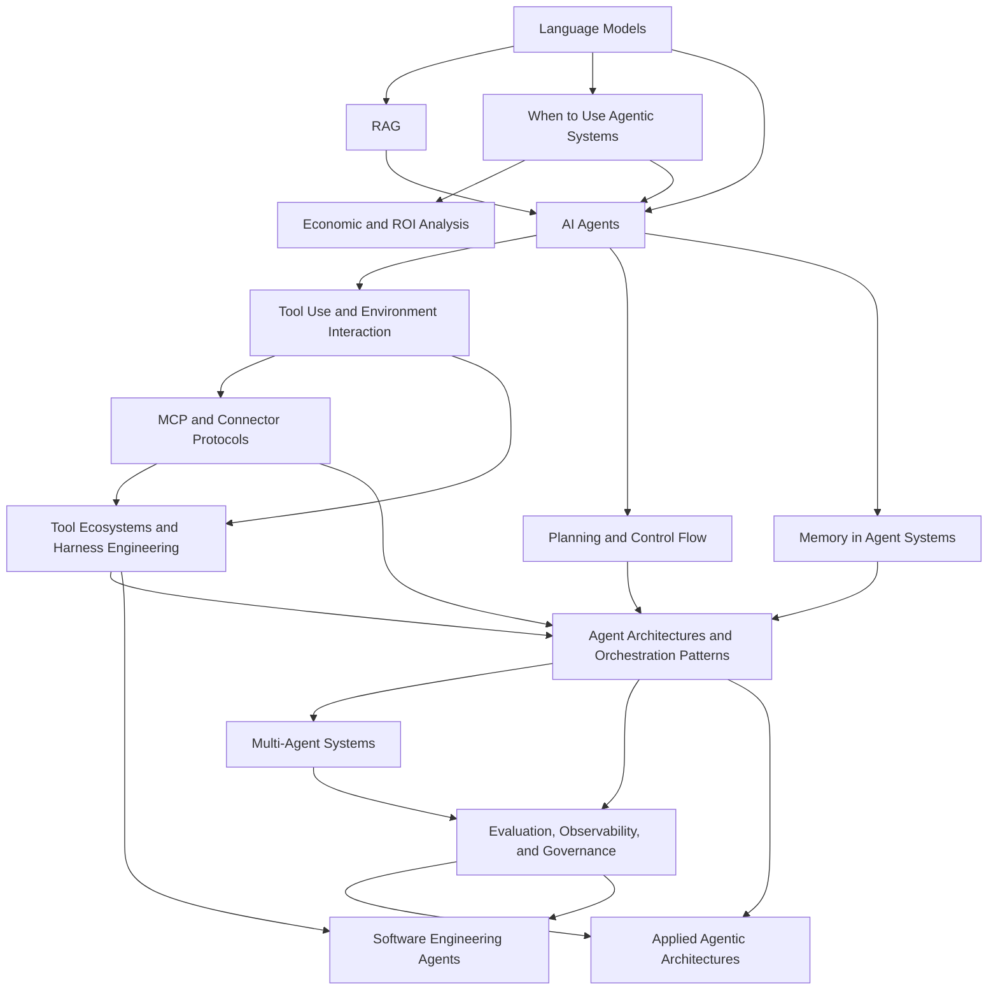

# Agentic Systems Index

This index organizes the vault branch for AI agents, agentic systems, software engineering agents, agent harness design, and applied architecture practice.

> [!INFO] Start here
> Use this branch if you want to move from `Language Models`, with or without `RAG`, into systems that can plan, use tools, persist state, and act over an environment.

> [!NOTE] Part of the vault
> This is the advanced systems branch under [[Home]]. If you need more foundations first, enter through [[Machine Learning Index]] or [[Deep Learning & NLP Index]].

## Why It Matters
Agentic systems are now a practical design space, not just a research curiosity. They sit between standard software workflows and more open-ended autonomous behavior, which makes them relevant for engineering, internal education, and `Data Strategy`.

## Study Map

> [!IMPORTANT] Three entry routes
> This branch is intentionally layered. A `Data Strategy` reader should be able to start with the decision note, a builder should be able to jump straight into architecture and evaluation, and a learner should be able to follow the full sequence.

## Recommended Routes
| Audience | Best Entry | Suggested Path |
| :--- | :--- | :--- |
| `Data Strategy` | [[When to Use Agentic Systems]] | decision -> economics -> orchestration -> governance |
| Builders / engineers | [[AI Agents]] | agents -> economics -> tools -> MCP -> harnesses -> planning -> memory -> orchestration -> evaluation |
| Learners / interns | [[AI Agents]] | agents -> economics -> tools -> MCP -> harnesses -> planning -> memory -> architectures -> multi-agent -> evaluation |

## Prerequisites
> [!TIP] Main prerequisite
> [[Language Models]] is the main prerequisite for this branch. [[RAG (Retrieval Augmented Generation)]] is useful context, but not a hard requirement for a first-pass reading of the agent notes.

## Suggested Learning Paths
### `Data Strategy`
1. [[When to Use Agentic Systems]]
2. [[Economic and ROI Analysis for Agentic Systems]]
3. [[AI Agents]]
4. [[Agent Architectures and Orchestration Patterns]]
5. [[Applied Agentic Architectures]]
6. [[Evaluation, Observability, and Governance for Agent Systems]]
7. [[Agentic Systems Sources and Research Log]]

### Builders / engineers
1. [[AI Agents]]
2. [[Economic and ROI Analysis for Agentic Systems]]
3. [[Tool Use and Environment Interaction]]
4. [[MCP and Connector Protocols]]
5. [[Tool Ecosystems and Harness Engineering]]
6. [[Planning and Control Flow in Agent Systems]]
7. [[Memory in Agent Systems]]
8. [[Agent Architectures and Orchestration Patterns]]
9. [[Multi-Agent Systems]]
10. [[Evaluation, Observability, and Governance for Agent Systems]]
11. [[Software Engineering Agents]]
12. [[Applied Agentic Architectures]]
13. [[Agentic Systems Sources and Research Log]]

### Learners / interns
1. [[AI Agents]]
2. [[Economic and ROI Analysis for Agentic Systems]]
3. [[Tool Use and Environment Interaction]]
4. [[MCP and Connector Protocols]]
5. [[Tool Ecosystems and Harness Engineering]]
6. [[Planning and Control Flow in Agent Systems]]
7. [[Memory in Agent Systems]]
8. [[Agent Architectures and Orchestration Patterns]]
9. [[Multi-Agent Systems]]
10. [[Evaluation, Observability, and Governance for Agent Systems]]
11. [[Software Engineering Agents]]
12. [[Applied Agentic Architectures]]

> [!WARNING] Do not start with multi-agent by default
> The current practice literature and official engineering guidance both point in the same direction: start simple, then add planning, memory, or delegation only when the task truly needs them.

## System Shapes At A Glance
| System Shape | Control Flow | State Owner | Typical Stop Rule | Approval Boundary |
| :--- | :--- | :--- | :--- | :--- |
| Workflow | predefined application logic | application or database | fixed business rule completes | business logic or human operator |
| Bounded tool workflow | controller with limited model choice | controller plus session state | tool budget, known completion rule, or approval gate | controller or human reviewer |
| Agent | model-guided dynamic loop under guardrails | agent session state and memory | success signal, budget, timeout, or critic | policy layer plus approvals |
| Multi-agent system | orchestrator plus specialists | shared plus role-local state | supervisor, verifier, or aggregator declares completion | orchestrator, policy layer, and human review |

## Where This Leads
| Next Area | Use It When |
| :--- | :--- |
| [[Evaluation, Observability, and Governance for Agent Systems]] | you are moving from prototypes into production discipline and control |
| [[Applied Agentic Architectures]] | you need deeper applied patterns for delegation, GUI agents, and proposal-to-production architecture work |
| [[Agentic Systems Sources and Research Log]] | you need the current research and practice baseline before expanding the branch further |

## V1 Branch Map
| Note | Role |
| :--- | :--- |
| [[When to Use Agentic Systems]] | executive-first decision note |
| [[Economic and ROI Analysis for Agentic Systems]] | business-case and operating-economics note |
| [[AI Agents]] | branch foundation |
| [[Tool Use and Environment Interaction]] | tool schemas, permissions, and reusable tool or app surfaces |
| [[MCP and Connector Protocols]] | protocol and product-surface layer for reusable integrations |
| [[Tool Ecosystems and Harness Engineering]] | harness layer for skills, subagents, hooks, permissions, and isolation |
| [[Planning and Control Flow in Agent Systems]] | control loops, planning, replanning |
| [[Memory in Agent Systems]] | state and memory layers |
| [[Multi-Agent Systems]] | delegation and coordination |
| [[Agent Architectures and Orchestration Patterns]] | design patterns |
| [[Evaluation, Observability, and Governance for Agent Systems]] | deployment discipline |
| [[Agentic Systems Sources and Research Log]] | research baseline and recency tracking |

## Applied Lines
| Note | Role |
| :--- | :--- |
| [[Software Engineering Agents]] | domain line for repo, terminal, CI, PR, and validation-heavy software work |
| [[Applied Agentic Architectures]] | line for proposal architectures, architecture probes, and pre-production design artifacts |

## Software Engineering Agents Track
> [!NOTE] Track contract
> These stage tables are specialization routes on top of the shared branch core. Read the core handoff notes before treating the track as a self-contained path.

| Stage | Notes | Outcome |
| :--- | :--- | :--- |
| Core handoff | [[AI Agents]], [[Tool Use and Environment Interaction]], [[Evaluation, Observability, and Governance for Agent Systems]] | shared trunk required before the specialization track |
| Apprenticeship | [[Software Engineering Agents]], [[Repo Operating Model for Coding Agents]], [[Approvals, Permissions, and Sandboxing for Coding Agents]] | operate a bounded coding agent safely in one repo |
| Advanced | [[CI, Pull Requests, and Human Review for Coding Agents]], [[Evaluating Software Engineering Agents]], [[Building Coding Agent Harnesses]] | design and validate a coding-agent workflow for a team |
| Mastery | [[Long-Running and Background Coding Agents]], [[Operating Coding Agents in Teams]], [[Tool Ecosystems and Harness Engineering]], [[Applied Agentic Architectures]], [[Multi-Agent Systems]] | build or govern coding-agent systems as production infrastructure |

## Applied Agentic Architectures Track
| Stage | Notes | Outcome |
| :--- | :--- | :--- |
| Core handoff | [[AI Agents]], [[Agent Architectures and Orchestration Patterns]], [[Multi-Agent Systems]] | shared trunk required before the specialization track |
| Apprenticeship | [[Applied Agentic Architectures]], [[Architecture Design Methods for Agent Systems]], [[Human-in-the-Loop and Approval Flows]] | design sound proposals and reject unnecessary complexity |
| Advanced | [[Validation and Eval Design for Agent Architectures]], [[Proposal-to-Production for Agent Systems]], [[Orchestration Trade-offs and Pattern Selection]], [[Delegation and Role Specialization]] | move a design into pilot with real promotion criteria |
| Mastery | [[Reliability, Checkpoints, and Recovery in Agent Systems]], [[Computer Use and GUI Agents]], [[Applied Agentic Architecture Case Studies]], [[Agent Architectures and Orchestration Patterns]], [[Multi-Agent Systems]], [[Evaluation, Observability, and Governance for Agent Systems]] | review, govern, and evolve architectures in production |

## Folder Map
| Folder | Role |
| :--- | :--- |
| `05 Agentic Systems/00 Core` | shared conceptual trunk for the branch |
| `05 Agentic Systems/10 Software Engineering Agents` | coding-agent track from repo workflow to team operations |
| `05 Agentic Systems/20 Applied Agentic Architectures` | architecture-design track from proposal to production |
| `05 Agentic Systems/90 Research and Roadmap` | source log, research watchlist, and roadmap-oriented material |

## Future Roadmap
### Phase 3
- `Long-Running and Background Agents`
- `Agent Memory Architectures`
- `Benchmarks and Evaluation Design for Agents`
- `Simulation Environments for Agent Testing`
- `Failure Taxonomy for Multi-Agent Systems`

### Phase 4
- `Debate, Reflection, and Self-Critique Patterns`
- `Enterprise Governance for Agent Ecosystems`
- `Framework and Platform Landscape`

> [!TIP] How to use the roadmap
> The practical expansion set is now part of the branch. Phases 3 and 4 should only be written once the current nucleus is stable and the source log has been refreshed.

## Related Notes
- Prerequisites: [[Language Models]]
- Context: [[RAG (Retrieval Augmented Generation)]], [[Attention]]
- Related: [[Deep Learning & NLP Index]], [[Machine Learning Index]], [[Agentic Systems Sources and Research Log]]

## Sources
- See [[Agentic Systems Sources and Research Log]] for the full research baseline, including canonical papers, surveys, and current official docs.

## Last Reviewed
- 2026-04-18
