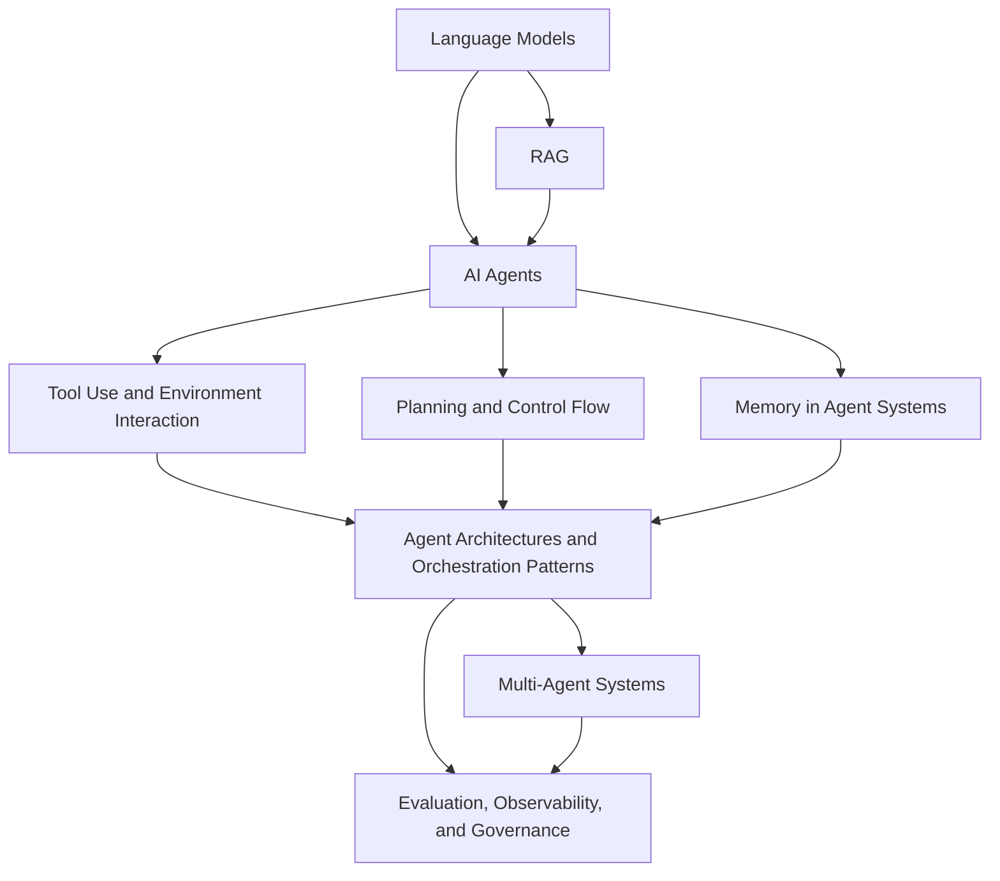

# Agentic Systems Index

This index organizes the vault branch for AI agents, agentic systems, and multi-agent architectures.

> [!INFO] Start here
> Use this branch if you want to move from `Language Models`, with or without `RAG`, into systems that can plan, use tools, persist state, and act over an environment.

> [!NOTE] Part of the vault
> This is the advanced systems branch under [[Home]]. If you need more foundations first, enter through [[Machine Learning Index]] or [[Deep Learning & NLP Index]].

## Why It Matters
Agentic systems are now a practical design space, not just a research curiosity. They sit between standard software workflows and more open-ended autonomous behavior, which makes them relevant for engineering, internal education, and `Data Strategy`.

## Study Map

> [!IMPORTANT] Three entry routes
> This branch is intentionally layered. A `Data Strategy` reader should be able to start with the decision note, a builder should be able to jump straight into architecture and evaluation, and a learner should be able to follow the full sequence.

## Recommended Routes
| Audience | Best Entry | Suggested Path |
| :--- | :--- | :--- |
| `Data Strategy` | [[When to Use Agentic Systems]] | decision -> orchestration -> governance |
| Builders / engineers | [[AI Agents]] | agents -> tools -> planning -> memory -> orchestration -> evaluation |
| Learners / interns | [[AI Agents]] | agents -> tools -> planning -> memory -> architectures -> multi-agent -> evaluation |

## Prerequisites
> [!TIP] Main prerequisite
> [[Language Models]] is the main prerequisite for this branch. [[RAG (Retrieval Augmented Generation)]] is useful context, but not a hard requirement for a first-pass reading of the agent notes.

## Suggested Learning Paths
### `Data Strategy`
1. [[When to Use Agentic Systems]]
2. [[AI Agents]]
3. [[Agent Architectures and Orchestration Patterns]]
4. [[Evaluation, Observability, and Governance for Agent Systems]]
5. [[Agentic Systems Sources and Research Log]]

### Builders / engineers
1. [[AI Agents]]
2. [[Tool Use and Environment Interaction]]
3. [[Planning and Control Flow in Agent Systems]]
4. [[Memory in Agent Systems]]
5. [[Agent Architectures and Orchestration Patterns]]
6. [[Multi-Agent Systems]]
7. [[Evaluation, Observability, and Governance for Agent Systems]]
8. [[Agentic Systems Sources and Research Log]]

### Learners / interns
1. [[AI Agents]]
2. [[Tool Use and Environment Interaction]]
3. [[Planning and Control Flow in Agent Systems]]
4. [[Memory in Agent Systems]]
5. [[Agent Architectures and Orchestration Patterns]]
6. [[Multi-Agent Systems]]
7. [[Evaluation, Observability, and Governance for Agent Systems]]

> [!WARNING] Do not start with multi-agent by default
> The current practice literature and official engineering guidance both point in the same direction: start simple, then add planning, memory, or delegation only when the task truly needs them.

## System Shapes At A Glance
| System Shape | Control Flow | State Owner | Typical Stop Rule | Approval Boundary |
| :--- | :--- | :--- | :--- | :--- |
| Workflow | predefined application logic | application or database | fixed business rule completes | business logic or human operator |
| Bounded tool workflow | controller with limited model choice | controller plus session state | tool budget, known completion rule, or approval gate | controller or human reviewer |
| Agent | model-guided dynamic loop under guardrails | agent session state and memory | success signal, budget, timeout, or critic | policy layer plus approvals |
| Multi-agent system | orchestrator plus specialists | shared plus role-local state | supervisor, verifier, or aggregator declares completion | orchestrator, policy layer, and human review |

## Where This Leads
| Next Area | Use It When |
| :--- | :--- |
| [[Evaluation, Observability, and Governance for Agent Systems]] | you are moving from prototypes into production discipline and control |
| Phase 2 roadmap notes | you need deeper patterns for connectors, approvals, GUI agents, or reliability controls |
| [[Agentic Systems Sources and Research Log]] | you need the current research and practice baseline before expanding the branch further |

## V1 Branch Map
| Note | Role |
| :--- | :--- |
| [[When to Use Agentic Systems]] | executive-first decision note |
| [[AI Agents]] | branch foundation |
| [[Tool Use and Environment Interaction]] | tool schemas, permissions, MCP/connectors |
| [[Planning and Control Flow in Agent Systems]] | control loops, planning, replanning |
| [[Memory in Agent Systems]] | state and memory layers |
| [[Multi-Agent Systems]] | delegation and coordination |
| [[Agent Architectures and Orchestration Patterns]] | design patterns |
| [[Evaluation, Observability, and Governance for Agent Systems]] | deployment discipline |
| [[Agentic Systems Sources and Research Log]] | research baseline and recency tracking |

## Future Roadmap
### Phase 2
- `MCP and Connector Protocols`
- `Human-in-the-Loop and Approval Flows`
- `Computer Use and GUI Agents`
- `Delegation and Role Specialization`
- `Agent Reliability, Sandboxing, and Permissions`

### Phase 3
- `Long-Running and Background Agents`
- `Agent Memory Architectures`
- `Benchmarks and Evaluation Design for Agents`
- `Simulation Environments for Agent Testing`
- `Economic and ROI Analysis for Agentic Systems`

### Phase 4
- `Debate, Reflection, and Self-Critique Patterns`
- `Enterprise Governance for Agent Ecosystems`
- `Failure Taxonomy for Multi-Agent Systems`
- `Reference Architectures by Use Case`
- `Framework and Platform Landscape`

> [!TIP] How to use the roadmap
> Treat Phase 2 as the practical expansion set. Phases 3 and 4 should only be written once the nucleus is stable and the source log has been refreshed.

## Related Notes
- Prerequisites: [[Language Models]]
- Context: [[RAG (Retrieval Augmented Generation)]], [[Attention]]
- Related: [[Deep Learning & NLP Index]], [[Machine Learning Index]], [[Agentic Systems Sources and Research Log]]

## Sources
- See [[Agentic Systems Sources and Research Log]] for the full research baseline, including canonical papers, surveys, and current official docs.

## Last Reviewed
- 2026-04-10
