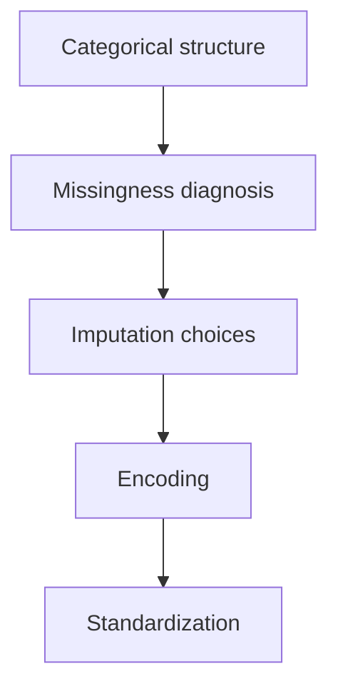

# Data Preparation Index

This index groups the notes needed before training most machine learning models.

> [!INFO] Start here
> If a model is behaving strangely, this section is often the first place to look before blaming the algorithm.

> [!NOTE] Part of the vault
> This is the upstream preprocessing branch under [[Home]]. Finish this path before most model-family notes, then continue into [[Machine Learning Index]] for the broader ML curriculum.

> [!INFO] Best fit
> Use this page if your main issue is dirty data, weak features, or unreliable preprocessing assumptions. Skip directly to model notes only if the dataset is already well understood and well prepared.

> [!TIP] Prerequisites
> Start here if you can already distinguish numeric vs categorical variables. [[Categorical Data]], [[Normal Distribution]], [[Skewness]], and [[Outliers]] are the best fast primers before deeper preprocessing choices.

## Study Path

> [!IMPORTANT] Preparation drives model quality
> Weak preprocessing can make a strong model look mediocre. Strong preprocessing often makes a simple model surprisingly competitive.

## Suggested Learning Path
1. [[Categorical Data]]
2. [[Types of Missing Data]]
3. [[Data Imputation]]
4. [[Data Encoding]]
5. [[Data Standardization]]

## Where This Leads
| Next Branch | Use It When |
| :--- | :--- |
| [[Linear Models]] | you want an interpretable supervised baseline after the dataset is cleaned |
| [[Tree-based Models]] | you want a strong tabular baseline with fewer linearity assumptions |
| [[Neural Networks]] | you need learned representations or plan to move into deep learning modalities |

## Reference Groups
| Group | Notes |
| :--- | :--- |
| Missing data | [[Types of Missing Data]], [[Data Imputation]], [[Selection Bias]] |
| Imputation methods | [[Regression Imputation]], [[KNN Imputation]] |
| Feature preparation | [[Categorical Data]], [[Data Encoding]], [[Data Standardization]] |
| Distribution shape | [[Normal Distribution]], [[Skewness]], [[Outliers]] |
| Spark-oriented pattern | [[Spark ML Estimators vs Transformers]] |

> [!WARNING] Typical beginner failure
> Many modeling problems are actually preprocessing problems in disguise.

> [!TIP] Quick route
> If the dataset has messy categories and nulls, read Types of Missing Data -> Data Imputation -> Data Encoding before touching model architecture.
