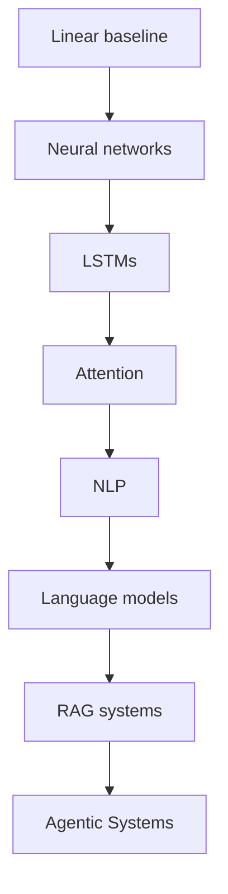

# Deep Learning & NLP Index

This index organizes the vault for deep learning, sequence modeling, and modern NLP topics.

> [!INFO] Start here
> Use this page when you want the bridge from general supervised learning into sequence models, language models, `RAG`, and agentic systems.

> [!NOTE] Part of the vault
> This is the deep learning and LLM branch under [[Home]]. It sits after the broader ML path and leads naturally into [[Agentic Systems Index]] when you want systems with tools, memory, and orchestration.

> [!INFO] Best fit
> Use this page if basic supervised ML already makes sense and you now want sequence models, language models, `RAG`, or the conceptual bridge into agentic systems.

> [!IMPORTANT] Data strategy lens
> Use this branch when the data shape and product constraints justify sequence models, language models, or retrieval-aware systems instead of stopping at a tabular baseline.

> [!TIP] Prerequisites
> [[Neural Networks]] is the real entry note for this branch. [[Linear Models]] is useful earlier background if you are still moving through the broader curriculum. [[RAG (Retrieval Augmented Generation)]] becomes useful later, but it is not required until you want retrieval-aware LLM systems or agentic system variants that depend on external knowledge.

## Study Path

> [!IMPORTANT] Reading order matters here
> Attention and language models make more sense once you already understand the difference between basic representation learning and sequence modeling.

## Suggested Learning Path
1. [[Neural Networks]]
2. [[LSTMs (Long Short-Term Memory)]]
3. [[Attention]]
4. [[NLP]]
5. [[Language Models]]
6. [[RAG (Retrieval Augmented Generation)]]
7. [[Agentic Systems Index]]

## Where This Leads
| Next Branch | Use It When |
| :--- | :--- |
| [[Language Models]] | you want the conceptual jump from sequence modeling into modern generative systems |
| [[RAG (Retrieval Augmented Generation)]] | you need retrieval-aware LLM systems grounded in external knowledge |
| [[Agentic Systems Index]] | you want planning, tools, memory, orchestration, and governance beyond plain LLM or RAG apps |

## Reference Groups
| Group | Notes |
| :--- | :--- |
| Foundations | [[Linear Models]], [[Neural Networks]], [[Outliers]], [[Skewness]] |
| Sequence and NLP | [[LSTMs (Long Short-Term Memory)]], [[Attention]], [[NLP]], [[Language Models]] |
| LLM systems | [[RAG (Retrieval Augmented Generation)]], [[Agentic Systems Index]] |

> [!TIP] Quick route
> If your end goal is modern LLM systems, the fastest conceptual path is Neural Networks -> LSTMs -> Attention -> Language Models -> RAG -> Agentic Systems.

> [!TIP] Compiled knowledge workspace
> Use [[80 Knowledge Ops/20 Domain Workspaces/04 Deep Learning & NLP/010 Deep Learning and NLP Knowledge Workspace|Deep Learning and NLP Knowledge Workspace]] when you are compiling sources, storing draft syntheses, or staging promotion candidates for this branch.

## Last Reviewed
- 2026-04-20
