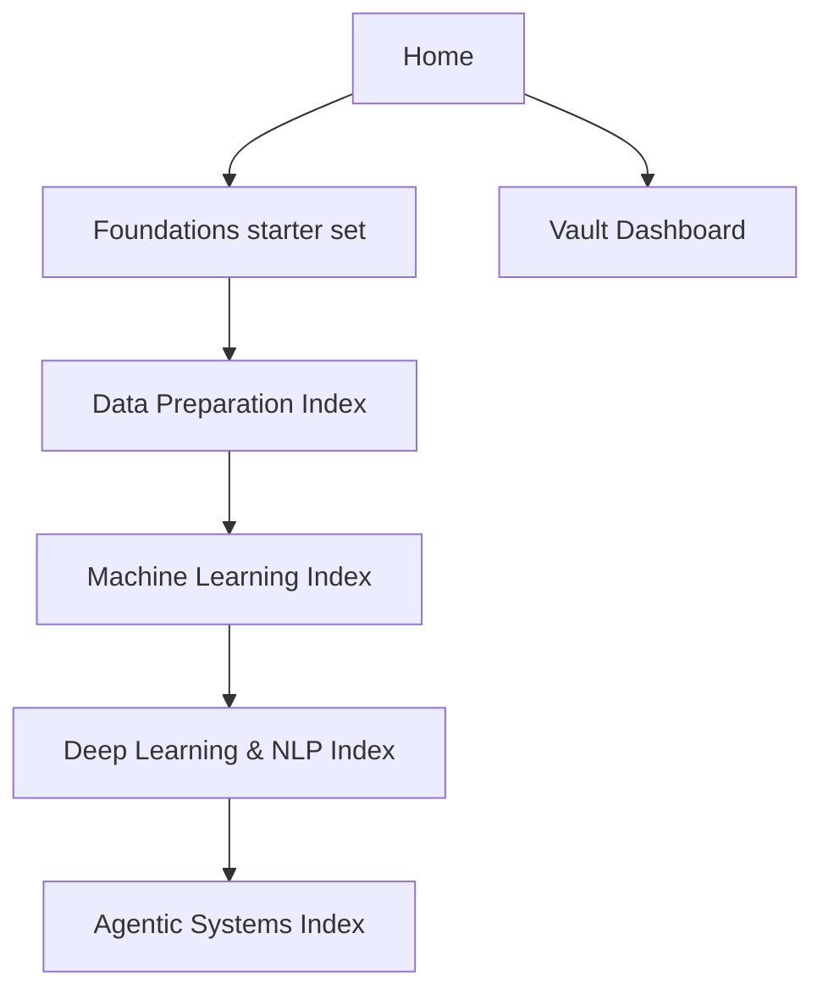

# Home

This is the main landing page for the vault. Use it to choose the right entry point, follow a study path, or jump directly into the branch that matters.

> [!INFO] Start here
> Use this page as the default portal for the vault. The four index notes below are the main navigation system after the foundations starter set.

> [!IMPORTANT] Two navigation modes
> The curriculum is hierarchical even if the indexes are all directly reachable from `Home`: a curated foundations starter set comes first, then the main study path runs through [[Data Preparation Index]], [[Machine Learning Index]], [[Deep Learning & NLP Index]], and [[Agentic Systems Index]]. Use the table below for direct entry by goal, not as a claim that all branches sit at the same depth.

## Navigation Map

> [!IMPORTANT] Use indexes before browsing folders
> The folders keep the vault tidy, but the index notes are the intended way to learn or navigate across topics.

## Curated Foundations Entry
> [!TIP] Start here first
> Learners should usually build the shared vocabulary in `01 Foundations` before jumping into the main index branches. This keeps preprocessing, model choice, and agentic framing grounded in the same mental model.

| First Note | Why It Comes First |
| :--- | :--- |
| [[Categorical Data]] | variable types, categories, and encoding choices |
| [[Normal Distribution]] | symmetry, scale, and baseline assumptions |
| [[Skewness]] | distribution shape and transformation cues |
| [[Outliers]] | extreme values and robust handling |
| [[Selection Bias]] | sampling distortions and leakage risk |
| [[Bias in Machine Learning]] | fairness and evaluation bias context |

## Main Entry Points
| Index | Best For | Start Here If |
| :--- | :--- | :--- |
| [[Data Preparation Index]] | upstream preprocessing branch | the main problem is missingness, encoding, scaling, or imbalance after the foundations starter set |
| [[Machine Learning Index]] | broad ML overview | you want the main path from prepared data into model families, evaluation, and advanced systems after the foundations starter set |
| [[Deep Learning & NLP Index]] | advanced modeling branch | you want the bridge from neural networks into sequence models, LLMs, and `RAG` after the broader ML path |
| [[Agentic Systems Index]] | advanced systems branch | you want systems with tools, planning, memory, decision economics, multi-agent patterns, software engineering agents, harness design, operator playbooks for `Claude Code`, `Codex`, and `OpenCode`, or applied architecture design across deeper internal tracks |

## Operational Views
| Dashboard | Use |
| :--- | :--- |
| [[Vault Dashboard]] | browse the vault by metadata, review cadence, and note class |
| [[Editorial Dashboard]] | inspect review queues, remaining bridge notes, and editorial exceptions |

## How To Use This Vault
### Reference Mode
- Jump into the note you need and use links, tables, and callouts to orient quickly.

### Study Mode
- Start with the curated foundations entry, then follow one of the indexes and the suggested paths in order.

> [!TIP] Quick routes by profile
> Learners should usually start with the curated foundations entry, then move into [[Data Preparation Index]] or [[Machine Learning Index]] depending on the topic. Builders can jump into [[Data Preparation Index]] or [[Agentic Systems Index]] depending on whether the task is model-building, software engineering agents, harness design, `Claude Code`, `Codex`, or `OpenCode` operating setup, computer use, or applied architecture work. `Data Strategy` readers should usually start with the curated foundations entry, then choose [[Data Preparation Index]] for data-readiness decisions or [[Agentic Systems Index]] for orchestration, operating-model, and ROI decisions. Inside `Agentic Systems`, the branch is organized as a shared core plus two specializations: `Software Engineering Agents` and `Applied Agentic Architectures`. The operator-playbook layer lives inside the software-engineering specialization rather than as a separate top-level branch.

## Folder Map
| Folder | Meaning |
| :--- | :--- |
| `00 Home` | root navigation and top-level indexes |
| `01 Foundations` | statistics, data concepts, and bias foundations |
| `02 Data Preparation` | preprocessing, imputation, encoding, standardization, and imbalance |
| `03 Classical ML` | metrics, tabular ML, and core model families |
| `04 Deep Learning & NLP` | neural networks, sequence models, language models, and `RAG` |
| `05 Agentic Systems` | agents, orchestration, evaluation, and research notes, organized as a shared core, a software-engineering specialization, an applied-architectures specialization, and a research subtrack, with a deeper operator-playbook layer inside software engineering |
| `90 Guides` | shared operating and authoring documentation |

## Related Notes
- Related: [[Machine Learning Index]], [[Data Preparation Index]], [[Deep Learning & NLP Index]], [[Agentic Systems Index]], [[Vault Dashboard]], [[Note Style Guide]]

## Last Reviewed
- 2026-04-20
