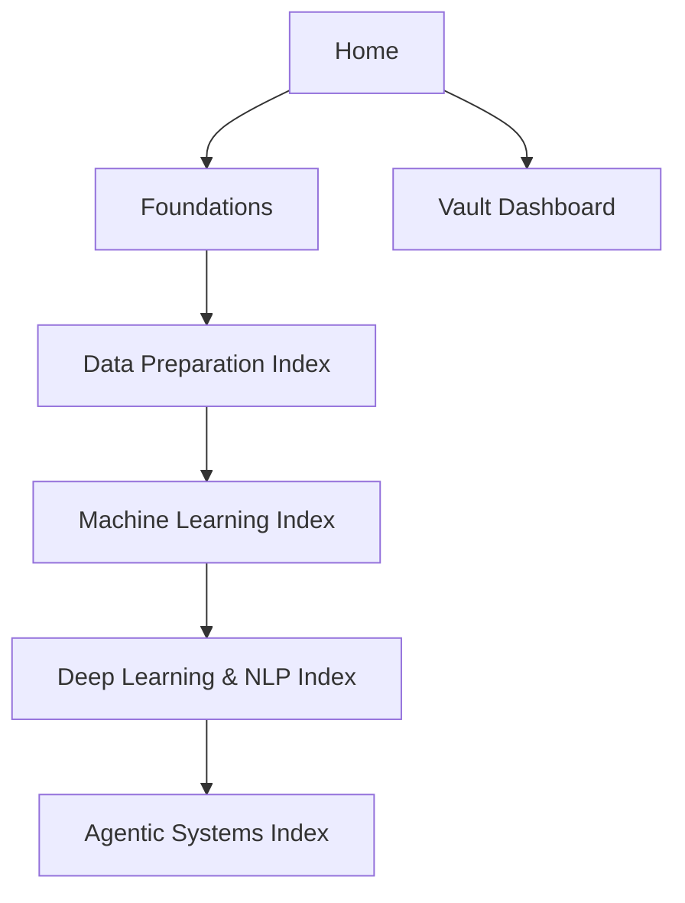

# Home

This is the main landing page for the vault. Use it to choose the right entry point, follow a study path, or jump directly into the branch that matters.

> [!INFO] Start here
> Use this page as the default portal for the vault. The four index notes below are the main navigation system.

> [!IMPORTANT] Two navigation modes
> The curriculum is hierarchical even if the indexes are all directly reachable from `Home`: foundations feed into [[Data Preparation Index]], then into [[Machine Learning Index]], then into [[Deep Learning & NLP Index]], and finally into [[Agentic Systems Index]]. Use the table below for direct entry by goal, not as a claim that all branches sit at the same depth.

## Navigation Map

> [!IMPORTANT] Use indexes before browsing folders
> The folders keep the vault tidy, but the index notes are the intended way to learn or navigate across topics.

## Main Entry Points
| Index | Best For | Start Here If |
| :--- | :--- | :--- |
| [[Data Preparation Index]] | upstream preprocessing branch | the main problem is missingness, encoding, scaling, or imbalance |
| [[Machine Learning Index]] | broad ML overview | you want the main path from prepared data into model families, evaluation, and advanced systems |
| [[Deep Learning & NLP Index]] | advanced modeling branch | you want the bridge from neural networks into sequence models, LLMs, and `RAG` |
| [[Agentic Systems Index]] | advanced systems branch | you want systems with tools, planning, memory, and multi-agent patterns |

## Operational Views
| Dashboard | Use |
| :--- | :--- |
| [[Vault Dashboard]] | browse the vault by metadata, review cadence, and note class |
| [[Editorial Dashboard]] | inspect review queues, remaining bridge notes, and editorial exceptions |

## How To Use This Vault
### Reference Mode
- Jump into the note you need and use links, tables, and callouts to orient quickly.

### Study Mode
- Start from one of the indexes and follow the suggested paths in order.

> [!TIP] Quick routes by profile
> Learners should usually start from [[Machine Learning Index]]. Builders can jump into [[Data Preparation Index]] or [[Agentic Systems Index]] depending on the task. `Data Strategy` readers should usually start from [[Agentic Systems Index]].

## Folder Map
| Folder | Meaning |
| :--- | :--- |
| `00 Home` | root navigation and top-level indexes |
| `01 Foundations` | statistics, data concepts, and bias foundations |
| `02 Data Preparation` | preprocessing, imputation, encoding, standardization, and imbalance |
| `03 Classical ML` | metrics, tabular ML, and core model families |
| `04 Deep Learning & NLP` | neural networks, sequence models, language models, and `RAG` |
| `05 Agentic Systems` | agents, orchestration, evaluation, and research notes |
| `90 Guides` | shared operating and authoring documentation |

## Related Notes
- Related: [[Machine Learning Index]], [[Data Preparation Index]], [[Deep Learning & NLP Index]], [[Agentic Systems Index]], [[Vault Dashboard]], [[Note Style Guide]]

## Last Reviewed
- 2026-04-10
