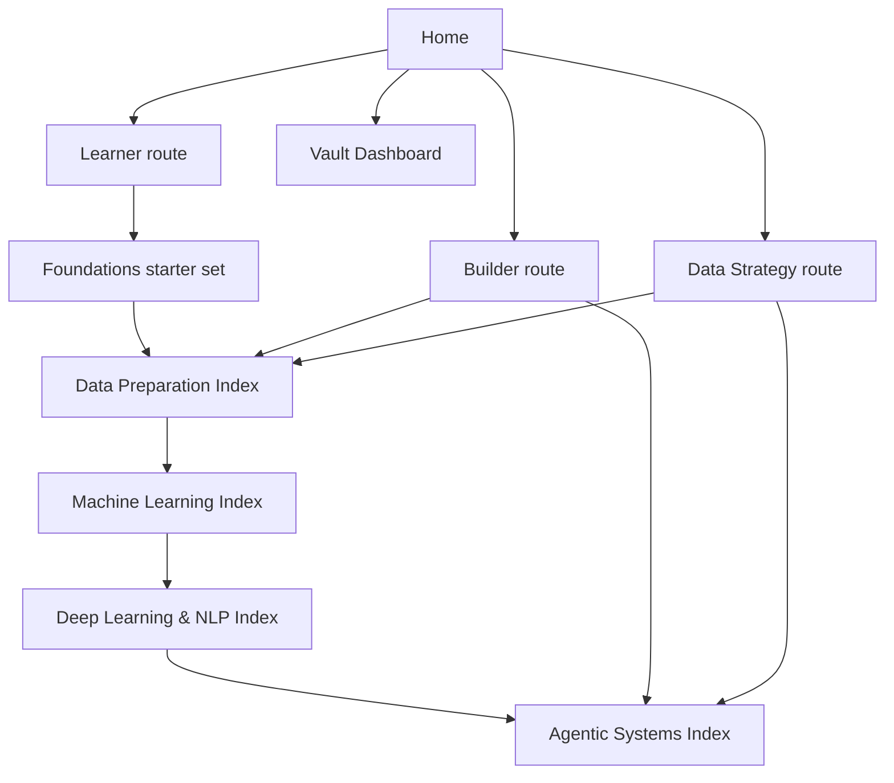

# Home

This is the main landing page for the vault. Choose your route by audience first, then use the branch indexes as the main study and reference layer.

> [!INFO] Start here
> `Home` is audience-first. Pick the route that matches your job, then move into the branch index that matches the problem.

> [!IMPORTANT] Audience-first, curriculum underneath
> The learning progression is still `foundations -> data preparation -> machine learning -> deep learning and NLP -> agentic systems`. The role-based routes below tell you where to enter that progression, not replace it.

## Best Route By Audience
| Audience | Best For | Start Here | Then Continue To |
| :--- | :--- | :--- | :--- |
| `Learner` | building shared vocabulary and following a guided path | [[Categorical Data]] and the curated foundations starter set | [[Data Preparation Index]] or [[Machine Learning Index]] -> [[Deep Learning & NLP Index]] -> [[Agentic Systems Index]] |
| `Builder` | solving a concrete implementation, model, or systems problem | [[Data Preparation Index]] for data quality and preprocessing; [[Agentic Systems Index]] for tool-rich systems, coding agents, and applied architectures | [[Machine Learning Index]] or [[Deep Learning & NLP Index]] when you need model-family or LLM context |
| `Data Strategy` | making decisions about readiness, investment, governance, or operating model | [[Data Preparation Index]] for data-readiness policy and quality debt; [[Agentic Systems Index]] for economics, governance, and operating-model questions | [[Machine Learning Index]] or [[Deep Learning & NLP Index]] when model tradeoffs or product shape need deeper support |

## Navigation Map

> [!IMPORTANT] Use indexes before browsing folders
> The folders keep the vault tidy, but the index notes are the intended way to learn or navigate across topics.

## Curated Foundations Starter
> [!TIP] Shared vocabulary first
> Learners should usually start here. Builders and `Data Strategy` readers can skim this block when they need a lighter refresher before choosing a branch.

| First Note | Why It Comes First |
| :--- | :--- |
| [[Categorical Data]] | variable types, categories, and encoding choices |
| [[Normal Distribution]] | symmetry, scale, and baseline assumptions |
| [[Skewness]] | distribution shape and transformation cues |
| [[Outliers]] | extreme values and robust handling |
| [[Selection Bias]] | sampling distortions and leakage risk |
| [[Bias in Machine Learning]] | fairness and evaluation bias context |

## Main Branches
| Index | Best For | Start Here If |
| :--- | :--- | :--- |
| [[Data Preparation Index]] | upstream preprocessing branch | the main problem is missingness, encoding, scaling, imbalance, or data-readiness policy |
| [[Machine Learning Index]] | broad ML overview | you want the central path from prepared data into model families, metrics, and advanced systems |
| [[Deep Learning & NLP Index]] | advanced modeling branch | you want the bridge from neural networks into sequence models, language models, `RAG`, and LLM product context |
| [[Agentic Systems Index]] | advanced systems branch | you want tools, planning, memory, decision economics, coding agents, operator playbooks, or applied architecture design |

## Operational Views
| Dashboard | Use |
| :--- | :--- |
| [[Vault Dashboard]] | browse the vault by metadata, review cadence, and note class |
| [[Editorial Dashboard]] | inspect review queues, remaining bridge notes, and editorial exceptions |
| [[80 Knowledge Ops/010 Knowledge Ops|Knowledge Ops]] | operate the vault as a source-ingest, draft, lint, and supervised-promotion system |

## How To Use This Vault
### Reference Mode
- Jump into the note you need and use links, tables, and callouts to orient quickly.

### Study Mode
- Start with the curated foundations entry, then follow one of the indexes and the suggested paths in order.

> [!TIP] `Knowledge Ops` stays operational
> Use [[80 Knowledge Ops/010 Knowledge Ops|Knowledge Ops]] when you want to ingest sources, stage drafts, lint the workspace, or supervise promotion into canon. It is visible from `Home`, but it is not a fourth study route.

## Folder Map
| Folder | Meaning |
| :--- | :--- |
| `00 Home` | root navigation and top-level indexes |
| `01 Foundations` | statistics, data concepts, and bias foundations |
| `02 Data Preparation` | preprocessing, imputation, encoding, standardization, and imbalance |
| `03 Classical ML` | metrics, tabular ML, and core model families |
| `04 Deep Learning & NLP` | neural networks, sequence models, language models, and `RAG` |
| `05 Agentic Systems` | agents, orchestration, evaluation, and research notes, organized as a shared core, a software-engineering specialization, an applied-architectures specialization, and a research subtrack, with a deeper operator-playbook layer inside software engineering and knowledge or editorial systems inside applied architectures |
| `80 Knowledge Ops` | operational layer for raw source intake, source-note normalization, domain workspaces, promotion queues, and lint; supports the canon but is not a curriculum branch |
| `90 Guides` | shared operating and authoring documentation |

## Related Notes
- Related: [[Machine Learning Index]], [[Data Preparation Index]], [[Deep Learning & NLP Index]], [[Agentic Systems Index]], [[Vault Dashboard]], [[80 Knowledge Ops/010 Knowledge Ops|Knowledge Ops]], [[Note Style Guide]]

## Last Reviewed
- 2026-04-21
