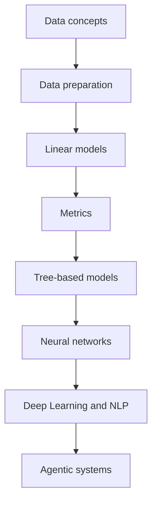

# Machine Learning Index

This is the main machine-learning entry point for the vault as both a reference knowledge base and a study path.

> [!INFO] Start here
> Use this index if you want the shortest path from data preparation to model families, evaluation, and advanced AI systems.

> [!NOTE] Part of the vault
> Return to [[Home]] for the main portal. This note is the main ML overview, but the broad curriculum still expects [[Data Preparation Index]] to feed into it before you go deeper into model families and evaluation.

> [!INFO] Best fit
> Use this page if you want the broadest ML path: preprocessing -> model families -> metrics -> advanced branches. If your immediate problem is still in data quality, start one step upstream in [[Data Preparation Index]].

> [!IMPORTANT] Data strategy lens
> Use this branch to decide which model family fits the dataset, the governance constraints, and the downstream operating cost after preprocessing is in shape.

> [!TIP] Prerequisites
> If you are new to ML, skim [[Categorical Data]], [[Normal Distribution]], and [[Outliers]] first. This index assumes you can already reason about tabular data, feature preparation, and basic evaluation language.

## Best Route By Audience
| Audience | Start Here | Do Not Start Here If | Then Go To |
| :--- | :--- | :--- | :--- |
| `Learner` | this index after the foundations starter set and [[Data Preparation Index]] | data quality is still unresolved or you mainly need sequence and LLM concepts | [[Deep Learning & NLP Index]] and later [[Agentic Systems Index]] |
| `Builder` | this index after [[Data Preparation Index]] to choose a baseline, a model family, and the right metrics | the real problem is still preprocessing debt, or you already know you need sequence models or LLM systems | direct model notes, then [[Deep Learning & NLP Index]] or [[Agentic Systems Index]] as needed |
| `Data Strategy` | this index when deciding which model family, evaluation frame, and governance tradeoff fit the dataset | the dataset is not ready yet, or the question is already about agent economics or operating model | [[Deep Learning & NLP Index]] for sequence or LLM justification, or [[Agentic Systems Index]] for systems and governance |

## Study Path

> [!IMPORTANT] How to use this page
> Follow the study path if you are learning in sequence. Use the grouped tables below if you already know where you want to go.

## Suggested Learning Path
1. [[Categorical Data]]
2. [[Data Preparation Index]]
3. [[Linear Models]]
4. [[Classification Metrics]]
5. [[Regression Metrics]]
6. [[Tree-based Models]]
7. [[Neural Networks]]
8. [[Deep Learning & NLP Index]]
9. [[Agentic Systems Index]]

## Where This Leads
| Next Branch | Use It When |
| :--- | :--- |
| [[Data Preparation Index]] | your main problems are still in data quality, missingness, encoding, or scaling |
| [[Deep Learning & NLP Index]] | you want to move from tabular ML into sequence models, language models, and `RAG` |
| [[Agentic Systems Index]] | you want systems with tools, memory, orchestration, and governance concerns |

## Reference Groups
| Group | Notes |
| :--- | :--- |
| Core model families | [[Linear Models]], [[Tree-based Models]], [[Neural Networks]] |
| Evaluation | [[Classification Metrics]], [[Regression Metrics]], [[Imbalanced Datasets]], [[Bias in Machine Learning]] |
| Data preparation | [[Data Preparation Index]] |
| Tabular techniques | [[Random Forest]], [[XGBoost]], [[KNN]], [[SMOTE]], [[Regression Imputation]] |
| Statistical shape | [[Normal Distribution]], [[Skewness]], [[Outliers]] |
| Advanced systems | [[Deep Learning & NLP Index]], [[Agentic Systems Index]] |

> [!TIP] Quick route
> If your goal is practical tabular ML, start with Data Preparation -> Linear Models -> Classification or Regression Metrics -> Tree-based Models. If your goal is modern LLM and agentic systems, continue from [[Deep Learning & NLP Index]] into [[Agentic Systems Index]].

> [!TIP] Compiled knowledge workspace
> Use [[80 Knowledge Ops/20 Domain Workspaces/03 Classical ML/010 Classical ML Knowledge Workspace|Classical ML Knowledge Workspace]] when you want to file source-backed comparisons, benchmark notes, or draft updates before they become canonical ML notes.

## Last Reviewed
- 2026-04-21
