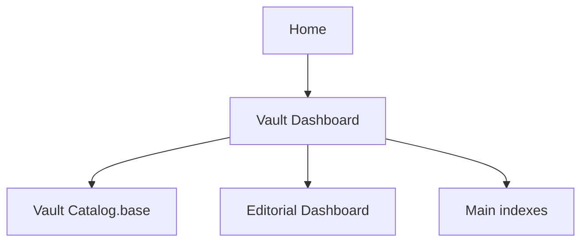

# Vault Dashboard

This dashboard complements [[Home]] with metadata-driven views for browsing, review cadence, and vault maintenance.

> [!INFO] Start here
> Use [[Home]] and the four main indexes for learning and navigation. Use this dashboard when you want to browse the vault by metadata or inspect maintenance signals.

> [!IMPORTANT] Dashboards support the vault
> Bases and Dataview are secondary navigation layers. The curated study paths in [[Home]], [[Machine Learning Index]], [[Data Preparation Index]], [[Deep Learning & NLP Index]], and [[Agentic Systems Index]] remain the default entry points.

## Metadata Map


## Main Views
| View | Purpose | Open |
| :--- | :--- | :--- |
| `Home` | human-curated portal and study entry point | [[Home]] |
| `Vault Catalog` | browse notes by domain, type, status, and review date | [[00 Home/Vault Catalog.base\|Vault Catalog]] |
| `Editorial Dashboard` | review debt, bridge-note drift, and missing-section checks | [[90 Guides/Editorial Dashboard\|Editorial Dashboard]] |
| `Editorial Review` | editorial Bases view for review queues and note classes | [[90 Guides/Editorial Review.base\|Editorial Review]] |
| `Knowledge Ops Dashboard` | operational control surface for intake, promotion, and lint | [[80 Knowledge Ops/90 Dashboards/010 Knowledge Ops Dashboard\|Knowledge Ops Dashboard]] |

## Bases Views
![[00 Home/Vault Catalog.base#By Domain]]

![[00 Home/Vault Catalog.base#Review Queue]]

## Dataview Quick Signals
### Notes By Domain
```dataview
TABLE rows.length AS "Notes", min(rows.last_reviewed) AS "Oldest Review"
FROM ""
WHERE type
GROUP BY domain
SORT domain ASC
```

### Oldest Reviewed Notes
```dataview
TABLE file.link AS Note, domain AS Domain, type AS Type, status AS Status, last_reviewed AS "Last Reviewed"
FROM ""
WHERE type
SORT last_reviewed ASC, file.name ASC
LIMIT 12
```

### Recently Reviewed Notes
```dataview
TABLE file.link AS Note, domain AS Domain, type AS Type, last_reviewed AS "Last Reviewed"
FROM ""
WHERE type
SORT last_reviewed DESC, file.name ASC
LIMIT 10
```

### Knowledge Ops Signals
```dataview
TABLE file.link AS Note, type AS Type, knowledge_state AS "Knowledge State", review_state AS "Review State"
FROM "80 Knowledge Ops"
WHERE type
SORT file.name ASC
LIMIT 12
```

## Related Notes
- Related: [[Home]], [[Machine Learning Index]], [[Data Preparation Index]], [[Deep Learning & NLP Index]], [[Agentic Systems Index]], [[90 Guides/Editorial Dashboard|Editorial Dashboard]], [[80 Knowledge Ops/90 Dashboards/010 Knowledge Ops Dashboard|Knowledge Ops Dashboard]]

## Last Reviewed
- 2026-04-20
