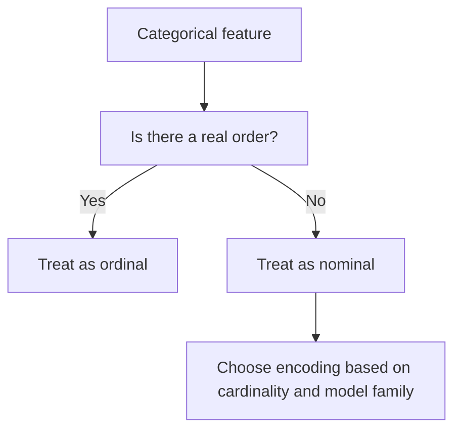

# Categorical Data

Categorical data represents labels or groups rather than continuous quantities.

> [!INFO] Core idea
> Before you encode a category, you need to know whether it carries order. That single distinction changes which transformations are mathematically valid.

## Why It Matters
Many business datasets are dominated by categories such as country, role, product type, or device. If you treat those categories incorrectly, you inject false assumptions into the model.

## Main Types
| Type | Meaning | Example | Main Risk |
| :--- | :--- | :--- | :--- |
| **Nominal** | no intrinsic order | browser, city, color | fake numeric order if encoded badly |
| **Ordinal** | real rank or progression | low, medium, high | assuming distances between levels are equal |

> [!IMPORTANT] Nominal is not ordinal
> If a category has no natural rank, an integer code like `1, 2, 3` is not harmless. It can create relationships the model interprets as real.

## Common Challenges
- high cardinality
- rare categories
- missing values
- unstable frequency estimates

## Typical Handling Patterns

> [!WARNING] High-cardinality categories are easy to misuse
> A naive one-hot encoding of a very large category space can explode dimensionality and make the model harder to train or interpret.

## Practical Heuristics
- Use [[Data Encoding]] to map the category correctly for the target model.
- Use [[Data Imputation]] or explicit unknown categories before encoding when values are missing.
- Treat business identifiers carefully. Many are technically categorical but semantically close to keys rather than features.

> [!TIP] Useful default
> Ask two questions first: "Is there a true order?" and "How many unique values are there?" That already rules out many bad encoding choices.

## Related Notes
- Related: [[Tree-based Models]], [[Linear Models]], [[Neural Networks]]

## Sources
- Kuhn and Johnson, *Feature Engineering and Selection*.
- Zheng and Casari, *Feature Engineering for Machine Learning*.

## Last Reviewed
- 2026-04-17
