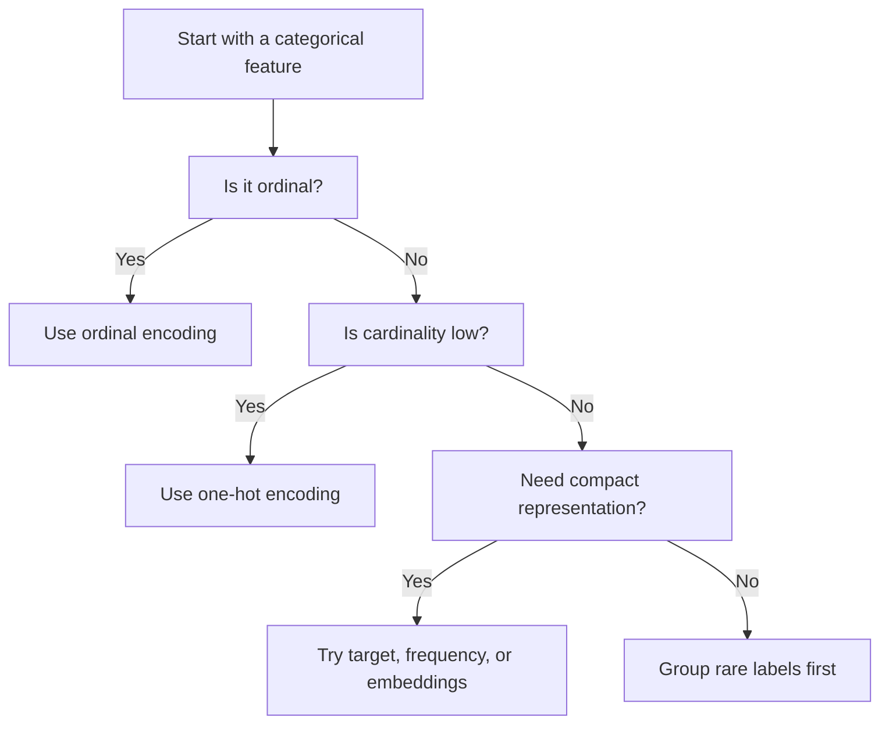

# Data Encoding

Data encoding converts categorical variables into numeric representations that machine learning models can use.

> [!INFO] What encoding really does
> Encoding is not just a formatting step. It defines the structure the model is allowed to infer from categories.

## Why It Matters
Most models do not understand raw labels such as `"red"` or `"finance"`. The chosen encoding changes what the model can learn and what mistakes it is likely to make.

## Visual Decision Flow


## 1. The Main Options
### One-Hot Encoding
- best for low-cardinality nominal variables
- avoids fake order
- can create large sparse feature spaces

### Ordinal Encoding
- best when categories have a real rank
- compact and simple
- dangerous for nominal labels

### Target Or Frequency Encoding
- useful for high-cardinality features
- often effective for tabular models
- can leak target information if done badly

### Embeddings
- dense learned vectors, often used with [[Neural Networks]]
- useful when the category space is large and structured

> [!WARNING] Label encoding trap
> If you encode nominal categories as integers, a model may interpret those integers as meaningful order.

## 2. What Should Drive The Choice?
| Question | Why It Matters | Typical Impact |
| :--- | :--- | :--- |
| Is the feature nominal or ordinal? | order may or may not be meaningful | determines whether ordinal encoding is valid |
| How many unique values are there? | high cardinality affects memory and model behavior | pushes you away from naive one-hot |
| Which model family will consume it? | model families react differently to sparse or ordered inputs | changes the safest default |
| Are missing values already handled? | nulls can carry information | may require [[Data Imputation]] first |

> [!CAUTION] Leakage risk
> Target encoding can be powerful, but it must be computed with training-only logic or cross-validation folds.

## 3. When To Use / When Not To Use
### When To Use
- Use **One-Hot** for small nominal vocabularies.
- Use **Ordinal** only when the order is real.
- Use **Target/Frequency** when cardinality is high and you need compact tabular features.
- Use **Embeddings** when category structure matters and you can train for it.

### When Not To Use
- Do not use **Ordinal** for purely nominal categories.
- Do not use **One-Hot** blindly on very large category spaces.
- Do not use **Target Encoding** without leakage-safe training logic.

## 4. Cheat Sheet
| Feature Type | Cardinality | Model Family | Good Default | Main Risk |
| :--- | :--- | :--- | :--- | :--- |
| Nominal | Low | [[Linear Models]] | One-Hot | sparse expansion |
| Nominal | Low | [[Tree-based Models]] | One-Hot or careful simple encoding | false order if done badly |
| Nominal | High | [[Tree-based Models]] | Frequency or target encoding | leakage or unstable rare labels |
| Nominal | High | [[Neural Networks]] | Embeddings | extra training complexity |
| Ordinal | Any | Most models | Ordinal encoding | wrong spacing assumptions |

> [!TIP] Practical default
> If you are unsure, start with one-hot for low-cardinality nominal features and explicit ordinal encoding only for real ranks.

## Related Notes
- Prerequisites: [[Categorical Data]], [[Data Imputation]]
- Related: [[Linear Models]], [[Tree-based Models]], [[Neural Networks]]

## Example
```python
from sklearn.preprocessing import OneHotEncoder

encoder = OneHotEncoder(handle_unknown="ignore")
columns = ["city_name"]
X_encoded = encoder.fit_transform(X_train[columns])
```

## Sources
- Kuhn and Johnson, *Feature Engineering and Selection*.
- Zheng and Casari, *Feature Engineering for Machine Learning*.

## Last Reviewed
- 2026-04-10
