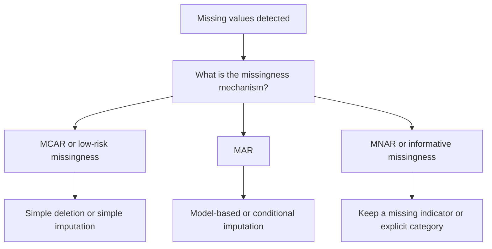

# Data Imputation

Data imputation is the process of handling missing values so models can train and infer reliably.

> [!INFO] Core idea
> Imputation is not only about filling blanks. It is about preserving signal without introducing fake certainty or hidden bias.

## Why It Matters
Missing values can break pipelines, distort feature distributions, and create misleading conclusions if the missingness mechanism is misunderstood.

## Decision Flow


> [!WARNING] The `dropna()` trap
> Deleting rows is only safe when the missingness assumptions are reasonable. Otherwise you risk [[Selection Bias]].

## Main Options
| Method | Best When | Main Risk |
| :--- | :--- | :--- |
| Delete rows or columns | missingness is limited and low-risk | removes signal and can bias the sample |
| Explicit missing category | missingness itself may carry information | can blur modeling assumptions for some algorithms |
| Mean / median / mode | simple baseline needed | shrinks variability and can hide structure |
| Model-based imputation | relationships between features are informative | more complexity and more leakage risk |

## Common Patterns
### Deletion
- simplest option
- acceptable when missingness is limited and roughly ignorable

### Explicit Missing Category
- useful for categorical features
- often useful for tree-based workflows

### Statistical Imputation
- **Mean** for roughly symmetric numeric data close to a [[Normal Distribution|normal-like distribution]]
- **Median** when [[Skewness]] or [[Outliers]] matter
- **Mode** for categorical variables

### Model-Based Imputation
- [[Regression Imputation]] when observed variables explain the missing one well
- [[KNN Imputation]] when local similarity between rows is informative

> [!IMPORTANT] Mechanism first, method second
> The right imputation method depends on the missingness pattern in [[Types of Missing Data]], not just on the column type.

## When To Use / When Not To Use
### When To Use
- Use simple imputation for low-risk baseline workflows.
- Use explicit missing categories when absence itself may be informative.
- Use model-based methods when local structure matters and compute budget allows it, especially with [[Regression Imputation]] or [[KNN Imputation]].

### When Not To Use
- Do not fill MNAR-like data with a naive average and assume the issue is solved.
- Do not fit imputers on the full dataset before the split.
- Do not assume the numerically cleanest dataset is the least biased one.

> [!TIP] Production default
> Fit the imputation logic on training data only and apply the fitted object to validation and test data.

## Related Notes
- Prerequisites: [[Types of Missing Data]]
- Related: [[Selection Bias]], [[Bias in Machine Learning]], [[Spark ML Estimators vs Transformers]]

## Example
```python
from pyspark.ml.feature import Imputer

imputer = Imputer(inputCols=["age"], outputCols=["age_imputed"]).setStrategy("median")
model = imputer.fit(train_df)
train_filled = model.transform(train_df)
```

## Sources
- Little and Rubin, *Statistical Analysis with Missing Data*.
- Spark ML and scikit-learn imputation documentation for implementation patterns.

## Last Reviewed
- 2026-04-10
