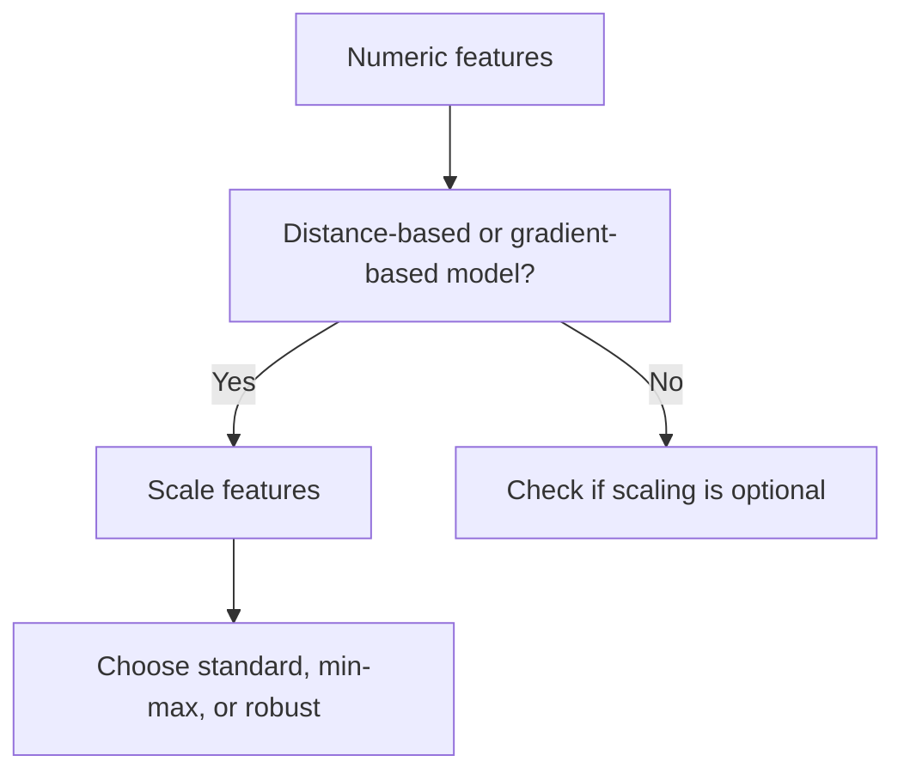

# Data Standardization

Data standardization rescales features so their magnitudes become more comparable.

> [!INFO] Core idea
> Standardization changes the geometry of the feature space. That matters most when optimization or distance depends on relative scale.

## Why It Matters
For distance-based and gradient-based models, raw feature scale can dominate learning dynamics and make training unstable or misleading.

## Scaling Options
| Method | What It Does | Best When | Main Risk |
| :--- | :--- | :--- | :--- |
| **Standardization** | center at 0, scale to unit variance | general numeric modeling | less intuitive interpretation |
| **Min-Max scaling** | maps to a bounded interval | bounded-input workflows | sensitive to outliers |
| **Robust scaling** | uses median and IQR | heavy [[Outliers]] or skew | may be less intuitive for reporting |

> [!IMPORTANT] Scaling is model-dependent
> [[Linear Models]], [[Neural Networks]], and [[KNN]] usually care a lot about scale. [[Tree-based Models]] such as [[Random Forest]] and [[XGBoost]] usually care much less.

## Visual Decision Rule


## 1. Main Techniques
### Standardization
$$ z = \frac{x - \mu}{\sigma} $$
- strong default for many ML pipelines
- especially natural when numeric features are not extremely far from a [[Normal Distribution|normal-like shape]]

### Min-Max Scaling
- useful when bounded inputs are desirable

### Robust Scaling
- safer when the data is strongly skewed or outlier-heavy

> [!WARNING] Scaling is not distribution repair
> Standard scaling does not fix a badly skewed feature or a broken data-generating process by itself.

## 2. Models That Care Most
- [[Linear Models]]
- [[Neural Networks]]
- [[KNN]]

## 3. Practical Tradeoffs
- Scaling improves optimization but can reduce interpretability.
- Centering sparse matrices can destroy sparsity and increase memory cost.
- The wrong scaler can still leave the model sensitive to extreme tails.

> [!TIP] Practical default
> If you are unsure and the model is gradient-based, start with standardization and revisit only when the data distribution suggests otherwise.

## Related Notes
- Prerequisites: [[Outliers]], [[Skewness]]
- Related: [[Linear Models]], [[Neural Networks]], [[KNN]]

## Example
```python
from sklearn.preprocessing import StandardScaler

scaler = StandardScaler()
X_train_scaled = scaler.fit_transform(X_train)
X_test_scaled = scaler.transform(X_test)
```

## Sources
- Hastie, Tibshirani, and Friedman, *The Elements of Statistical Learning*.
- Geron, *Hands-On Machine Learning with Scikit-Learn, Keras, and TensorFlow*.

## Last Reviewed
- 2026-04-10
