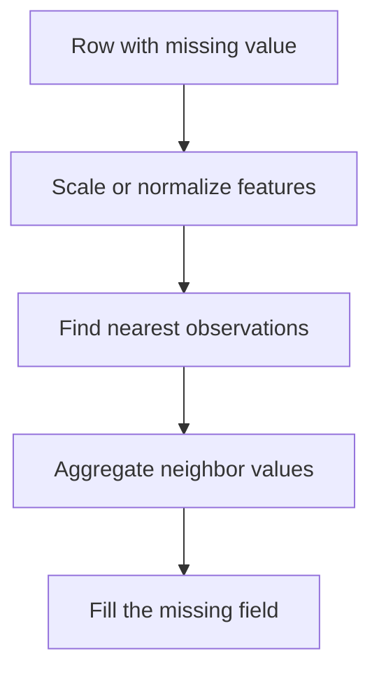

# KNN Imputation

KNN imputation fills missing values using the values of nearby observations in feature space.

> [!INFO] Core idea
> KNN imputation assumes local similarity is informative. Instead of using one global fill value, it looks for rows that resemble the current one and borrows information from them.

## Why It Matters
KNN imputation can preserve local structure better than mean or median imputation when neighborhood similarity is meaningful. It is often a better fit for heterogeneous datasets where one global average hides too much variation.

## Visual Map

> [!IMPORTANT] Distance quality drives imputation quality
> If the distance metric is misleading because of weak scaling or irrelevant features, the imputed values will look precise but be poorly grounded.

## Core Mechanics
### Main Steps
- choose a distance metric
- compute neighbors using observed features
- pick `k`, the number of neighbors
- average or otherwise aggregate the neighbor values

### Best Fit
- tabular data with meaningful local structure
- cases where similar rows genuinely behave similarly
- datasets where global mean or median is too crude

> [!WARNING] KNN imputation is sensitive to scaling
> Features with larger numeric ranges can dominate the neighborhood search unless preprocessing is handled carefully.

## Tradeoffs And Decision Rules
| Situation | KNN Imputation Usually Helps | Main Risk |
| :--- | :--- | :--- |
| local similarity matters | preserves neighborhood structure | noisy neighbors |
| heterogeneous populations | avoids one global fill value | expensive at scale |
| moderate dataset size | practical and interpretable enough | slower than simple baselines |

### When To Use
- use it when local neighborhood structure is meaningful
- use it when you expect different subregions of the data to have different typical values

### When Not To Use
- do not use it blindly on very high-dimensional noisy spaces
- do not use it without checking scaling and missingness assumptions
- do not fit it before the train-validation split

> [!CAUTION] Better fit can mean hidden leakage
> Because KNN imputation borrows information from other rows, the train-test separation must be respected carefully.

> [!TIP] Practical default
> Try KNN imputation after a simple baseline. If it improves performance, verify that the gain survives proper train-only fitting and sensible scaling.

## Related Notes
- Prerequisites: [[Data Imputation]], [[KNN]]
- Related: [[Data Standardization]], [[Types of Missing Data]], [[Regression Imputation]]

## Sources
- Troyanskaya et al., *Missing value estimation methods for DNA microarrays*.
- van Buuren, *Flexible Imputation of Missing Data*.

## Last Reviewed
- 2026-04-10
