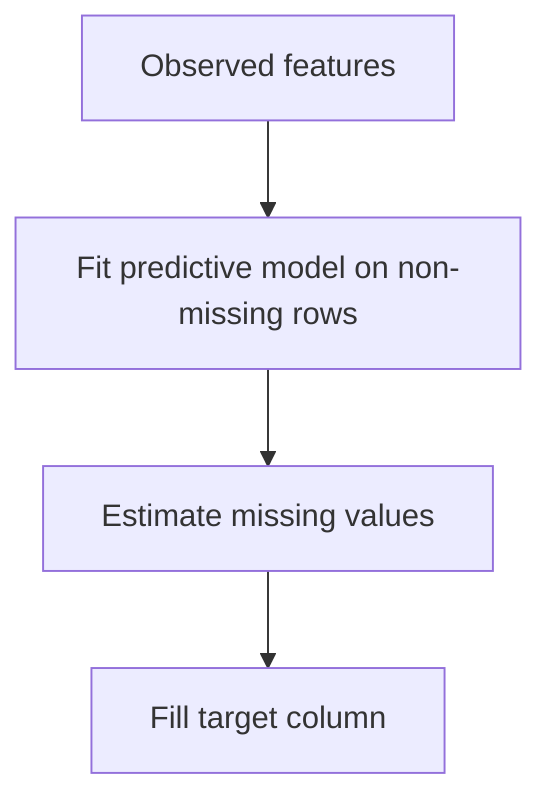

# Regression Imputation

Regression imputation fills missing values by predicting them from other observed variables.

> [!INFO] Core idea
> Instead of using one fixed replacement, regression imputation uses a predictive relationship between features to estimate the missing value.

## Why It Matters
Regression imputation can recover structure better than mean or median imputation when other variables strongly explain the missing field. It is especially useful when one feature can be estimated from correlated signals already present in the row.

## Visual Map

> [!IMPORTANT] This is model-based imputation
> The quality of the filled values depends on how informative the observed predictors are and how honest the training split is.

## Core Mechanics
### Main Steps
- choose a target feature with missing values
- train a predictive model on rows where that feature is observed
- generate estimates for rows where the feature is missing
- write the estimated values back into the dataset

### Best Fit
- one missing feature is strongly explained by other observed features
- the predictive relationship is reasonably stable
- preserving multivariate structure matters more than using a global statistic

> [!WARNING] Predicted values can look more certain than they are
> Regression imputation often shrinks uncertainty because every missing entry gets a neat estimate, even when the estimate should be treated as approximate.

## Tradeoffs And Decision Rules
| Situation | Regression Imputation Usually Helps | Main Risk |
| :--- | :--- | :--- |
| strong correlation with other variables | preserves structure better than mean fill | overconfidence in estimates |
| moderate missingness in one target feature | targeted and interpretable setup | extra modeling complexity |
| train-only preprocessing discipline | production-safe pipeline | leakage if fit globally |

### When To Use
- use it when the missing feature is predictable from observed variables
- use it when preserving feature relationships matters

### When Not To Use
- do not use it if the target column is weakly explained by the other features
- do not fit the imputation model on the full dataset
- do not treat the imputed values as if they were directly observed measurements

> [!CAUTION] Good prediction is not the same as honest uncertainty
> Even a useful imputation model can understate variability, which may matter downstream in analysis or decision thresholds.

> [!TIP] Practical default
> Compare regression imputation against a simple baseline. Keep it only if the downstream gain is real and the pipeline remains leakage-safe.

## Related Notes
- Prerequisites: [[Data Imputation]], [[Linear Models]]
- Related: [[Types of Missing Data]], [[KNN Imputation]], [[Selection Bias]]

## Sources
- Little and Rubin, *Statistical Analysis with Missing Data*.
- van Buuren, *Flexible Imputation of Missing Data*.

## Last Reviewed
- 2026-04-10
