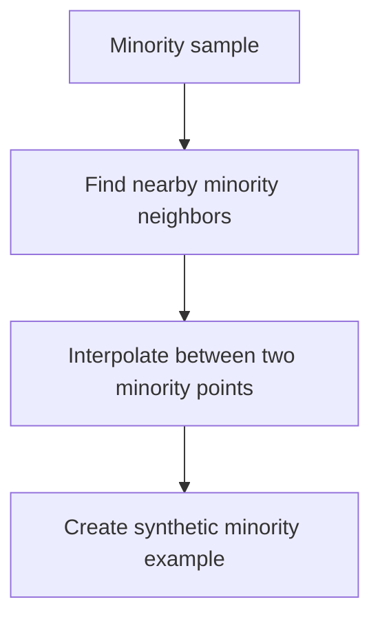

# SMOTE

SMOTE generates synthetic minority-class examples by interpolating between nearby minority samples.

> [!INFO] Core idea
> SMOTE does not simply duplicate rare-class rows. It creates new synthetic points between existing minority examples to give the model denser minority coverage.

## Why It Matters
When classification data is heavily imbalanced, the model can learn the majority class too easily. SMOTE is a classic way to strengthen minority-class representation before training.

## Visual Map

> [!IMPORTANT] Train split only
> Apply SMOTE only inside the training workflow, never before the train-test split. Otherwise the synthetic points leak information across the evaluation boundary.

## Core Mechanics
### Main Steps
- identify minority-class examples
- find minority neighbors
- interpolate between nearby minority points
- add the synthetic rows to training data

### Best Fit
- tabular classification with meaningful local structure
- minority classes that are too rare for the model to learn reliably
- workflows where evaluation already tracks precision, recall, or PR-AUC

> [!WARNING] Synthetic does not mean realistic
> If minority examples are noisy, overlapping, or poorly structured, SMOTE can create synthetic rows that make the class boundary worse instead of better.

## Tradeoffs And Decision Rules
| Situation | SMOTE Usually Helps | Main Risk |
| :--- | :--- | :--- |
| rare minority class | improves minority exposure | noisy synthetic rows |
| moderate class overlap | smoother class support | class-boundary distortion |
| metrics emphasize recall or PR quality | better minority learning signal | evaluation can still worsen if noise grows |

### When To Use
- use it when the minority class is too sparse and naive duplication is not enough
- use it when the downstream metric cares about minority recovery

### When Not To Use
- do not use it before splitting the dataset
- do not assume it automatically improves real-world precision
- do not use it blindly when classes overlap heavily or minority examples are unreliable

> [!CAUTION] Better recall can hide worse precision
> SMOTE often helps the model see the minority class, but it can also create extra false positives if the synthetic region is too broad.

> [!TIP] Practical default
> Use SMOTE as one candidate in the imbalance toolkit. Compare it against class weighting and threshold tuning instead of assuming it is the default winner.

## Related Notes
- Prerequisites: [[Imbalanced Datasets]]
- Related: [[Classification Metrics]], [[Random Forest]], [[XGBoost]]

## Sources
- Chawla et al., *SMOTE: Synthetic Minority Over-sampling Technique*.
- He and Garcia, *Learning from Imbalanced Data*.

## Last Reviewed
- 2026-04-10
