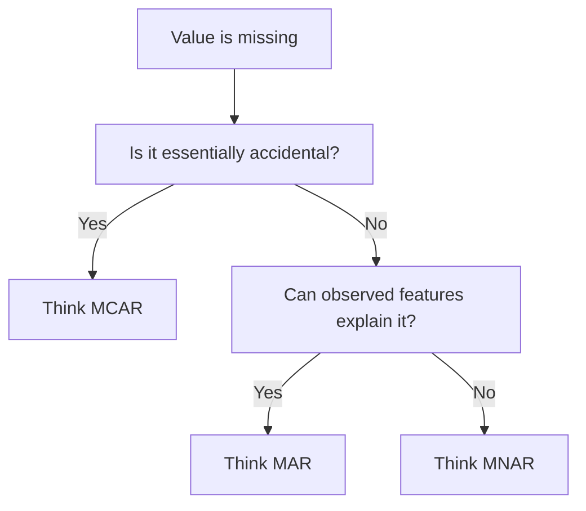

# Types of Missing Data

Missing data is not just a cleaning problem. The reason values are missing changes which handling strategy is safe.

> [!INFO] Core idea
> Before choosing an imputation method, identify whether the missingness is accidental, explainable, or informative in itself.

## Why It Matters
If you misdiagnose missingness, you can introduce bias, hide signal, or choose an imputation method that makes the dataset look cleaner while making the model worse.

## Missingness Cheat Sheet
| Type | Meaning | Typical Risk | Common Reaction |
| :--- | :--- | :--- | :--- |
| **MCAR** | missingness has no systematic pattern | lower bias risk | simple deletion or simple imputation may be fine |
| **MAR** | missingness depends on observed variables | moderate bias risk | conditional or model-based imputation such as [[Regression Imputation]] or [[KNN Imputation]] |
| **MNAR** | missingness depends on the missing value itself | highest bias risk | explicit missing indicators or specialized handling |

> [!IMPORTANT] MCAR, MAR, and MNAR are not just labels
> They directly change which preprocessing choices are defensible.

## Visual Decision Rule

> [!WARNING] MNAR is the dangerous case
> If the fact that a value is missing is tied to the value itself, naive imputation can inject strong bias.

## Practical Use
- Start here before [[Data Imputation]].
- Use this note to decide whether deletion, simple imputation, or explicit missing indicators are reasonable.
- If the pattern looks closer to MAR, the next notes to compare are often [[Regression Imputation]] and [[KNN Imputation]].

> [!TIP] Practical default
> If you are unsure and missingness looks behavior-driven or sensitive, investigate before you impute aggressively.

## Related Notes
- Related: [[Data Imputation]], [[Selection Bias]], [[Bias in Machine Learning]]

## Sources
- Rubin, *Inference and Missing Data*.
- Little and Rubin, *Statistical Analysis with Missing Data*.

## Last Reviewed
- 2026-04-17
