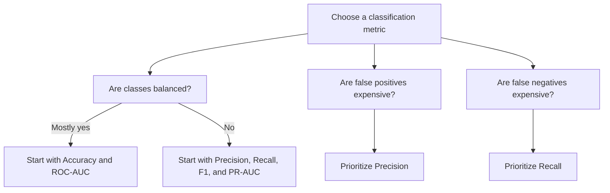

# Classification Metrics

Classification metrics measure how well a model distinguishes classes and how costly its mistakes are.

> [!INFO] Core idea
> Classification metrics are about the **type of mistake** as much as the final score. A model can look good overall and still fail on the cases that matter.

## Why It Matters
Accuracy alone is often misleading. In most real systems, the key question is not "How many predictions were correct?" but "Which errors are acceptable?"

## Visual Map


> [!FAILURE] Accuracy trap
> In rare-event problems, a model can predict the majority class everywhere and still report strong accuracy.

## Confusion Matrix
Everything starts from the confusion matrix:

| Actual / Predicted | Positive | Negative |
| :--- | :--- | :--- |
| Positive | True Positive (TP) | False Negative (FN) |
| Negative | False Positive (FP) | True Negative (TN) |

## Metric Families
> [!IMPORTANT] Threshold metrics vs ranking metrics
> Accuracy, Precision, Recall, and F1 depend on a fixed decision threshold. ROC-AUC and PR-AUC measure ranking quality across many thresholds.

### Threshold Metrics
- **Accuracy:** overall fraction of correct predictions.
- **Precision:** of predicted positives, how many were truly positive?
- **Recall:** of true positives, how many did we catch?
- **F1-score:** balance between precision and recall.

### Ranking Metrics
- **ROC-AUC:** how well positives rank above negatives across thresholds.
- **PR-AUC:** how well the model identifies positives when the positive class is rare.

## Metric Cheat Sheet
| Metric | Answers This Question | Best When | Main Risk |
| :--- | :--- | :--- | :--- |
| **Accuracy** | How often am I right overall? | classes are balanced | hides failure on rare classes |
| **Precision** | When I say positive, how often am I right? | false positives are expensive | may miss real positives |
| **Recall** | How many real positives did I catch? | false negatives are expensive | may trigger many false alarms |
| **F1** | How balanced are precision and recall? | need one balanced score | hides the exact tradeoff |
| **ROC-AUC** | How well do I rank positives above negatives? | balanced or moderately imbalanced data | can look better than business reality |
| **PR-AUC** | How well do I identify positives? | strongly imbalanced data | harder to explain casually |

> [!CAUTION] ROC-AUC can flatter the model
> In very imbalanced problems, ROC-AUC may look strong even when minority-class performance is weak.

## When To Use / When Not To Use
### When To Use
- Use **Accuracy** when classes are reasonably balanced.
- Use **Precision** when false alarms are expensive.
- Use **Recall** when missing a positive case is costly.
- Use **F1** when you want a single summary of precision and recall.
- Use **PR-AUC** for heavily imbalanced settings.

### When Not To Use
- Do not use **Accuracy** as the primary metric for [[Imbalanced Datasets]].
- Do not use **F1** if the business decision depends on inspecting precision and recall separately.
- Do not rely only on **ROC-AUC** when the positive class is rare.

> [!TIP] Practical default
> For rare-event classification, start by reporting Precision, Recall, and PR-AUC. Then add Accuracy or ROC-AUC only as supporting context.

## Related Notes
- Related: [[Imbalanced Datasets]], [[Bias in Machine Learning]], [[Linear Models]], [[Tree-based Models]]

## Example
```python
from sklearn.metrics import (
    accuracy_score,
    precision_score,
    recall_score,
    f1_score,
    roc_auc_score,
    average_precision_score,
)

y_pred = model.predict(X_test)
y_prob = model.predict_proba(X_test)[:, 1]

print("accuracy", accuracy_score(y_test, y_pred))
print("precision", precision_score(y_test, y_pred))
print("recall", recall_score(y_test, y_pred))
print("f1", f1_score(y_test, y_pred))
print("roc_auc", roc_auc_score(y_test, y_prob))
print("pr_auc", average_precision_score(y_test, y_prob))
```

## Sources
- Powers, *Evaluation: From Precision, Recall and F-Measure to ROC, Informedness, Markedness and Correlation*.
- Saito and Rehmsmeier, *The Precision-Recall Plot Is More Informative than the ROC Plot When Evaluating Binary Classifiers on Imbalanced Datasets*.

## Last Reviewed
- 2026-04-17
