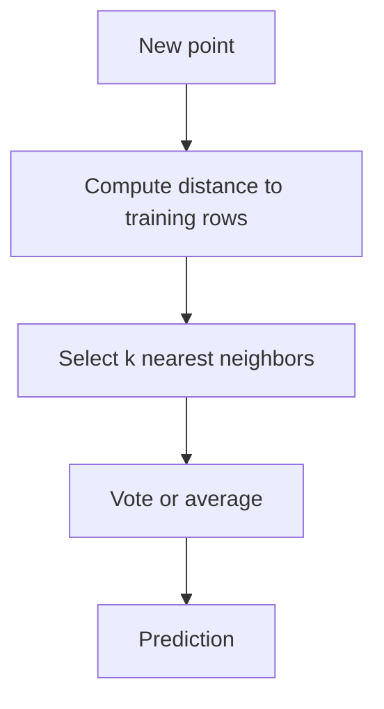

# KNN

K-nearest neighbors predicts using the labels or values of the most similar observations in feature space.

> [!INFO] Core idea
> KNN is a lazy, distance-based model. It does not learn a compact parameterized equation first; it waits until prediction time and looks at nearby examples.

## Why It Matters
KNN is one of the clearest demonstrations of why feature scale, distance metrics, and local structure matter in machine learning.

## Visual Map

> [!IMPORTANT] Distance is the model
> In KNN, the distance function and preprocessing choices are not side details. They are the heart of the model behavior.

## Core Mechanics
### Main Steps
- choose a distance metric
- choose `k`, the number of neighbors
- find the closest rows
- aggregate by majority vote for classification or average for regression

### Best Fit
- problems where local neighborhoods are meaningful
- small to medium tabular datasets
- tasks where a simple local baseline is useful

> [!WARNING] KNN is very sensitive to scale
> Features with larger ranges can dominate the distance calculation unless they are normalized appropriately.

## Tradeoffs And Decision Rules
| Choice | Main Benefit | Main Risk |
| :--- | :--- | :--- |
| small `k` | more local detail | noisy predictions |
| large `k` | smoother behavior | oversmoothing class boundaries |
| Euclidean-style distance | simple default | weak under bad scaling |

### When To Use
- use it when neighborhood similarity is meaningful
- use it as an interpretable distance-based baseline

### When Not To Use
- do not default to it on very high-dimensional noisy datasets
- do not use it without thinking about scaling
- do not expect it to scale cheaply to very large datasets

> [!CAUTION] Prediction cost stays at inference time
> Unlike many fitted models, KNN can be cheap to set up but expensive to query repeatedly because the neighborhood search happens during prediction.

> [!TIP] Practical default
> Standardize features first, try a small range of `k`, and compare KNN against a simple linear baseline and a tree baseline.

## Related Notes
- Prerequisites: [[Data Standardization]]
- Related: [[KNN Imputation]], [[Classification Metrics]], [[Regression Metrics]], [[Linear Models]]

## Sources
- Cover and Hart, *Nearest Neighbor Pattern Classification*.
- Hastie, Tibshirani, and Friedman, *The Elements of Statistical Learning*.

## Last Reviewed
- 2026-04-10
