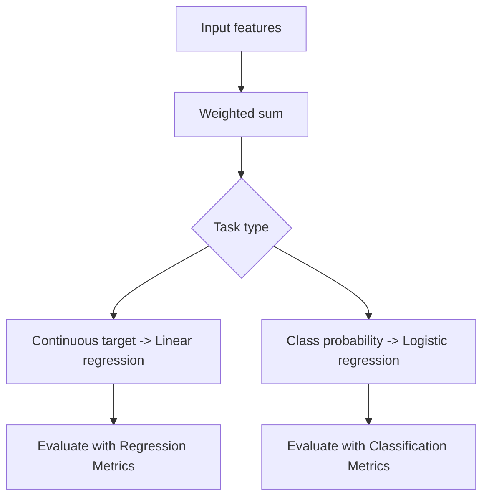

# Linear Models

Linear models assume the prediction can be expressed as a weighted linear combination of the input features.

> [!INFO] Core idea
> Linear does not mean simple-minded. These models are still powerful baselines, but they are explicit about how each feature contributes.

## Why It Matters
Linear models are fast, interpretable, and foundational. They also teach the optimization and regularization ideas that reappear across machine learning.

## Visual Map


## 1. Core Equation
$$ \hat{y} = \mathbf{w}^T \mathbf{x} + b $$

Training means learning weights that minimize a loss function.

> [!IMPORTANT] The coefficients are the message
> A linear model is often valuable not only because of its score, but because it exposes how strongly each feature pushes the prediction.

## 2. Common Variants
### Linear Regression
- predicts continuous targets
- usually evaluated with [[Regression Metrics]]

### Logistic Regression
- predicts class probabilities
- usually evaluated with [[Classification Metrics]]

## 3. Regularization Cheat Sheet
| Method | Effect | Typical Benefit | Main Cost |
| :--- | :--- | :--- | :--- |
| **L2 / Ridge** | shrinks weights smoothly | handles multicollinearity better | keeps all features alive |
| **L1 / Lasso** | pushes some weights to zero | implicit feature selection | can be unstable with correlated features |
| **Elastic Net** | mixes L1 and L2 | useful compromise in larger feature spaces | adds tuning complexity |

> [!WARNING] Linear models are sensitive to representation
> Poor scaling, outliers, and bad categorical encoding can hurt a linear model long before the algorithm itself becomes the problem.

## 4. When They Work Well
- interpretable baselines
- tabular problems with relatively smooth relationships
- cases where coefficients matter for explanation

## 5. When They Struggle
- heavily nonlinear decision boundaries
- strong outlier sensitivity
- poorly prepared categorical data

> [!TIP] Practical default
> If you are starting a supervised tabular project, a well-prepared linear baseline is often the fastest way to learn what the data is doing.

## Related Notes
- Prerequisites: [[Data Standardization]], [[Data Encoding]]
- Related: [[Neural Networks]], [[Tree-based Models]], [[Outliers]]

## Example
```python
from sklearn.linear_model import LogisticRegression
from sklearn.pipeline import make_pipeline
from sklearn.preprocessing import StandardScaler

model = make_pipeline(
    StandardScaler(),
    LogisticRegression(C=1.0, penalty="l2", solver="lbfgs"),
)
```

## Sources
- Hastie, Tibshirani, and Friedman, *The Elements of Statistical Learning*.
- James et al., *An Introduction to Statistical Learning*.

## Last Reviewed
- 2026-04-10
