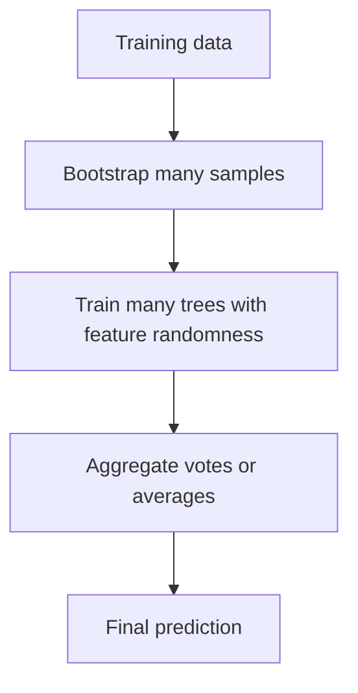

# Random Forest

Random forest is a bagging ensemble of decision trees trained on bootstrapped samples with feature randomness at each split.

> [!INFO] Core idea
> A random forest improves on a single tree by averaging many decorrelated trees. The averaging reduces variance while preserving much of the flexibility of tree-based decision rules.

## Why It Matters
Random forest is one of the strongest practical defaults for structured tabular data because it is robust, handles nonlinear relationships well, and usually needs less tuning than boosting methods.

## Visual Map

> [!IMPORTANT] Variance reduction is the main win
> A single tree is often unstable. A forest smooths that instability by averaging many slightly different trees.

## Core Mechanics
### Main Ingredients
- bootstrap resampling of the training data
- feature subsampling at each split
- aggregation by vote for classification
- aggregation by average for regression

### Best Fit
- strong tabular baseline
- mixed feature relationships and nonlinear structure
- situations where interpretability matters less than robust predictive performance

> [!WARNING] Strong default does not mean zero evaluation
> Random forest can still hide minority-class failure, overfit noisy signals, or look better on easy metrics than on the business metric that matters.

## Tradeoffs And Decision Rules
| Strength | Why It Helps | Main Tradeoff |
| :--- | :--- | :--- |
| robust baseline | often works with limited tuning | less interpretable than one tree |
| nonlinear handling | captures interactions well | larger model footprint |
| limited preprocessing burden | usually less scaling-sensitive | categorical handling still depends on the library |

### When To Use
- use it as a serious early baseline for tabular supervised learning
- use it when you want a resilient ensemble before moving to heavier boosting

### When Not To Use
- do not assume it solves class imbalance by itself
- do not expect coefficient-style interpretability
- do not skip metric design just because the model is strong by default

> [!CAUTION] Feature importance can be overread
> Random-forest importance measures can be useful, but they do not automatically mean causal importance or stable business explanation.

> [!TIP] Practical default
> Random forest is often one of the first strong baselines worth testing on tabular data before heavier tuning with boosting methods.

## Related Notes
- Prerequisites: [[Tree-based Models]]
- Related: [[Classification Metrics]], [[Regression Metrics]], [[Imbalanced Datasets]], [[XGBoost]]

## Sources
- Breiman, *Random Forests*.
- Hastie, Tibshirani, and Friedman, *The Elements of Statistical Learning*.

## Last Reviewed
- 2026-04-10
