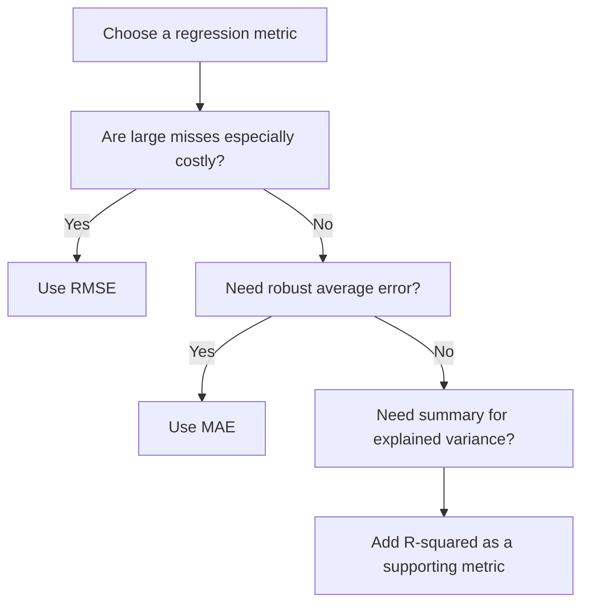

# Regression Metrics

Regression metrics quantify how far numeric predictions are from the true target values.

> [!INFO] Core idea
> Regression is not about right versus wrong. It is about the size, shape, and cost of prediction error.

## Why It Matters
The right regression metric depends on whether you care most about typical error, large misses, or a high-level summary of explained variation.

## Metric Map
| Metric | What It Emphasizes | Best When | Main Risk |
| :--- | :--- | :--- | :--- |
| **RMSE** | large errors | large misses are costly, often under roughly [[Normal Distribution\|Gaussian-like]] error assumptions | very sensitive to outliers |
| **MAE** | typical absolute error | robust reporting is needed | downplays rare big failures |
| **R-squared** | explained variance | high-level communication | easy to over-interpret |

> [!IMPORTANT] RMSE and MAE answer different questions
> RMSE punishes rare large failures more aggressively. MAE is better when you want a more stable summary of average miss size.

## 1. The Three Core Metrics
### RMSE
$$ RMSE = \sqrt{\frac{1}{n} \sum (y - \hat{y})^2} $$

### MAE
$$ MAE = \frac{1}{n} \sum |y - \hat{y}| $$

### R-squared
$$ R^2 = 1 - \frac{\text{unexplained variation}}{\text{total variation}} $$

## 2. Decision Rule


> [!WARNING] R-squared is not enough
> A model can have a reasonable R-squared and still make practically unacceptable errors on the cases that matter most.

## 3. When To Use / When Not To Use
### When To Use
- Use **RMSE** when rare large mistakes are especially painful.
- Use **MAE** when robustness and interpretability matter.
- Use **R-squared** as a communication layer on top of error metrics.

### When Not To Use
- Do not report only R-squared.
- Do not ignore the unit of the target when interpreting error magnitude.
- Do not let RMSE dominate the discussion if the dataset has heavy [[Outliers]] and that is not the business reality.

> [!TIP] Practical default
> Report MAE and RMSE together. They tell a more complete story than either one alone.

## Related Notes
- Prerequisites: [[Linear Models]]
- Related: [[Tree-based Models]], [[Outliers]]

## Example
```python
from sklearn.metrics import mean_squared_error, mean_absolute_error, r2_score
import numpy as np

y_pred = model.predict(X_test)

rmse = np.sqrt(mean_squared_error(y_test, y_pred))
mae = mean_absolute_error(y_test, y_pred)
r2 = r2_score(y_test, y_pred)
```

## Sources
- Hyndman and Koehler, *Another Look at Measures of Forecast Accuracy*.
- Willmott and Matsuura, *Advantages of the Mean Absolute Error over the Root Mean Square Error in Assessing Average Model Performance*.

## Last Reviewed
- 2026-04-10
