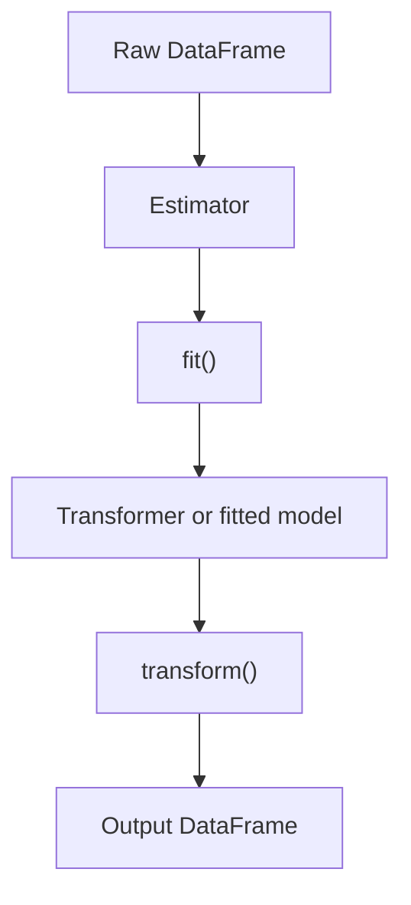

# Spark ML Estimators vs Transformers

Spark ML separates algorithms into estimators, which learn from data, and transformers, which apply a learned or predefined transformation.

> [!INFO] Core idea
> If a stage needs to inspect the data to learn parameters, it is an estimator. If it can already act on a DataFrame, it is a transformer.

## Why It Matters
This distinction is the foundation of Spark ML pipelines. If you understand it, you understand why some stages need `.fit()` and others can directly `.transform()`.

## Visual Flow


## 1. Comparison Table
| Type | Method | What It Does | Example |
| :--- | :--- | :--- | :--- |
| **Estimator** | `.fit()` | learns parameters from data | `Imputer`, `StandardScaler`, `LogisticRegression` |
| **Transformer** | `.transform()` | applies a deterministic transformation | `VectorAssembler`, `Tokenizer`, `LogisticRegressionModel` |

> [!IMPORTANT] A fitted model is usually a transformer
> Once the parameters are learned, the model no longer needs to inspect the training data again. It can just transform new input.

## 2. Pipeline Behavior
When you call `pipeline.fit(data)`:
1. Spark fits any estimator stages.
2. The fitted stage becomes a transformer.
3. Spark applies transformers in order to pass data downstream.

> [!WARNING] Fitting can trigger real computation
> Estimators often force Spark to inspect the data. Transformations may remain lazy until an action is called.

## 3. Common Gotchas
- assuming everything in a pipeline behaves lazily in the same way
- forgetting that fitted state must be saved for production reuse
- confusing a model class with its fitted-model counterpart

> [!TIP] Practical mental model
> Estimator means "learn first." Transformer means "apply now."

## Related Notes
- Prerequisites: [[Data Imputation]], [[Data Standardization]]
- Related: [[Linear Models]]

## Example
```python
from pyspark.ml.feature import Imputer

imputer = Imputer(inputCols=["age"], outputCols=["age_imputed"])
imputer_model = imputer.fit(train_df)
df_clean = imputer_model.transform(test_df)
```

## Sources
- Apache Spark ML pipeline documentation.
- Karau et al., *Learning Spark*.

## Last Reviewed
- 2026-04-10
