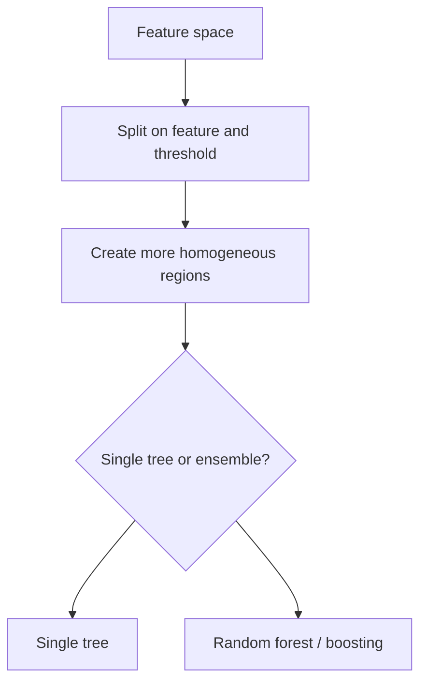

# Tree-based Models

Tree-based models learn decision rules by recursively splitting the feature space into regions with more homogeneous targets.

> [!INFO] Core idea
> Trees learn by asking a sequence of feature-based questions. Ensembles improve them by averaging or correcting many trees.

## Why It Matters
Tree-based models are among the most practical machine learning families because they handle nonlinear patterns, mixed feature types, and limited preprocessing well.

## Visual Map


## The Main Logic
At each split, the model chooses a feature and threshold that reduce impurity or error.

## Split Criteria
| Criterion | Used For | What It Optimizes |
| :--- | :--- | :--- |
| **Gini** | classification | node purity |
| **Entropy** | classification | information gain |
| **Variance reduction** | regression | lower within-node error |

> [!IMPORTANT] Trees are decision surfaces, not coefficients
> They do not assume a linear relationship between features and target. They carve the space into rule-based regions.

## Main Ensemble Families
| Family | Canonical Example | Main Strength | Main Risk |
| :--- | :--- | :--- | :--- |
| **Bagging** | [[Random Forest]] | variance reduction and robustness | larger models, lower interpretability |
| **Boosting** | [[XGBoost]] | strong predictive performance | easier to overfit or overtune |

> [!WARNING] Easy defaults still need evaluation
> Tree ensembles often perform well out of the box, but they can still overfit, leak, or hide minority-class failure if evaluation is weak.

## Practical Strengths
- handle nonlinear structure well
- often need less scaling than [[Linear Models]]
- work well on many tabular problems
- include strong practical defaults such as [[Random Forest]] and [[XGBoost]]

## Practical Limits
- single trees overfit easily
- large ensembles are harder to interpret
- categorical handling still requires thoughtful preprocessing in many libraries

> [!TIP] Practical default
> For structured tabular data, a tree ensemble is often one of the first serious baselines worth testing.

## Related Notes
- Prerequisites: [[Classification Metrics]], [[Regression Metrics]]
- Related: [[Imbalanced Datasets]], [[Data Encoding]], [[Outliers]]

## Example
```python
from sklearn.ensemble import RandomForestClassifier, GradientBoostingClassifier

rf = RandomForestClassifier(n_estimators=100, random_state=42)
gb = GradientBoostingClassifier(n_estimators=100, learning_rate=0.1)
```

## Sources
- Breiman, *Random Forests*.
- Chen and Guestrin, *XGBoost: A Scalable Tree Boosting System*.

## Last Reviewed
- 2026-04-10
