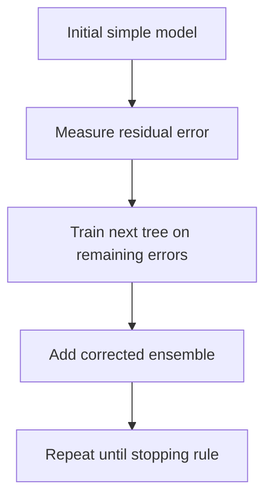

# XGBoost

XGBoost is a gradient boosting framework that builds trees sequentially to correct prior errors.

> [!INFO] Core idea
> Unlike bagging methods that average many independent trees, boosting builds trees in sequence so each new tree focuses on what the current ensemble still gets wrong.

## Why It Matters
XGBoost is one of the most common high-performance models for structured tabular data when tuning budget and predictive performance both matter.

## Visual Map

> [!IMPORTANT] Sequential correction is the differentiator
> Boosting is powerful because each stage learns from the current residual mistakes instead of starting independently from scratch.

## Core Mechanics
### Main Ingredients
- sequential tree building
- gradient-based error correction
- regularization and shrinkage
- early stopping or other control against overfitting

### Best Fit
- tabular prediction tasks where raw performance matters
- datasets where interactions and nonlinearities matter
- workflows where tuning effort is acceptable

> [!WARNING] Strong performance comes with tuning overhead
> XGBoost often rewards careful tuning, but it can overfit or become unnecessarily complex if the training loop is not controlled.

## Tradeoffs And Decision Rules
| Strength | Why It Helps | Main Tradeoff |
| :--- | :--- | :--- |
| strong predictive performance | sequentially fixes residual mistakes | more tuning burden |
| flexible handling of nonlinear structure | captures interactions well | harder to explain casually |
| regularization options | helps control overfitting | more configuration decisions |

### When To Use
- use it when tabular accuracy is a priority and tuning budget exists
- use it after establishing simpler baselines like [[Random Forest]] or linear models

### When Not To Use
- do not jump to it before you understand the metric and preprocessing story
- do not assume the most tuned model is the most maintainable one
- do not ignore overfitting just because cross-validation once looked good

> [!CAUTION] Boosting can optimize the wrong objective very efficiently
> If the metric or data split is weak, XGBoost can become very good at the wrong target behavior.

> [!TIP] Practical default
> Use XGBoost after you already have a trustworthy baseline and evaluation setup. Treat it as a refinement step, not as the first modeling idea.

## Related Notes
- Prerequisites: [[Tree-based Models]]
- Related: [[Classification Metrics]], [[Regression Metrics]], [[Imbalanced Datasets]], [[Random Forest]]

## Sources
- Friedman, *Greedy Function Approximation: A Gradient Boosting Machine*.
- Chen and Guestrin, *XGBoost: A Scalable Tree Boosting System*.

## Last Reviewed
- 2026-04-10
