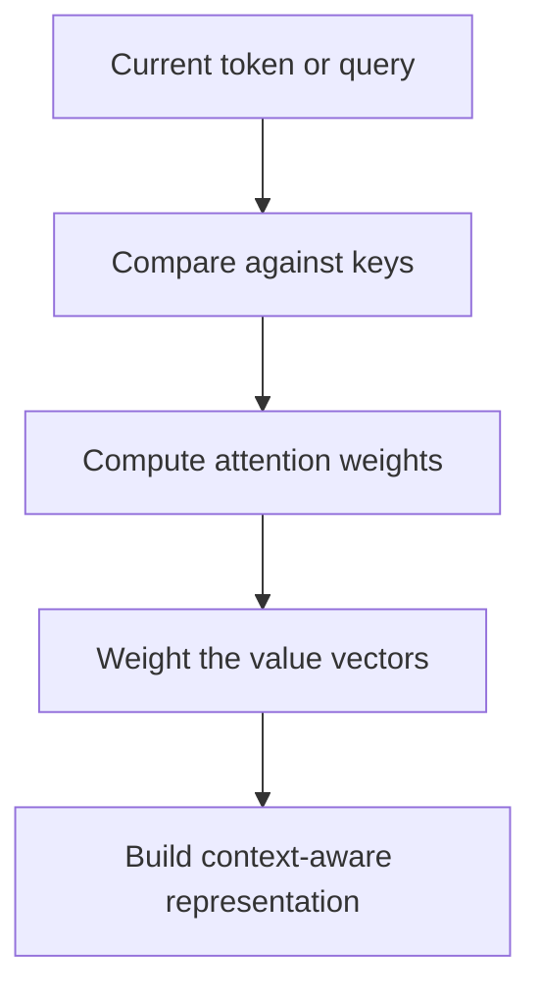

# Attention

Attention is a mechanism that lets a model focus on the most relevant parts of an input when producing a representation or prediction.

> [!INFO] Core idea
> Instead of forcing a model to compress all history into one state, attention lets it look back selectively at multiple positions.

## Why It Matters
Attention removed one of the main bottlenecks of older sequence models and became the core building block of transformers.

## Visual Map

## Core Mechanics
- A **query** asks what information is needed now.
- **Keys** describe what each position contains.
- **Values** carry the information that can be mixed into the output.
- The model scores query-key similarity, normalizes those scores, and uses them to weight the values.

> [!IMPORTANT] What changes versus recurrent memory
> In a recurrent setup, old information must survive through repeated state updates. With attention, the model can access relevant positions more directly.

## Why It Works So Well
| Property | Benefit |
| :--- | :--- |
| Direct access to multiple positions | Reduces information bottlenecks |
| Context-dependent weighting | Adapts to the current token or task |
| Parallel-friendly computation | Scales better than purely sequential recurrence |

> [!WARNING] Attention is not free
> Standard self-attention becomes expensive as sequence length grows, which is why long-context design still matters.

## When To Use / When Not To Use
### When To Use
- Use attention for sequence modeling where long-range context matters.
- Use it in NLP, retrieval, multimodal models, and transformer architectures.

### When Not To Use
- Do not assume attention alone solves grounding or factuality.
- Do not add Mermaid-like conceptual complexity to a note if a table or short explanation is enough.

> [!TIP] Practical connection
> When a note mentions transformers, retrieval-conditioned generation, or context windows, attention is usually part of the explanation path.

## Related Notes
- Prerequisites: [[Neural Networks]], [[NLP]]
- Related: [[LSTMs (Long Short-Term Memory)]], [[Language Models]], [[RAG (Retrieval Augmented Generation)]]

## Sources
- Bahdanau, Cho, and Bengio, *Neural Machine Translation by Jointly Learning to Align and Translate*.
- Vaswani et al., *Attention Is All You Need*.

## Last Reviewed
- 2026-04-10
