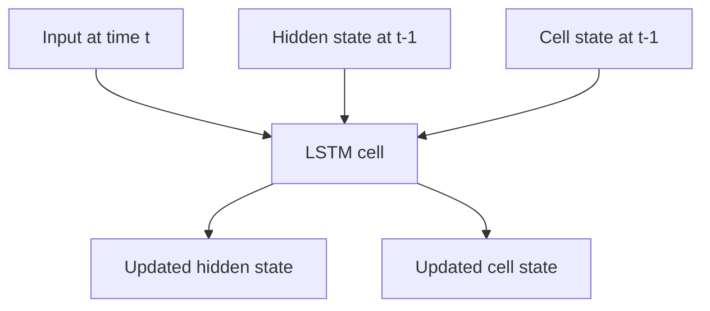

# LSTMs (Long Short-Term Memory)

LSTMs are recurrent neural networks designed to preserve useful information across longer sequences than vanilla RNNs usually can.

> [!INFO] Core idea
> LSTMs make sequence memory more stable by controlling what gets stored, forgotten, and exposed at each step.

## Why It Matters
Before transformers dominated modern [[NLP]], LSTMs were one of the main practical sequence models for text, speech, and time series.

## Visual Map

## 1. The Vanilla RNN Problem
Vanilla RNNs pass a hidden state from one step to the next. Over long sequences, that leads to:
- vanishing or exploding gradients
- difficulty preserving long-range context
- information bottlenecks

> [!IMPORTANT] What LSTMs fix
> The key improvement is not that they remove sequence difficulty completely. It is that they provide a more stable memory pathway than a plain RNN.

## 2. The Three Main Gates
| Gate | Job | Intuition |
| :--- | :--- | :--- |
| **Forget gate** | decide what to discard | clear stale memory |
| **Input gate** | decide what to store | write new useful context |
| **Output gate** | decide what to expose | reveal the right part of memory |

## 3. Why They Worked
- better handling of longer dependencies than vanilla RNNs
- more stable training on sequential data
- practical performance on many pre-transformer NLP tasks

> [!WARNING] They are still sequential
> LSTMs process data step by step, which makes them harder to parallelize than transformer-based models.

## 4. Relationship To Attention
[[Attention]] reduces the need to compress everything into one evolving state by letting the model look back at multiple relevant positions directly.

## 5. When To Use / When Not To Use
### When To Use
- Use LSTMs for sequence problems when a lightweight recurrent baseline is useful.
- Use them when you want historical continuity with older NLP or time-series pipelines.

### When Not To Use
- Do not default to LSTMs for very long-context NLP when transformer architectures are more suitable.
- Do not assume better memory means better parallelism or easier scaling.

> [!TIP] Practical place in the vault
> Read LSTMs as the bridge between classic sequential recurrence and modern attention-based language modeling.

## Related Notes
- Prerequisites: [[Neural Networks]], [[NLP]]
- Related: [[Attention]], [[Language Models]]

## Sources
- Hochreiter and Schmidhuber, *Long Short-Term Memory*.
- Tunstall, von Werra, and Wolf, *Natural Language Processing with Transformers*.

## Last Reviewed
- 2026-04-10
