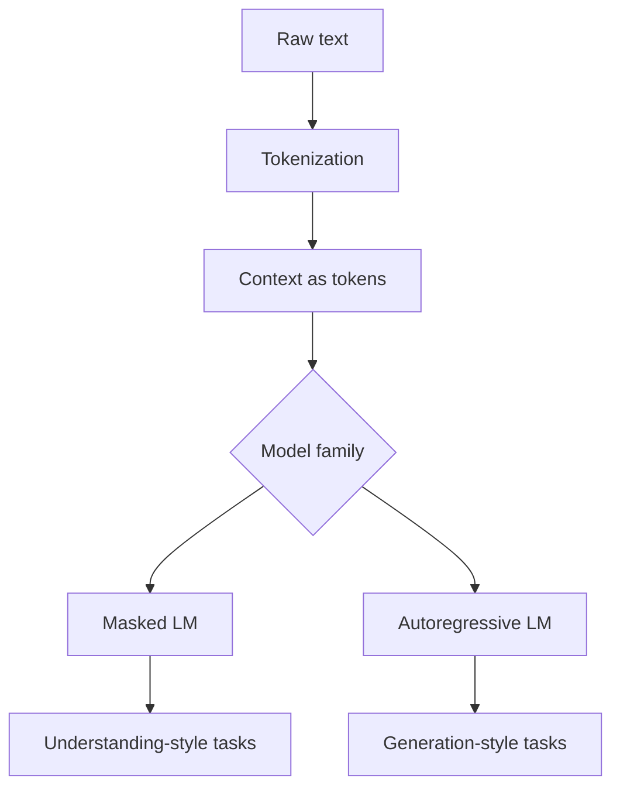

# Language Models

Language models assign probabilities to token sequences and learn patterns that let them classify, complete, or generate text.

> [!INFO] Mental model
> A language model predicts **tokens**, not whole ideas. Everything else emerges from repeated token-level prediction.

## Why It Matters
Language models are the foundation of modern NLP systems, from classic representation-learning models to chat assistants and code generation systems.

## Visual Pipeline

## 1. Tokens First
Language models read sequences of **tokens**, which may be words, subwords, or characters.

> [!IMPORTANT] Tokenization is architectural
> Tokenization affects vocabulary size, sequence length, memory use, and how efficiently the model can represent language.

## 2. The Two Main Families
| Family | Core Prediction | Context Access | Canonical Example | Best Known For |
| :--- | :--- | :--- | :--- | :--- |
| **Masked LM** | predict missing tokens | left and right context | BERT | understanding and representation learning |
| **Autoregressive LM** | predict next token | prior context only | GPT-style models | open-ended generation |

### Masked Language Models
- predict masked tokens inside a sentence
- use bidirectional context
- strong for representation-heavy tasks

### Autoregressive Language Models
- predict one token after another
- naturally support generation
- power most chat and completion systems

> [!WARNING] Fluency is not truth
> A language model can produce convincing text even when the underlying answer is poorly grounded or incorrect.

## 3. Why Context Window Matters
Language models only reason over a limited number of tokens at a time. That affects:
- how much history they can use
- whether long documents must be chunked
- whether systems like [[RAG (Retrieval Augmented Generation)]] are needed
- whether systems like [[020 AI Agents|AI Agents]] add tools and control loops around the model

## 4. When To Use / When Not To Use
### When To Use
- Use language models when the input or output is natural language.
- Use autoregressive models for generation, dialogue, rewriting, and completion.
- Use encoder-style models when you need compact textual representations.

### When Not To Use
- Do not assume a larger model automatically solves domain grounding.
- Do not ignore tokenization and context-window constraints in system design.
- Do not treat fluent output as guaranteed factual output.

> [!TIP] Practical framing
> If the task is mostly **understanding**, start with encoder-style thinking. If it is mostly **generation**, start with autoregressive thinking.

## Related Notes
- Prerequisites: [[NLP]], [[Neural Networks]]
- Related: [[LSTMs (Long Short-Term Memory)]], [[Attention]], [[RAG (Retrieval Augmented Generation)]], [[020 AI Agents|AI Agents]], [[Agentic Systems Index]]

## Sources
- Bengio et al., *A Neural Probabilistic Language Model*.
- Jurafsky and Martin, *Speech and Language Processing*.

## Last Reviewed
- 2026-04-10
