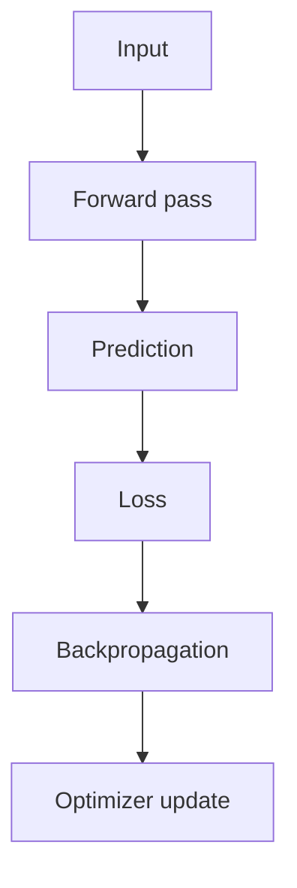

# Neural Networks

Neural networks are function approximators built by stacking weighted transformations and nonlinear activations.

> [!INFO] Core idea
> A neural network learns layers of representation. Each layer transforms the input into a more useful internal view for the task.

## Why It Matters
Neural networks power modern deep learning across tabular modeling, computer vision, NLP, recommendation systems, and generative AI.

## Learning Flow


## The Perceptron
A neuron computes a weighted sum plus bias, then applies an activation:
$$ z = \sum_i w_i x_i + b $$
$$ \hat{y} = \sigma(z) $$

> [!IMPORTANT] Nonlinearity is the turning point
> Without nonlinear activation functions, a deep stack collapses into something equivalent to a linear model.

## Common Architecture Families
| Architecture    | Best For                       | Signature Strength             |
| :-------------- | :----------------------------- | :----------------------------- |
| **MLP**         | tabular or vector data         | flexible dense modeling        |
| **CNN**         | images and spatial signals     | local pattern detection        |
| **RNN / LSTM**  | sequential data                | recurrence over time           |
| **Transformer** | long-context sequence modeling | attention-based context mixing |

## Training Ingredients
- forward pass
- loss computation
- backpropagation
- optimizer update

> [!WARNING] Expressive does not mean easy
> Neural networks are powerful, but they are also data-hungry, sensitive to tuning, and often less interpretable than simpler models.

## Practical Requirements
- handle missing values with [[Data Imputation]]
- scale features when appropriate with [[Data Standardization]]
- encode categories with [[Data Encoding]] or learned embeddings

## When To Use / When Not To Use
### When To Use
- Use neural networks when nonlinear structure is important.
- Use them when representation learning matters more than direct coefficient interpretation.

### When Not To Use
- Do not default to deep learning when a simpler baseline answers the business need.
- Do not assume expressive capacity compensates for weak feature preparation or poor labeling.

> [!TIP] Practical default
> Start with the simplest network family that matches the data modality, then expand only when the task requires more capacity.

## Related Notes
- Prerequisites: [[Linear Models]]
- Related: [[LSTMs (Long Short-Term Memory)]], [[Attention]], [[Language Models]]

## Example
```python
import tensorflow as tf
from tensorflow.keras import Sequential
from tensorflow.keras.layers import Dense

model = Sequential([
    Dense(12, activation="relu", input_dim=8),
    Dense(8, activation="relu"),
    Dense(1, activation="sigmoid"),
])

model.compile(loss="binary_crossentropy", optimizer="adam", metrics=["accuracy"])
```

## Sources
- Goodfellow, Bengio, and Courville, *Deep Learning*.
- Rumelhart, Hinton, and Williams, *Learning Representations by Back-Propagating Errors*.

## Last Reviewed
- 2026-04-10
