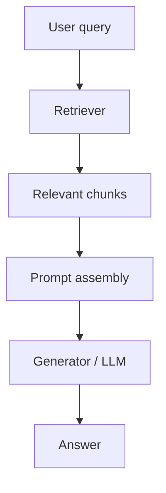

# RAG (Retrieval Augmented Generation)

RAG is a system pattern where a language model answers using retrieved external context instead of relying only on what is stored in its parameters.

> [!INFO] Core idea
> RAG separates knowledge access from text generation. The retriever finds the evidence and the generator turns that evidence into an answer.

## Why It Matters
RAG is one of the most practical ways to ground LLMs on private knowledge, keep answers more current, and reduce purely parametric guessing.
In agentic systems, `RAG` often becomes one tool or memory-adjacent subsystem rather than the whole architecture.

## Core Architecture

> [!WARNING] Retrieval quality is the bottleneck
> If the retriever surfaces weak or irrelevant context, the generator usually cannot repair the system on its own.

## 1. Main Components
### Retriever
- finds relevant chunks from a knowledge source
- may be sparse, dense, or hybrid

### Generator
- produces the final answer using the retrieved context
- is usually a language model conditioned on both the query and the retrieved text

## 2. Retrieval Styles
| Style | Best For | Main Strength | Main Risk |
| :--- | :--- | :--- | :--- |
| **Sparse** | lexical or keyword-sensitive search | fast and interpretable | misses semantic similarity |
| **Dense** | semantic retrieval | meaning-aware matching | adds embedding and vector-search complexity |
| **Hybrid** | practical production retrieval | balances lexical and semantic signals | more moving parts |

> [!IMPORTANT] RAG is a system, not a single trick
> Chunking, indexing, retrieval, prompt assembly, and answer generation all affect quality.

## 3. Design Choices That Matter
- chunking strategy
- embedding model
- retrieval method
- reranking
- prompt construction
- context budget

## 4. Evaluation
- context precision
- context recall
- final answer quality

> [!CAUTION] Good retrieval does not guarantee a good answer
> The retrieved context still needs to be correctly selected, formatted, and used by the generator.

## 5. When To Use / When Not To Use
### When To Use
- Use RAG when the answer depends on external or changing knowledge.
- Use it for private documents, internal knowledge bases, or domain-specific corpora.

### When Not To Use
- Do not add RAG when the task is self-contained and the model already has the needed context.
- Do not assume RAG is automatically better if the corpus, chunking, or retrieval layer is weak.

> [!TIP] Practical default
> In real applications, a simple hybrid retriever plus clean chunking often beats a more complex setup with poor document preparation.

## Related Notes
- Prerequisites: [[Language Models]], [[Attention]]
- Related: [[NLP]], [[020 AI Agents|AI Agents]], [[070 Memory in Agent Systems|Memory in Agent Systems]], [[Agentic Systems Index]]

## Sources
- Lewis et al., *Retrieval-Augmented Generation for Knowledge-Intensive NLP Tasks*.
- Izacard and Grave, *Leveraging Passage Retrieval with Generative Models for Open Domain Question Answering*.

## Last Reviewed
- 2026-04-10
