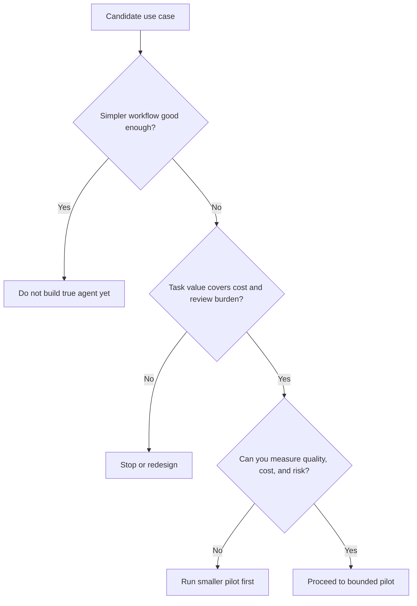

# Economic and ROI Analysis for Agentic Systems

Economic and ROI analysis for agentic systems focuses on whether the added flexibility of an agent produces enough value to justify its extra cost, latency, risk, and operating burden.

> [!INFO] Core idea
> The right comparison is not “agent vs no AI.” It is “agent vs the simplest workflow that could solve the same task.”

## Why It Matters
Many teams can explain why an agent is technically possible before they can explain why it is economically sensible. That usually leads to attractive demos with weak production cases. The real decision is whether dynamic control flow, tool use, and supervision reduce enough manual effort or failure cost to pay for the system.

## Executive Lens
| Lens | Positive Signal | Negative Signal | Main Metric |
| :--- | :--- | :--- | :--- |
| labor leverage | removes material analyst or operator time | only saves a few low-value clicks | minutes saved per completed task |
| quality uplift | reduces rework, escalation, or missed edge cases | output still needs near-total human rewrite | success rate and rework rate |
| economic fit | task value absorbs model, tool, and review cost | each successful run costs too much | cost per successful task |
| operating fit | governance and evals are sustainable | every rollout increases ops burden sharply | maintenance and review hours |

> [!IMPORTANT] ROI is baseline-relative
> An agent only earns its keep if it beats a simpler baseline on the same task, not if it merely looks more capable in isolation.

## Go Or No-Go Map

## Economic Stack
| Cost Layer | What It Includes | Commonly Underestimated Part |
| :--- | :--- | :--- |
| model and token cost | inference, long traces, retries, parallel agents | multi-agent and long-running loops can multiply cost quickly |
| tool and environment cost | browser sessions, sandboxes, APIs, search, storage | idle time and duplicated environments |
| review cost | human approvals, QA, exception handling | senior reviewer time becomes the hidden bottleneck |
| evaluation cost | task sets, trace review, grading, regressions | eval maintenance after every prompt or tool change |
| governance cost | logging, auditability, guardrails, incident response | policy work grows faster in high-impact workflows |
| adoption cost | training, workflow change, trust-building | users keep parallel manual processes longer than expected |

### Practical ROI Frame
| Component | Question |
| :--- | :--- |
| value created | what expensive or slow work becomes cheaper, faster, or more reliable? |
| cost avoided | what rework, missed cases, or exception handling disappears? |
| direct cost | what does each run consume in model, tool, and environment spend? |
| supervision cost | how much human review remains after the system is “working”? |
| risk-adjusted penalty | what is the expected cost of harmful errors, rollbacks, or mistrust? |

> [!CAUTION] Operating cost usually arrives after the demo
> The first prototype mostly reveals technical feasibility. The real economic burden often appears later in eval upkeep, reviewer time, incident handling, and integration drift.

## Pilot Metrics That Matter
| Stage | Minimum Metrics |
| :--- | :--- |
| prototype | task completion rate, latency, gross cost per run |
| pilot | cost per successful task, human review rate, rollback or escalation rate |
| production candidate | total cost of ownership, trend in maintenance load, adoption and trust signals |

### Useful Threshold Questions
- how much manual effort is removed per successful run?
- how often does the system require human rescue?
- what simpler baseline should this beat?
- does added orchestration improve outcomes enough to justify its token and review cost?
- can the same tool stack be reused across multiple workflows?

## Strong Economic Signals
- the task is high value and recurrent
- variability or exceptions make deterministic automation expensive to maintain
- the same tools or instructions can be reused across multiple workflows
- review cost declines materially after the pilot rather than staying flat

## Failure Modes
- comparing the agent only against manual work instead of the best simpler automation baseline
- counting draft generation as savings even when a human still rewrites everything
- ignoring review, eval, and maintenance labor in ROI claims
- using multi-agent decomposition where a bounded single-agent loop would be cheaper and easier to govern
- extrapolating from demo success without measuring production error cost

> [!WARNING] “Demo value” is not production value
> A system that produces impressive traces can still be a bad investment if it burns tokens, consumes reviewer time, or creates too much operational drag.

> [!TIP] Practical default
> Run the first business case as a bounded pilot: compare the candidate agent against a simpler baseline, measure cost per successful task, then promote only if quality gains and labor savings remain positive after review cost is included.

## Related Notes
- Prerequisites: [[010 When to Use Agentic Systems|When to Use Agentic Systems]]
- Related: [[020 AI Agents|AI Agents]], [[010 Applied Agentic Architectures|Applied Agentic Architectures]], [[100 Evaluation, Observability, and Governance for Agent Systems|Evaluation, Observability, and Governance for Agent Systems]], [[040 Validation and Eval Design for Agent Architectures|Validation and Eval Design for Agent Architectures]], [[060 Orchestration Trade-offs and Pattern Selection|Orchestration Trade-offs and Pattern Selection]]

## Sources
- [A practical guide to building agents | OpenAI](https://openai.com/business/guides-and-resources/a-practical-guide-to-building-ai-agents/)
- [New tools for building agents | OpenAI](https://openai.com/index/new-tools-for-building-agents/)
- [Building Effective AI Agents | Anthropic](https://www.anthropic.com/engineering/building-effective-agents)
- [How we built our multi-agent research system | Anthropic](https://www.anthropic.com/engineering/multi-agent-research-system)
- [Demystifying evals for AI agents | Anthropic](https://www.anthropic.com/engineering/demystifying-evals-for-ai-agents)
- See [[010 Agentic Systems Sources and Research Log|Agentic Systems Sources and Research Log]]

## Last Reviewed
- 2026-04-18
