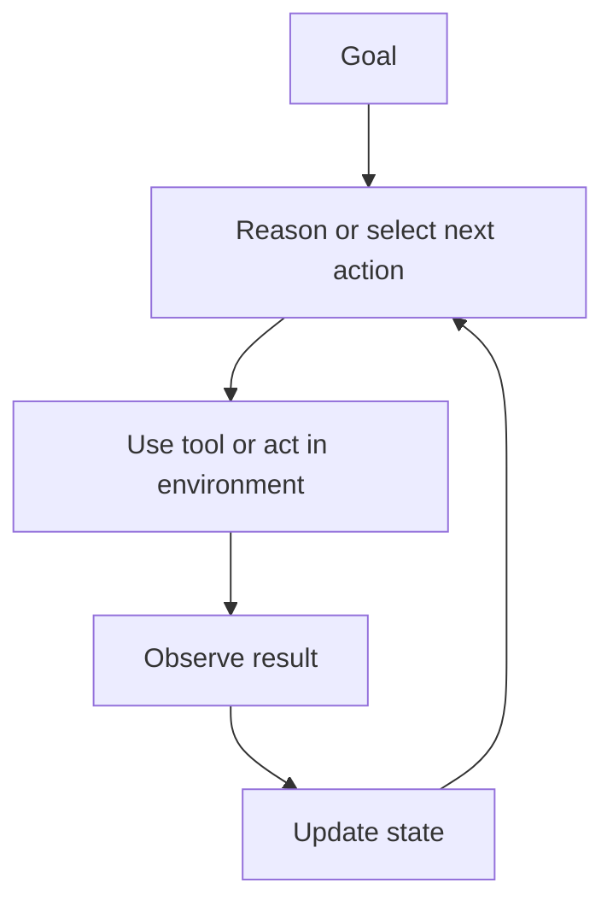

# AI Agents

An AI agent is a system that uses a model to pursue a goal through an iterative loop of reasoning, action, observation, and state updates.

> [!INFO] Core idea
> An LLM becomes part of an agentic system when it is not only generating text, but also helping decide what to do next in an environment.

## Why It Matters
This note is the foundation of the entire branch. It explains what counts as an agent, what does not, and why agent design is now central to modern LLM systems.

## Executive Lens
An agent is usually the right framing when the system needs a goal rather than a single prompt, and when the return from dynamic control flow is larger than the added operating cost.

| System Shape | Who Chooses The Next Step | Best Use | Business Threshold |
| :--- | :--- | :--- | :--- |
| Workflow | application code or business rules | stable deterministic processes | default choice when the path is known |
| `RAG`-style app | retrieval layer plus fixed generation step | knowledge access problems | use when grounding is the main need |
| Agent | model-guided loop under guardrails | tool use, dependent steps, or persistent state | justify only if flexibility saves enough manual work or rework |

> [!IMPORTANT] Workflow vs agent
> A workflow executes a predefined path. An agent chooses its next step dynamically based on goals, tools, and observations. If the system does not need tools, dependent steps, or state, the agent framing is usually unnecessary.

## Technical Core
### Minimal Agent Loop

### Core Components
| Component | Role |
| :--- | :--- |
| Goal | defines what success means |
| Model | proposes or evaluates next actions |
| Tools | allow external action or retrieval |
| Environment | where the task unfolds |
| State / memory | stores relevant context between steps |
| Control loop | determines when to continue, stop, retry, or escalate |

> [!WARNING] Not every LLM app is an agent
> A single prompt plus a formatted answer is not automatically an agentic system, even if the result looks sophisticated.

## Design Patterns and Failure Modes
### Common design choices
- bounded single-agent loop
- agent with structured tool use
- agent plus persistent memory
- agent plus delegation to specialists

### Common failure modes
- tool hallucination
- looping without progress
- stale or polluted memory
- unclear stopping conditions
- excess autonomy without approvals

> [!CAUTION] More autonomy raises the evaluation burden
> As soon as the model can choose actions dynamically, you need stronger tracing, better evals, and clearer permission boundaries.

> [!TIP] Practical default
> Start with a bounded single-agent design and only add memory, replanning, or multi-agent delegation when the task proves it needs them.

## Related Notes
- Prerequisites: [[Language Models]]
- Related: [[RAG (Retrieval Augmented Generation)]], [[When to Use Agentic Systems]], [[Tool Use and Environment Interaction]], [[Planning and Control Flow in Agent Systems]], [[Memory in Agent Systems]], [[Multi-Agent Systems]]

## Sources
- [ReAct: Synergizing Reasoning and Acting in Language Models (2022)](https://arxiv.org/abs/2210.03629)
- [MRKL Systems (2022)](https://arxiv.org/abs/2205.00445)
- [A Survey on Large Language Model based Autonomous Agents (2024)](https://arxiv.org/abs/2308.11432)
- [Anthropic, "Building Effective AI Agents" (2024-12-19)](https://www.anthropic.com/engineering/building-effective-agents)
- See [[Agentic Systems Sources and Research Log]]

## Last Reviewed
- 2026-04-10
