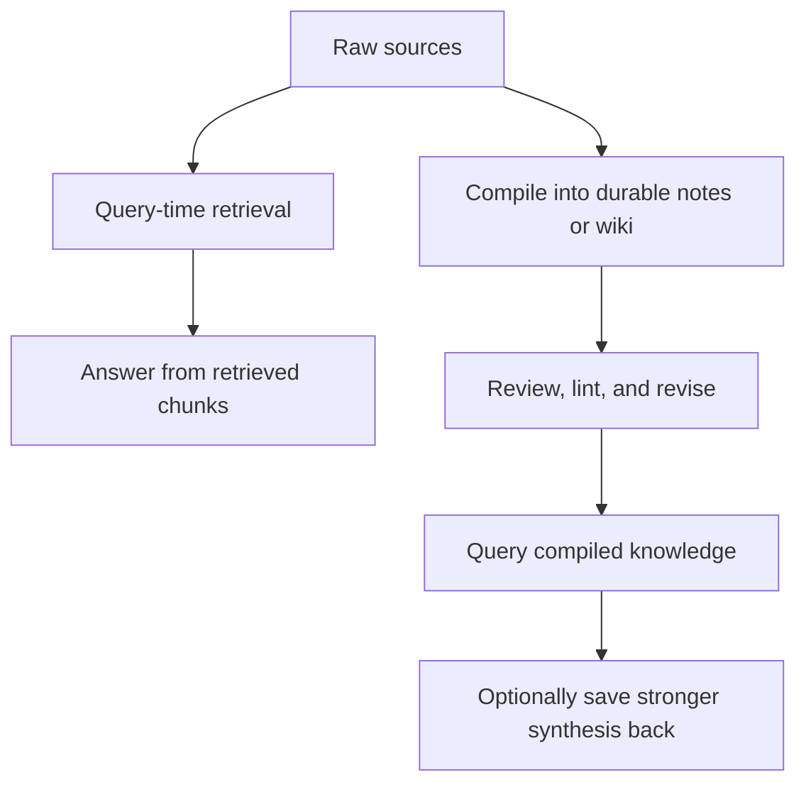

# Knowledge Compilation vs RAG

Knowledge compilation and `RAG` solve related but different problems. `RAG` retrieves raw evidence at query time, while knowledge compilation turns repeated reading and synthesis into a maintained artifact that can be queried, reviewed, and improved over time.

> [!INFO] Core idea
> `RAG` asks the model to rediscover the answer from raw material each time. Knowledge compilation asks the model to build and maintain a durable intermediate layer such as a wiki, synthesis set, or structured note graph.

## Why It Matters
If you treat every knowledge problem as `RAG`, the model keeps rebuilding the same synthesis from scratch. If you treat every knowledge problem as a compiled wiki, you can lock in bad summaries, stale claims, and editorial debt. The practical question is not which pattern is "best", but which one matches the shape of the work.

## Executive Lens
| Pattern | Primary Move | What Accumulates | Best Fit | Main Failure |
| :--- | :--- | :--- | :--- | :--- |
| `RAG` | retrieve raw chunks at query time | little beyond logs and caches | broad search over changing corpora | repeated re-synthesis with weak accumulation |
| compiled knowledge layer | ingest and rewrite durable pages | summaries, links, contradictions, decisions | curated domains where synthesis compounds | errors become sticky if review is weak |
| hybrid | combine compiled pages with just-in-time retrieval | durable synthesis plus fresh evidence | most serious long-running systems | complexity without clear boundaries |

> [!IMPORTANT] `RAG` is not obsolete
> Compiled knowledge is not a universal replacement for retrieval. `RAG` remains strong for high-churn corpora, broad search, and situations where you need fresh evidence instead of a maintained synthesis layer.

## Architecture Contrast

## Technical Core
### What Changes When Knowledge Is Compiled
| Dimension | `RAG` Default | Compiled Knowledge Default |
| :--- | :--- | :--- |
| source of truth | raw source files and retrieval index | raw source files plus maintained synthesis layer |
| runtime cost | repeated search and synthesis | more ingest and maintenance, lighter repeated questions |
| editorial burden | lower up front | higher, because pages must stay coherent |
| provenance challenge | chunk citation and freshness | keeping compiled claims tied to sources |
| best question shape | "find the relevant evidence now" | "what have we learned so far across many sources?" |

### Use Knowledge Compilation When
- the domain is curated rather than open-ended
- the same topic will be queried many times over weeks or months
- cross-source synthesis matters more than single-document lookup
- a human can review promoted summaries, contradictions, and schema changes
- the artifact itself is valuable, such as a vault, research wiki, handbook, or course notes set

### Use `RAG` When
- the corpus is large, noisy, or high-churn
- freshness is more important than durable synthesis
- you mostly need search plus citation rather than a maintained knowledge artifact
- ingest cost or editorial review would outweigh the value of persistent notes

### The Practical Default Is Hybrid
- keep raw sources immutable
- compile durable pages only for stable, high-value concepts and syntheses
- fall back to runtime retrieval when freshness or long-tail recall matters
- separate "compiled notes" from "search over raw material" in both tools and review policy

> [!WARNING] Compiled errors can become structural
> A bad ingest into a durable wiki is more dangerous than a bad one-off answer, because later queries may treat the compiled page as trusted context. Review and provenance are not optional.

## Design Patterns and Failure Modes
### Strong patterns
- compile small, atomic pages instead of giant summaries
- keep raw, compiled, and review-state layers separate
- save only substantive answers back into the compiled layer
- use linting to catch broken links, stale pages, duplicates, and oversized pages
- treat compiled pages as editable editorial artifacts, not as permanent truths

### Failure modes
- replacing all retrieval with a wiki too early
- treating the compiled layer as if it were automatically correct
- letting the model read and rewrite the whole wiki on every ingest
- compiling every transient question into a permanent note
- using graph aesthetics as proof that the knowledge layer is good

> [!TIP] Good default
> For personal or team-scale knowledge work, use a hybrid model: immutable raw sources, a compact compiled wiki for stable synthesis, and just-in-time retrieval for freshness or long-tail detail.

## Where This Leads Next
| Next Path | Use It When |
| :--- | :--- |
| [[085 Knowledge and Editorial Agents\|Knowledge and Editorial Agents]] | you want to design agents that maintain a vault, wiki, handbook, or research base |
| [[090 LLM Wiki and Agentic Knowledge Bases\|LLM Wiki and Agentic Knowledge Bases]] | you want a concrete operating pattern for raw sources, compiled notes, indexes, and review loops |
| [[095 Editorial Review Loops for AI-Maintained Knowledge\|Editorial Review Loops for AI-Maintained Knowledge]] | you need promotion policy, lifecycle states, and trust boundaries for durable knowledge artifacts |

## Related Notes
- Prerequisites: [[020 AI Agents|AI Agents]], [[070 Memory in Agent Systems|Memory in Agent Systems]]
- Related: [[010 When to Use Agentic Systems|When to Use Agentic Systems]], [[030 Tool Use and Environment Interaction|Tool Use and Environment Interaction]], [[085 Knowledge and Editorial Agents|Knowledge and Editorial Agents]], [[090 LLM Wiki and Agentic Knowledge Bases|LLM Wiki and Agentic Knowledge Bases]], [[095 Editorial Review Loops for AI-Maintained Knowledge|Editorial Review Loops for AI-Maintained Knowledge]], [[80 Knowledge Ops/010 Knowledge Ops|Knowledge Ops]], [[RAG (Retrieval Augmented Generation)]]

## Sources
- [LLM Wiki | Andrej Karpathy](https://gist.github.com/karpathy/442a6bf555914893e9891c11519de94f)
- [Agentic Retrieval-Augmented Generation: A Survey on Agentic RAG](https://arxiv.org/abs/2501.09136)
- [Effective context engineering for AI agents | Anthropic](https://www.anthropic.com/engineering/effective-context-engineering-for-ai-agents)
- [atomicmemory/llm-wiki-compiler | GitHub](https://github.com/atomicmemory/llm-wiki-compiler)
- [Mem0: Building Production-Ready AI Agents with Scalable Long-Term Memory](https://arxiv.org/abs/2504.19413)
- See [[010 Agentic Systems Sources and Research Log|Agentic Systems Sources and Research Log]]

## Last Reviewed
- 2026-04-20
