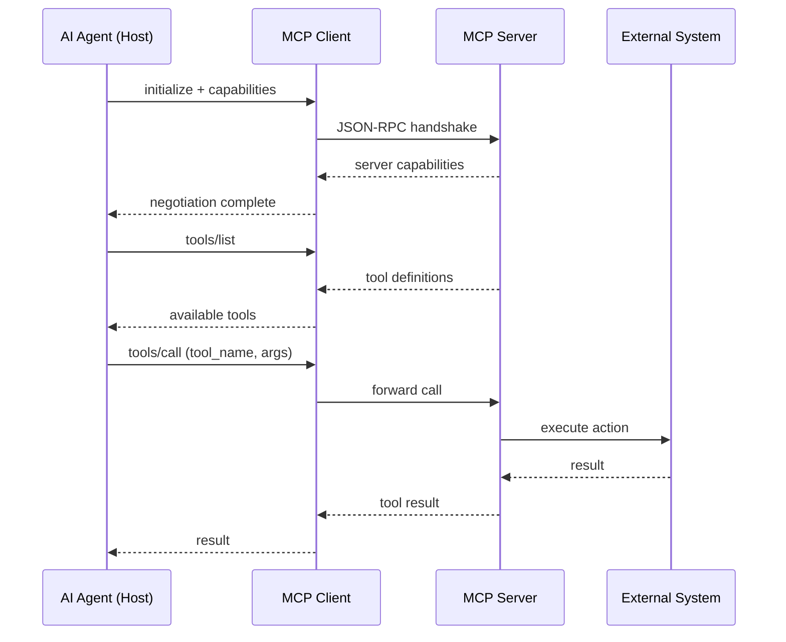

# MCP and Connector Protocols

MCP (Model Context Protocol) is an open standard protocol that lets AI agents connect to external tools, data sources, and services through a unified client-server interface, acting as a universal adapter layer between models and the systems they need to interact with.

> [!INFO] Core idea
> MCP is to AI integrations what USB-C is to hardware: a single standard that replaces proprietary adapters, letting one server implementation work across Claude, ChatGPT, Cursor, and any other MCP-compatible agent.

## Why It Matters

Before MCP, every AI assistant had its own proprietary tool format. Each integration required a custom implementation, creating fragmented maintenance burden across teams. MCP standardizes the connection layer so that a single server implementation works everywhere.

MCP is only the protocol layer. Real products still add their own host behaviors around it, such as authentication, admin rollout, synced indexing, app metadata, approvals, and UI semantics. In ChatGPT, these connected experiences are now called `apps` rather than `connectors`; custom apps can use MCP, but app-level capabilities such as sync, deep research, write actions, and rich UI sit above the protocol.

## Executive Lens

| Integration Pattern | Best For | Return Signal | Main Risk |
| :--- | :--- | :--- | :--- |
| Custom function tools | one-off agent actions | fastest for single integrations | schema maintenance per tool |
| MCP servers | reuse across agents and teams | build once, use everywhere | trust, approval, and standardization complexity |
| Direct API calls | low-latency internal services | fastest execution | duplication across integrations |

> [!IMPORTANT] MCP is not the whole integration story
> MCP shines for reusable tool abstractions. Custom functions remain the fastest path for one-off actions. Choose based on reuse potential, not trends.

> [!TIP] Adoption lens
> Standardize on MCP when the same connector surface needs to serve multiple agents, teams, or products. For one-off integrations or fast-moving prototypes, the governance and rollout overhead can outweigh the reuse benefit.

## Technical Core

### Architecture

### Three Primitives
MCP exposes three types of capability:

| Primitive | Purpose | Example |
| :--- | :--- | :--- |
| **Tools** | executable functions the agent can call | `search_products`, `send_email` |
| **Resources** | contextual data the agent can read | files, database records, docs |
| **Prompts** | templated workflows | email drafts, code templates |

### Protocol Layer Vs Host Layer
| Layer | Responsibility | Example |
| :--- | :--- | :--- |
| Protocol | JSON-RPC contract, tools, resources, prompts, transport | MCP client and server |
| Host product layer | auth, rollout, sync, approvals, metadata, UI behavior | ChatGPT apps, synced apps, IDE or desktop agent runtimes |

### Transport Options
| Transport | Use When | Tradeoff |
| :--- | :--- | :--- |
| stdio | local development, same machine | same-host only |
| Streamable HTTP | cloud deployment or remote servers | can optionally use SSE semantics, but adds session and deployment complexity |

### Tool Surface Design
| Pattern | Use When | Main Tradeoff |
| :--- | :--- | :--- |
| Narrow explicit tools | actions are stable and high precision matters | more schema maintenance |
| Broad search plus execute surface | the API or connector catalog is too large to enumerate safely | more reasoning burden on the agent |

### MCP Is Not A Full Coding Harness
| Need | MCP Covers It? | What A Full Harness Still Adds |
| :--- | :--- | :--- |
| Reusable tool and resource access | yes | host-specific policy and UX |
| Durable threads and turns | no | session lifecycle and persistence |
| Approval pauses and sticky permissions | no | policy layer plus client prompts |
| Diff, artifact, and progress semantics | no | event stream designed for reviewable work |
| Resumability across CLI, IDE, app, or cloud | no | runtime-specific thread and artifact continuity |

Products can use MCP underneath and still need a richer session layer above it. OpenAI documents this explicitly in the Codex App Server story: MCP was useful for interoperability, but richer coding-agent semantics needed a separate harness protocol.

> [!WARNING] Server trust is shared trust
> An MCP server has full access to the tools and data you expose. Do not connect to untrusted servers without scoping which capabilities are available.

## Design Patterns and Failure Modes

### Strong patterns
- start with official MCP servers before building custom ones
- use a small stable tool surface for very large APIs or connector catalogs
- scope OAuth 2.1 + PKCE for remote production servers
- separate read-only tools from write or high-impact tools

### Failure modes
- tool schema bloat from too many narrow tools
- trust model confusion between local and remote servers
- cold start latency on first tool call
- stale tool descriptions after API changes

> [!CAUTION] Local is not automatically safe
> A local MCP server can still read your filesystem, run commands, or access credentials. The security model is about what the server can access, not where it runs.

> [!TIP] Practical default
> Start with official servers (filesystem, git, postgres). Build custom servers only when reuse across agents justifies the maintenance investment.

## Related Notes

- Prerequisites: [[Tool Use and Environment Interaction]]
- Related: [[Tool Ecosystems and Harness Engineering]], [[Planning and Control Flow in Agent Systems]], [[Evaluation, Observability, and Governance for Agent Systems]], [[Agent Architectures and Orchestration Patterns]]

## Sources

- [MCP Specification](https://modelcontextprotocol.io/specification/latest)
- [MCP Transports](https://modelcontextprotocol.io/specification/2025-11-25/basic/transports)
- [Anthropic, "Introducing the Model Context Protocol" (2024)](https://www.anthropic.com/news/model-context-protocol)
- [Apps in ChatGPT | OpenAI Help Center](https://help.openai.com/en/articles/11487775-connectors-in-chatgpt)
- [MCP Ecosystem](https://github.com/modelcontextprotocol/servers)
- [Linux Foundation governance (Dec 2025)](https://foundation.modelcontextprotocol.io)
- [Unlocking the Codex harness: how we built the App Server | OpenAI](https://openai.com/index/unlocking-the-codex-harness/)
- See [[Agentic Systems Sources and Research Log]]

## Last Reviewed

- 2026-04-18
