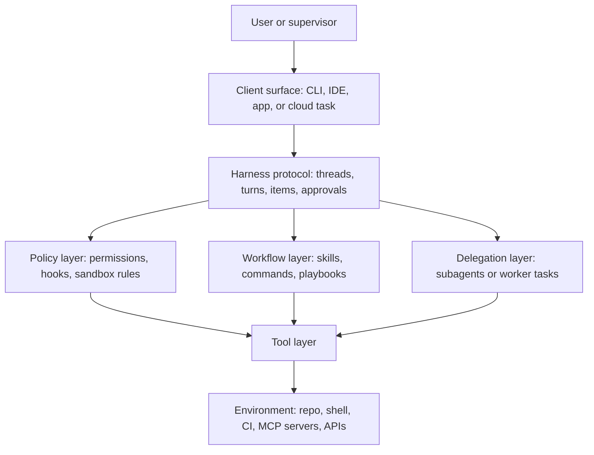

# Tool Ecosystems and Harness Engineering

Tool ecosystems and harness engineering describe the runtime layer that makes a modern agent practical: tools, reusable workflows, permissions, hooks, session semantics, isolation strategy, and the surfaces through which people supervise work.

> [!INFO] Core idea
> In modern software agents, the model is not the whole system. The harness defines what the agent can do, how it asks for permission, how it persists work, and how it turns actions into reviewable artifacts.

## Why It Matters
Two agents can use similarly capable models and still feel completely different in practice because their harnesses are different. The harness decides whether work happens in a CLI, IDE, desktop app, or cloud task, whether actions pause for approval, whether progress is visible as events or diffs, and whether the system can safely resume long-running work later.

> [!IMPORTANT] MCP is useful but narrower than a full harness
> MCP standardizes tools, resources, and prompts. A software-agent harness also needs thread lifecycle, approvals, artifact semantics, isolation, and resumability across surfaces.

## Harness Map

## Surface Taxonomy
| Surface | What It Does | Typical Example |
| :--- | :--- | :--- |
| Tools | execute actions with structured arguments | run tests, edit file, call API |
| Resources | expose readable context | docs, repo files, tickets, database rows |
| Prompts or skills | package reusable workflows and instructions | review checklist, deploy playbook, debugging routine |
| Subagents or worker tasks | isolate role, context, and sometimes tool access | code reviewer, research worker, migration specialist |
| Hooks | intercept events before or after actions | block risky commands, add lint step, inject context |
| Permissions or policy | define allow, ask, deny, and sandbox scope | read-only default, approve write, deny secrets access |
| Harness protocol | carries threads, turns, progress, approvals, and artifacts | JSON-RPC session layer, client event stream |
| Isolation primitives | keep work separated and safer to review | worktrees, containers, sandboxes, background tasks |

> [!WARNING] Hidden privilege lives between layers
> A tool may look harmless in isolation while inherited permissions, shared repo state, or a permissive hook chain make it effectively high impact. Review the combined surface, not each primitive one by one.

## MCP Vs Harness Protocols
| Layer | Best For | What It Standardizes | What It Usually Does Not Standardize |
| :--- | :--- | :--- | :--- |
| MCP | reusable integrations across hosts | tools, resources, prompts, transport | durable threads, diffs, approvals, resumability, review artifacts |
| Harness or session protocol | agent-native clients and long-running work | session lifecycle, progress events, approval pauses, artifact semantics | cross-host interoperability at the same level of portability |

MCP is the right abstraction when you want one connector surface to work across multiple agents or products. Harness protocols become important when the system needs rich session semantics such as parallel threads, resumable turns, diff streaming, or client-mediated approvals.

## Current Product Patterns
| Product Pattern | What It Highlights | Why It Matters |
| :--- | :--- | :--- |
| Codex surfaces | shared harness across CLI, IDE, app, and cloud | shows why thread lifecycle, approval pauses, worktrees, and UI-ready event streams matter |
| Codex skills | reusable bundles of instructions, resources, and scripts | separates repeatable workflows from always-on project memory |
| Claude Code skills and commands | selectively loaded playbooks and reusable procedures | keeps large workflow knowledge out of every session until needed |
| Claude Code subagents | role-specific workers with scoped tools, model choice, and optional worktree isolation | turns delegation into an explicit design primitive rather than an ad hoc prompt trick |
| Claude Code hooks and permissions | declarative control before or after tool use | shows that policy and automation belong in the harness, not only in the prompt |

> [!TIP] Practical default
> Start with the smallest harness that supports your real review loop: clear tools, explicit approvals, one reusable workflow primitive, and isolation strong enough to inspect or roll back the work.

## Design Rules
- separate the tool layer from the policy layer
- separate reusable workflow content from persistent memory or standing project instructions
- make approval semantics explicit: who decides, what pauses, what can be sticky, and what always re-prompts
- treat worktrees, sandboxes, and background tasks as architectural choices, not afterthoughts
- keep delegation narrow enough that each subagent or worker has a clear role, tool budget, and exit condition
- use MCP where reuse across hosts matters, but do not assume it replaces a richer harness when session semantics are central

## Failure Modes
- tool overload that makes discovery and selection unreliable
- hidden privilege escalation through inherited permissions or shared repo state
- stale skills or commands that encode old workflows
- subagent sprawl with unclear ownership and duplicated context
- assuming that “MCP support” means the whole agent runtime is production-ready
- weak isolation that lets one agent’s experiments leak into another branch or reviewer path

> [!CAUTION] Reusable workflows can decay silently
> Skills, commands, and hooks often keep working syntactically after the environment has changed. The result is silent drift: agents follow an obsolete playbook with high confidence.

## Related Notes
- Prerequisites: [[Tool Use and Environment Interaction]], [[MCP and Connector Protocols]]
- Related: [[Software Engineering Agents]], [[Applied Agentic Architectures]], [[Agent Architectures and Orchestration Patterns]]

## Sources
- [Unlocking the Codex harness: how we built the App Server | OpenAI](https://openai.com/index/unlocking-the-codex-harness/)
- [Introducing the Codex app | OpenAI](https://openai.com/index/introducing-the-codex-app/)
- [Apps in ChatGPT | OpenAI Help Center](https://help.openai.com/en/articles/11487775-connectors-in-chatgpt)
- [Claude Code overview](https://code.claude.com/docs/en/overview)
- [Claude Code settings](https://code.claude.com/docs/en/settings)
- [Extend Claude with skills](https://code.claude.com/docs/en/skills)
- [Create custom subagents](https://code.claude.com/docs/en/sub-agents)
- [Hooks reference](https://code.claude.com/docs/en/hooks)
- [MCP Specification](https://modelcontextprotocol.io/specification/latest)
- See [[Agentic Systems Sources and Research Log]]

## Last Reviewed
- 2026-04-18
