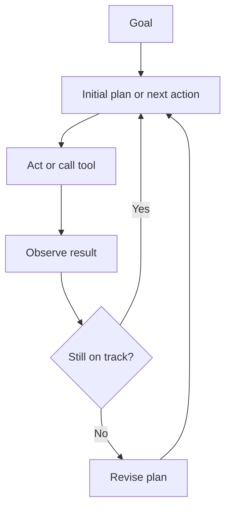

# Planning and Control Flow in Agent Systems

Planning and control flow determine how an agent chooses, sequences, revises, and stops its actions.

> [!INFO] Core idea
> Agent quality often depends less on raw model intelligence than on whether the system has the right control loop for the task.

## Why It Matters
Some tasks only need reactive next-step selection. Others benefit from explicit planning, branching search, or replanning after new observations. The wrong control pattern can waste tokens, add latency, or create brittle behavior.

## Executive Lens
| Control Style | Best For | Strength | Main Cost |
| :--- | :--- | :--- | :--- |
| Reactive loop | short bounded tasks | simple and cheap | weak on long horizons |
| Plan then execute | medium-complex tasks | clearer structure | plans may go stale |
| Replanning loop | uncertain environments | adapts to feedback | more latency |
| Search-based control | hard reasoning or long-horizon tasks | deeper exploration | highest cost and complexity |

> [!WARNING] Planning is not free intelligence
> More planning can improve difficult tasks, but it also multiplies token use, branching error, and execution time.

## Technical Core

### Key Control Patterns
| Pattern | Plain Meaning |
| :--- | :--- |
| Reactive loop | choose one next step at a time from the latest observation |
| Explicit decomposition | break the task into named subgoals before acting |
| Planner-executor | one component plans and another carries out the steps |
| Backtracking or branch search | explore alternatives, then keep the better path |
| Reflection or evaluator step | inspect the prior attempt before retrying |

### Worked Example
Suppose the task is: "Compare three vendors for a support automation project."

1. A reactive loop searches one vendor at a time, reads the latest evidence, and decides the next query after each result.
2. A plan-then-execute design first defines fixed comparison criteria like pricing, integrations, and governance, then gathers evidence for each vendor against the same checklist.
3. A replanning loop changes course if one vendor hides enterprise details and the agent has to switch to calculators, docs, or policy pages instead.
4. A reflection step checks whether each vendor now has enough evidence for every criterion before the system writes the final recommendation.

> [!IMPORTANT] Match planning depth to task uncertainty
> The best control flow is the minimum one that handles the task’s uncertainty and horizon length.

## Design Patterns and Failure Modes
### Patterns
- use reactive loops for short tasks with clear observations
- use explicit planning when the problem has dependencies or long horizons
- use replanning when the environment changes often
- use search or reflection only when the evals justify the cost

### Failure modes
- stale plans after new observations
- looping without convergence
- expensive branching with little payoff
- over-decomposition of simple tasks
- reflection steps that add text but not quality

> [!CAUTION] A beautiful plan can still be wrong
> Planning improves structure, not truth. If the model plans from weak observations or weak tool outputs, the plan can be confidently bad.

> [!TIP] Practical default
> Start reactive. Add explicit planning only when tasks regularly need multiple dependent steps or fail without lookahead.

## Related Notes
- Prerequisites: [[020 AI Agents|AI Agents]]
- Related: [[030 Tool Use and Environment Interaction|Tool Use and Environment Interaction]], [[070 Memory in Agent Systems|Memory in Agent Systems]], [[080 Agent Architectures and Orchestration Patterns|Agent Architectures and Orchestration Patterns]]

## Sources
- [ReAct: Synergizing Reasoning and Acting in Language Models (2022)](https://arxiv.org/abs/2210.03629)
- [Tree of Thoughts: Deliberate Problem Solving with Large Language Models (2023)](https://arxiv.org/abs/2305.10601)
- [Reflexion: Language Agents with Verbal Reinforcement Learning (2023)](https://arxiv.org/abs/2303.11366)
- [Language Agent Tree Search (2023)](https://arxiv.org/abs/2310.04406)
- [Anthropic, "Building Effective AI Agents" (2024-12-19)](https://www.anthropic.com/engineering/building-effective-agents)
- See [[010 Agentic Systems Sources and Research Log|Agentic Systems Sources and Research Log]]

## Last Reviewed
- 2026-04-10
