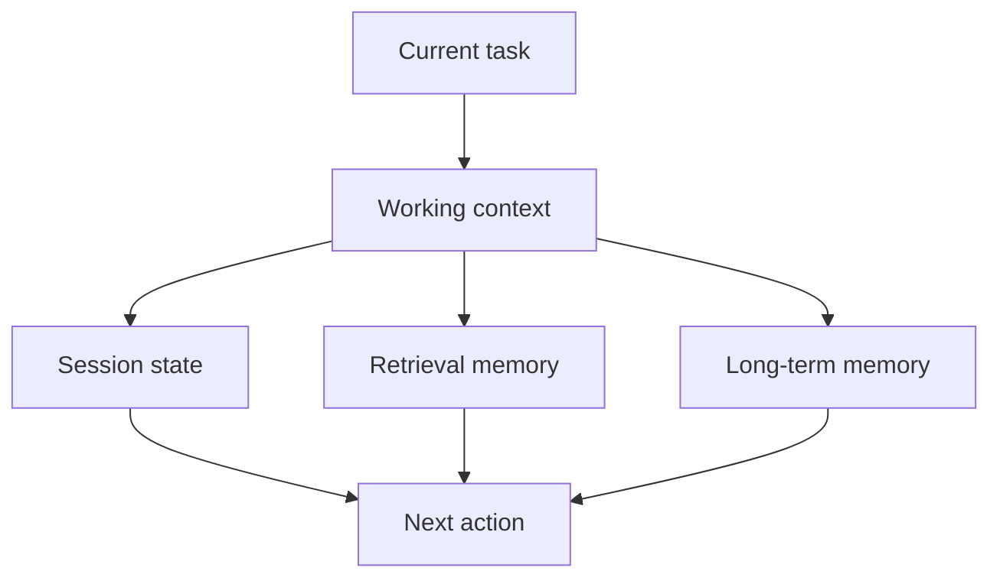

# Memory in Agent Systems

Memory in agent systems is the set of mechanisms used to preserve, retrieve, and update information beyond a single prompt context.

> [!INFO] Core idea
> Memory is not just “more context.” It is a design choice about what should persist, what should be retrievable, and what should be forgotten.

## Why It Matters
Agents often fail not because they cannot reason, but because they forget important state, carry irrelevant state forward, or persist the wrong information for too long.

## Executive Lens
| Memory Layer | What It Stores | Best Use | Main Risk |
| :--- | :--- | :--- | :--- |
| Prompt / context window | immediate working context | short tasks | fragile across long workflows |
| Session state | current task state | multi-step execution | stale state after retries |
| Retrieval memory | past artifacts or notes | episodic recall | irrelevant or misleading recall |
| Long-term profile memory | durable preferences or facts | repeated long-lived systems | privacy and contamination risk |

> [!IMPORTANT] Memory is a subsystem
> Once state persists beyond one prompt, you have to design retrieval, update policy, decay, and validation.

## Technical Core
### Useful Memory Functions
- preserve short-term task state
- recall prior tool outputs or artifacts
- retrieve relevant past experience
- summarize or compress old context
- decide what not to carry forward

### Memory vs `RAG`
| Mechanism | Core Question | Typical Timing |
| :--- | :--- | :--- |
| `RAG` | what external knowledge is relevant right now? | retrieval at answer time or step time |
| Agent memory | what state or prior information should persist across time? | across turns, retries, or sessions |

`RAG` can be one input to an agent, but it does not automatically create durable state. Memory is about persistence and update policy, not just retrieval.

> [!WARNING] Stale memory is a silent failure mode
> Old but plausible state can be more dangerous than missing state because it looks trustworthy while steering the agent incorrectly.

## Design Patterns and Failure Modes
### Useful patterns
- separate short-lived state from durable memory
- retrieve memory instead of pasting everything into context
- summarize long histories into task-relevant artifacts
- define explicit write rules for persistent memory

### Failure modes
- contamination from low-quality past outputs
- privacy leakage through persistent memory
- irrelevant recall
- memory drift after many sessions
- overreliance on memory instead of tool re-checks

> [!CAUTION] Persistent memory changes the governance profile
> Durable memory raises questions about retention, auditability, privacy, and how mistakes get corrected over time.

> [!TIP] Practical default
> Start with retrieval memory and bounded session state. Add durable long-term memory only when repeated use cases truly require it.

## Related Notes
- Prerequisites: [[020 AI Agents|AI Agents]]
- Related: [[RAG (Retrieval Augmented Generation)]], [[060 Planning and Control Flow in Agent Systems|Planning and Control Flow in Agent Systems]], [[100 Evaluation, Observability, and Governance for Agent Systems|Evaluation, Observability, and Governance for Agent Systems]]

## Sources
- [Generative Agents: Interactive Simulacra of Human Behavior (2023)](https://arxiv.org/abs/2304.03442)
- [Reflexion: Language Agents with Verbal Reinforcement Learning (2023)](https://arxiv.org/abs/2303.11366)
- [A Survey on Large Language Model based Autonomous Agents (2024)](https://arxiv.org/abs/2308.11432)
- [Anthropic, "Effective harnesses for long-running agents" (2025-11-26)](https://www.anthropic.com/engineering/effective-harnesses-for-long-running-agents)
- [Anthropic, "Scaling Managed Agents: Decoupling the brain from the hands"](https://www.anthropic.com/engineering/managed-agents)
- See [[010 Agentic Systems Sources and Research Log|Agentic Systems Sources and Research Log]]

## Last Reviewed
- 2026-04-10
