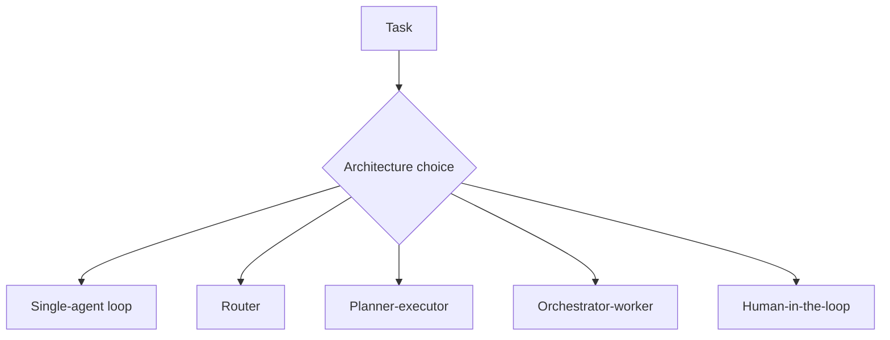

# Agent Architectures and Orchestration Patterns

Agent architectures define how goals, tools, memory, roles, and control logic are assembled into a working system.

> [!INFO] Core idea
> Architecture is the discipline of choosing the simplest orchestration pattern that reliably solves the task under your latency, cost, and governance constraints.

## Why It Matters
Many agent failures are really architecture mistakes: the wrong amount of planning, the wrong delegation pattern, or the wrong boundary between model, tools, and human review.

## Executive Lens
| Pattern | Best For | Governance Fit | Main Cost |
| :--- | :--- | :--- | :--- |
| Single-agent loop | bounded adaptive tasks | good for low-to-medium risk tasks with clear guardrails | limited specialization |
| Router | heterogeneous requests | useful when request classes are stable and auditable | routing errors |
| Planner-executor | dependent substeps | stronger reviewability than free-form loops | stale plans |
| Orchestrator-worker | decomposable workloads | only worth it when role boundaries are explicit | coordination overhead |
| Human-in-the-loop | sensitive or regulated actions | strongest trust boundary for high-impact tasks | slower execution |

> [!IMPORTANT] Pattern choice should follow task shape
> The best architecture is the one that matches uncertainty, tool dependence, risk, and required control depth, not the one that looks most sophisticated.

Long-running or background execution is a runtime model that can wrap several architectures. It is important operationally, but it is not the same abstraction as choosing between router, planner-executor, or orchestrator-worker.

## Technical Core

### Common Building Blocks
- agent loop
- tool layer
- memory layer
- delegation contract
- routing logic
- review and approval layer
- tracing and evaluation hooks

### Runtime and Execution Model
| Runtime Model | Use When | Main Concern |
| :--- | :--- | :--- |
| Synchronous execution | the task should finish within one user interaction | latency and token budget |
| Background or long-running harness | tasks wait on external systems, take longer, or need resumability | checkpoints, approvals, and trace continuity |

> [!WARNING] Composition increases failure surface
> Every added planner, worker, or review stage creates new opportunities for latency, disagreement, state drift, and monitoring gaps.

## Design Patterns and Failure Modes
### Strong patterns
- use routing when tasks naturally split by domain or toolset
- use planner-executor for dependent multi-step work
- use orchestrator-worker when delegation materially improves throughput
- use human approval for high-impact or irreversible actions

### Failure modes
- heavy orchestration for small tasks
- unclear ownership between planner and workers
- blocking review stages with no escalation path
- long-running jobs with weak resumability or trace continuity

> [!CAUTION] Background execution changes the ops model
> Once agents can run asynchronously or for long periods, retries, checkpoints, approvals, and trace persistence become first-class design concerns.

> [!TIP] Practical default
> Start with the single-agent loop. Add routing or delegation one at a time, and add background execution only when task duration or external waits force it.

## Related Notes
- Prerequisites: [[020 AI Agents|AI Agents]], [[060 Planning and Control Flow in Agent Systems|Planning and Control Flow in Agent Systems]]
- Related: [[030 Tool Use and Environment Interaction|Tool Use and Environment Interaction]], [[065 Delegation and Role Specialization|Delegation and Role Specialization]], [[090 Multi-Agent Systems|Multi-Agent Systems]], [[100 Evaluation, Observability, and Governance for Agent Systems|Evaluation, Observability, and Governance for Agent Systems]]

## Sources
- [MRKL Systems (2022)](https://arxiv.org/abs/2205.00445)
- [Anthropic, "Building Effective AI Agents" (2024-12-19)](https://www.anthropic.com/engineering/building-effective-agents)
- [Anthropic, "How we built our multi-agent research system" (2025-06-13)](https://www.anthropic.com/engineering/multi-agent-research-system)
- [OpenAI, "Introducing AgentKit" (2025-10-06)](https://openai.com/index/introducing-agentkit/)
- [OpenAI, "Background mode"](https://platform.openai.com/docs/guides/background)
- See [[010 Agentic Systems Sources and Research Log|Agentic Systems Sources and Research Log]]

## Last Reviewed
- 2026-04-18
