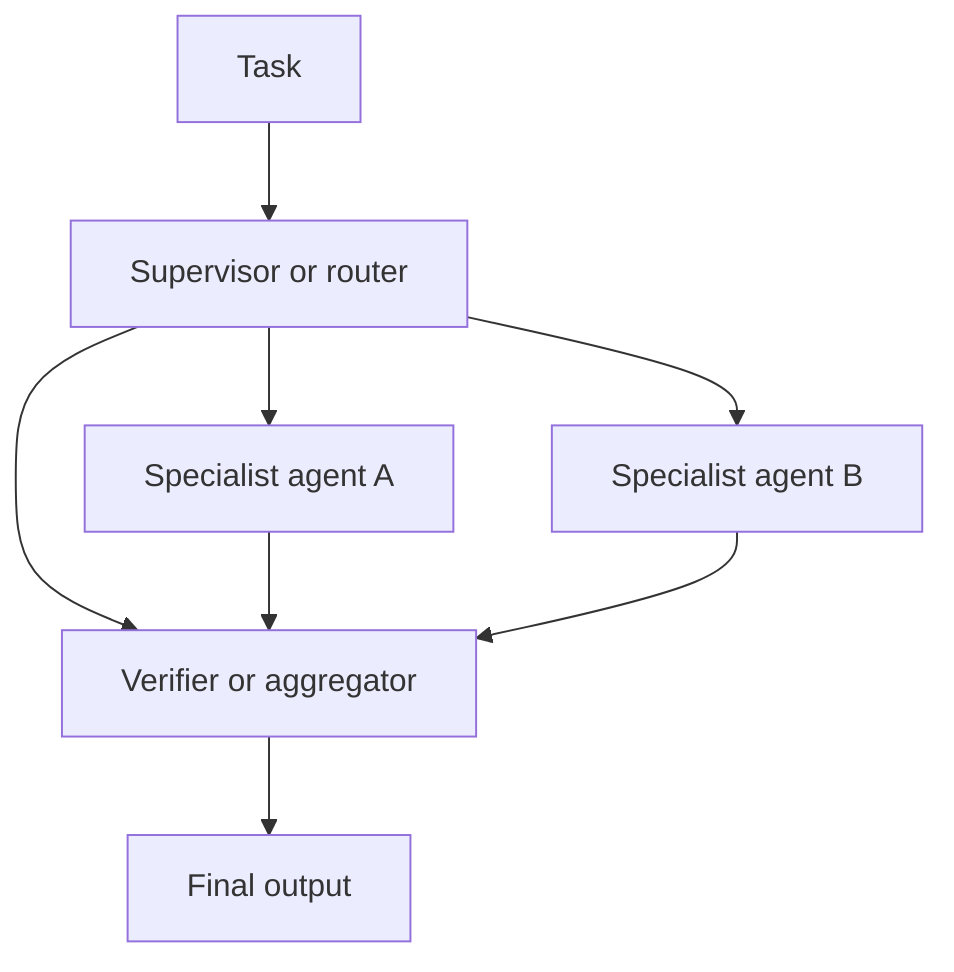

# Multi-Agent Systems

Multi-agent systems use multiple model-driven actors with differentiated roles, responsibilities, or viewpoints to solve a task.

> [!INFO] Core idea
> Multi-agent design is valuable when specialization, delegation, or verification improves the task more than the coordination overhead hurts it.

## Why It Matters
As tasks become larger, longer, or more heterogeneous, splitting work across agents can improve modularity, parallelism, and quality control. It can also create unnecessary complexity if applied too early.

## Executive Lens
| Pattern | Best For | Main Benefit | Main Risk |
| :--- | :--- | :--- | :--- |
| Supervisor-worker | decomposable work | role specialization | orchestration complexity |
| Peer collaboration | parallel exploration | broader coverage | duplication and drift |
| Debate / verifier patterns | quality control | better checking | extra cost and latency |
| Specialist routing | heterogeneous tasks | expertise matching | routing errors |

> [!IMPORTANT] More agents is not the same as more capability
> The strongest gains usually come from specialization and verification, not from simply increasing the number of agents.

## Technical Core

### Typical Reasons To Use Multi-Agent Design
- the task decomposes into separable subproblems
- different skills or tools are needed
- verification should be separated from generation
- parallel exploration materially reduces cycle time

> [!WARNING] Coordination is the hidden tax
> Communication overhead, duplicated work, role confusion, and cascading errors can erase the gains from multi-agent specialization.

## Design Patterns and Failure Modes
### Good uses
- parallel research or retrieval
- planner plus executor
- solver plus critic
- router plus specialists
- lead agent plus specialists with explicit handoff contracts

### Bad uses
- adding “sub-agents” when the task is still small and linear
- weak role boundaries
- no aggregation or verification logic
- unclear escalation paths when agents disagree

> [!CAUTION] Multi-agent failures can cascade
> One agent’s bad assumption can propagate through the rest of the system and be amplified by apparently well-structured collaboration.

> [!TIP] Practical default
> Start with a strong single-agent architecture. Add multi-agent decomposition only when role specialization or parallelism clearly improves the evals.

## Related Notes
- Prerequisites: [[AI Agents]]
- Related: [[Agent Architectures and Orchestration Patterns]], [[Delegation and Role Specialization]], [[Planning and Control Flow in Agent Systems]], [[Evaluation, Observability, and Governance for Agent Systems]]

## Sources
- [Large Language Model based Multi-Agents: A Survey of Progress and Challenges (2024)](https://arxiv.org/abs/2402.01680)
- [A Survey on Large Language Model based Autonomous Agents (2024)](https://arxiv.org/abs/2308.11432)
- [Anthropic, "How we built our multi-agent research system" (2025-06-13)](https://www.anthropic.com/engineering/multi-agent-research-system)
- [Anthropic, "Building Effective AI Agents" (2024-12-19)](https://www.anthropic.com/engineering/building-effective-agents)
- [A practical guide to building agents | OpenAI](https://openai.com/business/guides-and-resources/a-practical-guide-to-building-ai-agents/)
- See [[Agentic Systems Sources and Research Log]]

## Last Reviewed
- 2026-04-18
