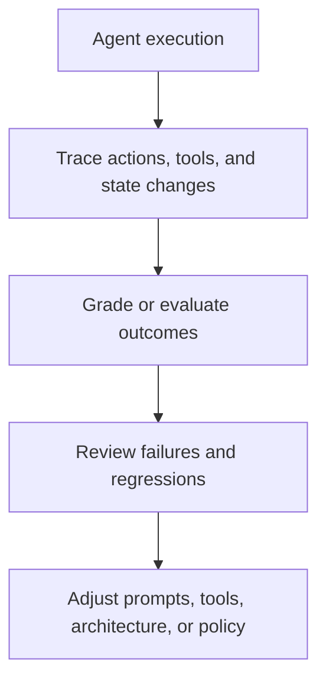

# Evaluation, Observability, and Governance for Agent Systems

Evaluation, observability, and governance are the operational disciplines that make agent systems trustworthy enough to improve and safe enough to deploy.

> [!INFO] Core idea
> If you cannot trace what the agent did, measure whether it worked, and control what it is allowed to do, you do not have a production-ready agent system.

## Why It Matters
Agentic systems act over tools, environments, and state. That makes silent failure far more expensive than in simple prompt-response applications.

## Executive Lens
| Discipline | Core Question | Why It Matters |
| :--- | :--- | :--- |
| Evaluation | did it solve the task correctly? | prevents false confidence and wasted rollout effort |
| Observability | what did it do and why? | reduces diagnosis time and improves auditability |
| Governance | what is it allowed to do? | controls risk, approvals, and accountability |

> [!IMPORTANT] Capability without observability is operational debt
> Before expanding autonomy, require at least durable traces, task-level evals, and approval gates for irreversible or high-impact actions. This investment usually pays back as fewer incidents and faster diagnosis.

## Technical Core

### What To Measure
- task success and partial success
- tool fidelity
- retries and loops
- latency and cost
- escalation and approval events
- policy or guardrail violations

### What To Log
- tool calls and arguments
- observations and outputs
- control-flow transitions
- human approvals or overrides
- failure categories

> [!WARNING] Benchmark scores are not enough
> AgentBench, GAIA, SWE-bench, OSWorld, and similar benchmarks are useful, but they do not replace use-case-specific evals with your own tools, permissions, and risks.

## Design Patterns and Failure Modes
### Good patterns
- trace every action boundary
- evaluate both end outcomes and intermediate tool behavior
- separate sandboxed actions from privileged actions
- use approval gates for irreversible or high-impact operations

### Failure modes
- no durable trace of why the agent acted
- evaluating only final output, not tool behavior
- weak prompt-injection defenses around tools
- governance defined only as policy text, not as executable system controls

> [!CAUTION] Governance is partly technical
> In agentic systems, governance is not just policy. It also means permissions, approval flows, privilege separation, audit logs, and enforceable boundaries.

> [!TIP] Practical default
> Before expanding autonomy, first expand eval coverage, trace quality, and approval boundaries.

## Where This Leads Next
| If You Want To | Next Note | Why |
| :--- | :--- | :--- |
| apply evals, review gates, and governance to coding work over repos and CI | [[010 Software Engineering Agents\|Software Engineering Agents]] | that specialization shows how validation, PR review, harnesses, and team operating models carry these controls into software delivery |
| apply validation and approval discipline to architecture proposals and pilots | [[010 Applied Agentic Architectures\|Applied Agentic Architectures]] | that specialization turns eval and governance into promotion gates for proposal, pilot, and production-target designs |

## Related Notes
- Prerequisites: [[020 AI Agents|AI Agents]]
- Related: [[030 Tool Use and Environment Interaction|Tool Use and Environment Interaction]], [[080 Agent Architectures and Orchestration Patterns|Agent Architectures and Orchestration Patterns]], [[010 When to Use Agentic Systems|When to Use Agentic Systems]]

## Sources
- [Anthropic, "Demystifying evals for AI agents" (2026-01-09)](https://www.anthropic.com/engineering/demystifying-evals-for-ai-agents)
- [OpenAI, "Trace grading"](https://platform.openai.com/docs/guides/trace-grading)
- [AgentBench: Evaluating LLMs as Agents (2023)](https://arxiv.org/abs/2308.03688)
- [GAIA: a benchmark for General AI Assistants (2023)](https://arxiv.org/abs/2311.12983)
- [SWE-bench (2023)](https://arxiv.org/abs/2310.06770)
- [OSWorld (2024)](https://arxiv.org/abs/2404.07972)
- [The Instruction Hierarchy (2024)](https://arxiv.org/abs/2404.13208)
- See [[010 Agentic Systems Sources and Research Log|Agentic Systems Sources and Research Log]]

## Last Reviewed
- 2026-04-10
