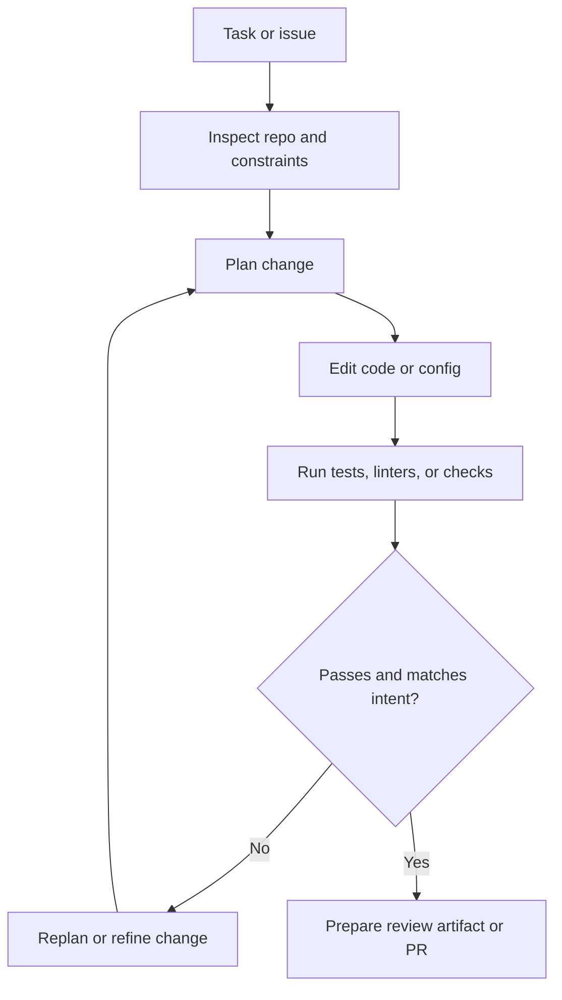

# Software Engineering Agents

Software engineering agents are agentic systems that work over codebases, terminals, tests, CI, and review workflows to inspect, modify, validate, and ship software safely.

> [!INFO] Core idea
> A coding agent is not just a code generator. It becomes an agent when it can inspect a repository, choose tools, apply edits, run validation, observe failures, and decide the next step under guardrails.

## Why It Matters
Software engineering is one of the clearest domains where agentic systems already create value because the work is tool-rich, stateful, and highly checkable. Repositories, test suites, linters, CI pipelines, issue trackers, and pull requests give the agent both action surfaces and feedback loops. Current coding-agent products increasingly package this as isolated tasks running in sandboxes or worktrees, with tests, diffs, logs, and pull requests treated as first-class artifacts of the loop.

## Executive Lens
| System Shape | Best For | Main Return Signal | Main Risk |
| :--- | :--- | :--- | :--- |
| Code assistant | drafting snippets or local edits | faster first draft | no closed-loop validation |
| Bounded coding workflow | standard fixes, issue triage, or CI failures | predictable automation | brittle on ambiguous repos |
| Software engineering agent | issue resolution, repo exploration, code review, and multi-step change plus validation | reduced manual coordination on tool-heavy work | unsafe edits or weak verification |
| Multi-agent coding system | larger tasks with explicit role split | parallelism and review separation | coordination overhead |

> [!IMPORTANT] Coding assistant vs coding agent
> Autocomplete and one-shot code generation are useful, but they are not the same thing as an agent that can inspect files, run tests, recover from failures, and stop when validation is good enough.

## Working Loop

> [!WARNING] Execution power raises the bar
> A coding agent with shell, git, or deployment access can cause expensive damage if tool boundaries, approval rules, and validation gates are weak.

## Technical Core
### Core Environment Layers
| Layer | What The Agent Needs | Why It Matters |
| :--- | :--- | :--- |
| Repository | file read and write, search, diff awareness | most tasks require local state inspection |
| Execution | terminal, runtime, package manager | code must be checked in context |
| Validation | unit tests, linters, type checks, CI status | gives ground truth beyond model judgment |
| Collaboration | issue tracker, PRs, review comments | software work rarely ends at code generation |
| Safety boundary | branch policy, permission modes, hooks, sandboxing | separates safe automation from unsafe autonomy |

### Harness Surfaces
| Surface | Typical Strength | Common Constraint |
| :--- | :--- | :--- |
| Terminal or CLI harness | direct repo and shell control | higher local-environment risk |
| IDE agent | fast iteration and diff inspection | shorter supervision loops |
| Cloud task or worker | long-running parallel work on isolated repo copies | slower feedback and artifact handoff |
| App or server harness | persistence, multi-agent coordination, cross-surface continuity | more policy and session complexity |

### Common Patterns
- bounded issue-resolution loop
- planner plus executor for multi-file changes
- reviewer gate before merge or deploy
- background harness for long-running CI or dependency waits
- initializer plus progress-file pattern for long-running coding work across many sessions

### Harness Primitives
- skills or reusable task bundles: instructions, resources, and scripts packaged for repeated workflows
- subagents or worker tasks: isolated specialists with narrower context and tool boundaries
- hooks and permission controls: pre-tool and post-tool checks around risky operations

### Harness Components In Practice
| Component | What It Solves |
| :--- | :--- |
| Session protocol | keeps threads, turns, progress streaming, and approval pauses consistent across surfaces |
| Repo isolation | prevents one task from corrupting another through branches, worktrees, sandboxes, or cloud containers |
| Workflow reuse | packages repeatable procedures into skills, commands, or playbooks instead of restating them every session |
| Delegation | lets subagents or worker tasks handle narrower slices of the work with clearer context and tool scope |
| Policy layer | separates permissions, hooks, deny-lists, and escalation rules from the model prompt itself |

### Codex and Claude Code as Reference Harnesses
| Current Product Example | What It Highlights |
| :--- | :--- |
| Codex | shared harness across CLI, IDE, app, and cloud, with worktrees, approval pauses, and reviewable thread artifacts |
| Claude Code | project-local control through `CLAUDE.md`, skills, hooks, subagents, permission modes, and MCP-backed integrations |

### Track Map
This track assumes you already know the shared branch core, especially `AI Agents`, `Tool Use and Environment Interaction`, and `Evaluation, Observability, and Governance for Agent Systems`.

| Stage | Best Notes | Outcome |
| :--- | :--- | :--- |
| Core handoff | [[AI Agents]], [[Tool Use and Environment Interaction]], [[Evaluation, Observability, and Governance for Agent Systems]] | shared trunk required before the specialization track |
| Apprenticeship | [[Software Engineering Agents]], [[Repo Operating Model for Coding Agents]], [[Approvals, Permissions, and Sandboxing for Coding Agents]] | operate one bounded coding agent safely in a real repo |
| Advanced | [[CI, Pull Requests, and Human Review for Coding Agents]], [[Evaluating Software Engineering Agents]], [[Building Coding Agent Harnesses]] | design and validate a coding-agent workflow that fits a team |
| Mastery | [[Long-Running and Background Coding Agents]], [[Operating Coding Agents in Teams]], [[Tool Ecosystems and Harness Engineering]], [[Applied Agentic Architectures]], [[Multi-Agent Systems]] | build or govern coding-agent systems as production infrastructure |

### Subline Notes
- [[Repo Operating Model for Coding Agents]]
- [[Approvals, Permissions, and Sandboxing for Coding Agents]]
- [[CI, Pull Requests, and Human Review for Coding Agents]]
- [[Evaluating Software Engineering Agents]]
- [[Building Coding Agent Harnesses]]
- [[Long-Running and Background Coding Agents]]
- [[Operating Coding Agents in Teams]]

### Good Tool Contracts
- repository search with deterministic paths
- file edit tools that preserve diff clarity
- test tools with scoped invocation and readable failure output
- git or PR tools with explicit approval boundaries
- paths and edit contracts that are hard to misuse, especially on large repos

> [!CAUTION] Benchmarks are not production
> Success on `SWE-bench` or a demo repository is useful evidence, but production software work also depends on repo conventions, in-repository knowledge quality, human review norms, infra permissions, and rollback discipline.

## Design Patterns and Failure Modes
### Strong patterns
- start with repo-local read and test permissions before write or deploy permissions
- make validation explicit at each meaningful checkpoint
- separate code editing from merge or deploy authority
- treat PR review as an explicit gate even when the changes are fully agent-generated
- keep artifact quality visible through diffs, test output, and review summaries

### Failure modes
- editing the wrong files because repository discovery is weak
- passing local tests while violating architectural or product intent
- overusing multi-agent decomposition for tasks one bounded agent could finish
- giving write or deploy permissions before approval and rollback paths exist

> [!TIP] Practical default
> Start with a bounded issue-resolution agent that can search the repo, edit files, run local validation, and prepare a review artifact. Add CI, PR, or deploy actions only after the review loop is dependable.

## Related Notes
- Prerequisites: [[AI Agents]], [[Tool Use and Environment Interaction]], [[Evaluation, Observability, and Governance for Agent Systems]]
- Related: [[Tool Ecosystems and Harness Engineering]], [[Repo Operating Model for Coding Agents]], [[Approvals, Permissions, and Sandboxing for Coding Agents]], [[CI, Pull Requests, and Human Review for Coding Agents]], [[Evaluating Software Engineering Agents]], [[Building Coding Agent Harnesses]], [[Long-Running and Background Coding Agents]], [[Operating Coding Agents in Teams]], [[Agent Architectures and Orchestration Patterns]], [[Planning and Control Flow in Agent Systems]], [[Multi-Agent Systems]], [[Applied Agentic Architectures]]

## Sources
- [A practical guide to building agents | OpenAI](https://openai.com/business/guides-and-resources/a-practical-guide-to-building-ai-agents/)
- [Building Effective AI Agents | Anthropic](https://www.anthropic.com/engineering/building-effective-agents)
- [Introducing Codex | OpenAI](https://openai.com/index/introducing-codex/)
- [Introducing upgrades to Codex | OpenAI](https://openai.com/index/introducing-upgrades-to-codex/)
- [Unlocking the Codex harness: how we built the App Server | OpenAI](https://openai.com/index/unlocking-the-codex-harness/)
- [Claude Code overview](https://code.claude.com/docs/en/overview)
- [Extend Claude with skills](https://code.claude.com/docs/en/skills)
- [Create custom subagents](https://code.claude.com/docs/en/sub-agents)
- [Hooks reference](https://code.claude.com/docs/en/hooks)
- [Effective harnesses for long-running agents | Anthropic](https://www.anthropic.com/engineering/effective-harnesses-for-long-running-agents)
- [SWE-bench: Can Language Models Resolve Real-World GitHub Issues? (2023)](https://arxiv.org/abs/2310.06770)
- [Demystifying evals for AI agents | Anthropic](https://www.anthropic.com/engineering/demystifying-evals-for-ai-agents)
- See [[Agentic Systems Sources and Research Log]]

## Last Reviewed
- 2026-04-18
