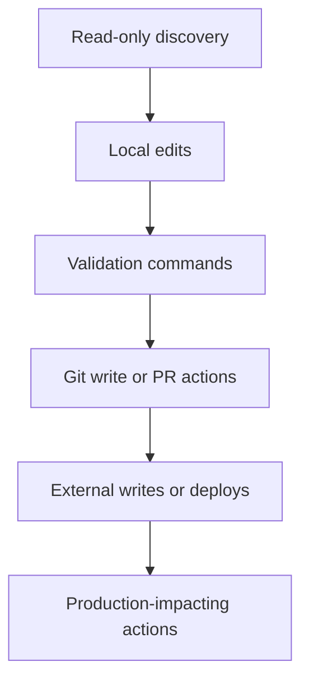

# Approvals, Permissions, and Sandboxing for Coding Agents

Approvals, permissions, and sandboxing define the policy boundary around a coding agent: what it may do automatically, what must pause for review, and what should never happen inside the runtime.

> [!INFO] Core idea
> Good coding-agent safety is not one giant “be careful” instruction. It is a policy system that separates allowed actions, approval-gated actions, denied actions, and the environments where those actions can run.

## Why It Matters
The same coding agent may be harmless in read-only mode and dangerous in a write-enabled shell with secrets, package installs, and deploy credentials. Permission design is therefore part of the architecture, not a late-stage security add-on.

## Policy Ladder

> [!IMPORTANT] Not all writes are equal
> Editing a file in a worktree, pushing a branch, merging to main, and deploying to production are all “write actions,” but they do not deserve the same approval rule.

## Approval Matrix
| Action Class | Typical Default | Why |
| :--- | :--- | :--- |
| read files, search repo, inspect logs | allow | low-impact discovery is necessary for orientation |
| edit files in isolated workspace | ask or allow in supervised sessions | useful but still changes state |
| run tests or linters | allow if command set is trusted | needed for validation |
| install dependencies or run unknown scripts | ask | high supply-chain and environment risk |
| create commits, branches, or PR drafts | ask | creates collaboration artifacts and history |
| push, merge, or trigger deploys | ask or deny by default | external side effects with team impact |
| access secrets or production systems | deny or tightly gate | highest misuse cost |

## Permission Semantics
| Mode | Use It For | Main Risk |
| :--- | :--- | :--- |
| Allow | safe, reversible, well-scoped actions | policy creep if used too broadly |
| Ask every time | infrequent or higher-risk actions | slows throughput |
| Sticky approval | repeated trusted actions within one session | approval granted in the wrong context |
| Deny | destructive or out-of-scope actions | pushes the agent to work around the rule if prompts are weak |

### Sandboxing Layers
| Layer | What It Limits | Example |
| :--- | :--- | :--- |
| Filesystem scope | where reads and writes are permitted | worktree-only access |
| Process scope | which commands may execute | allowlisted test and build tools |
| Network scope | which external systems can be reached | no internet or only internal APIs |
| Credential scope | which tokens and secrets are available | no production secrets in dev runtime |
| Git scope | which refs or repos can be changed | no direct writes to protected branches |

> [!WARNING] Permission prompts are not enough
> If the runtime exposes secrets, mutable shared state, or direct deploy authority, a human clicking “approve” is not a substitute for strong scoping.

## Design Rules
- separate policy rules from prompt instructions
- treat destructive shell commands as a special class
- gate package installation and arbitrary scripts more tightly than repo-local test commands
- prefer isolated worktrees or sandboxes before enabling write access
- record who approved what and under which context
- make escalation explicit when the agent hits a denied action it cannot safely bypass

## Reviewer Questions For Approval Design
| Question | Why It Matters |
| :--- | :--- |
| what is the highest-impact action this agent can take? | defines the true risk ceiling |
| what actions must always pause? | creates hard trust boundaries |
| can approvals persist across tasks or only within one thread? | controls sticky-permission risk |
| what must remain impossible even after approval? | protects against accidental overreach |
| where do logs and audit records live? | supports incident review and governance |

> [!TIP] Practical default
> Start with read, search, local edit in isolation, and trusted validation commands. Add git writes, installs, and external writes only after the review loop is dependable.

## Failure Modes
- giving package installs the same trust level as running tests
- allowing writes in the main repo instead of an isolated workspace
- exposing secrets to a session whose main task does not require them
- using sticky approvals without a clear scope boundary
- treating “human approved it” as an excuse for weak sandboxing

## Related Notes
- Prerequisites: [[Software Engineering Agents]], [[Tool Ecosystems and Harness Engineering]]
- Related: [[Repo Operating Model for Coding Agents]], [[CI, Pull Requests, and Human Review for Coding Agents]], [[Human-in-the-Loop and Approval Flows]]

## Sources
- [Safety in building agents | OpenAI API](https://platform.openai.com/docs/guides/agent-builder-safety)
- [Claude Code settings](https://code.claude.com/docs/en/settings)
- [Hooks reference](https://code.claude.com/docs/en/hooks)
- [Unlocking the Codex harness: how we built the App Server | OpenAI](https://openai.com/index/unlocking-the-codex-harness/)
- [Building Effective AI Agents | Anthropic](https://www.anthropic.com/engineering/building-effective-agents)
- See [[Agentic Systems Sources and Research Log]]

## Last Reviewed
- 2026-04-18
