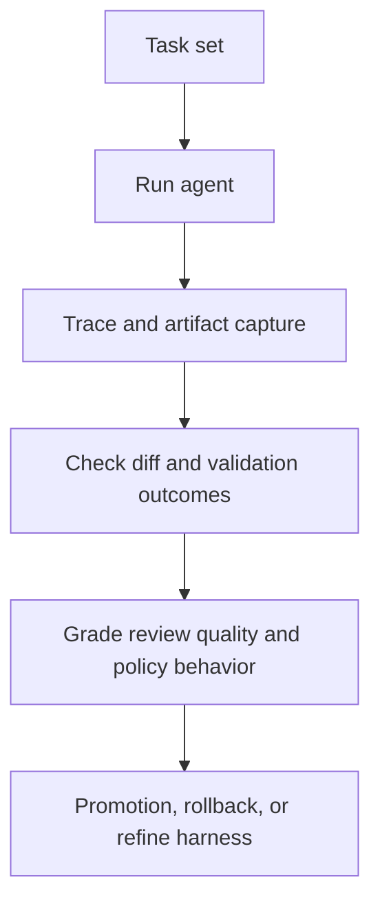

# Evaluating Software Engineering Agents

Evaluating software engineering agents means measuring not only whether a patch compiles, but whether the agent navigated the repo correctly, changed the right files, produced reviewable artifacts, and improved team outcomes without introducing hidden risk.

> [!INFO] Core idea
> A coding-agent eval should reflect the real workflow: task intake, repo discovery, edit quality, validation behavior, PR quality, and reviewer trust.

## Why It Matters
General agent evals are useful, but coding agents operate in a uniquely checkable domain. They interact with repositories, commands, CI logs, review threads, and branch state. That gives you richer evidence than simple answer quality, but only if the eval design uses it.

## Eval Stack

> [!IMPORTANT] Benchmarks are only one layer
> `SWE-bench` is useful for comparing broad capability, but teams still need repo-local evals that reflect their commands, conventions, CI, review norms, and risk boundaries.

## What To Evaluate
| Layer | Example Questions |
| :--- | :--- |
| task completion | did the agent solve the requested issue? |
| repo navigation | did it inspect the right files and instructions before editing? |
| diff quality | is the patch minimal, coherent, and easy to review? |
| validation behavior | did it run the right commands and react intelligently to failures? |
| policy adherence | did it respect approval and sandbox boundaries? |
| collaboration quality | did the PR summary, logs, and open questions help the reviewer? |
| operational outcomes | did it reduce cycle time without increasing regressions or reviewer burden? |

## Eval Types
| Eval Type | Use It For | Example Signal |
| :--- | :--- | :--- |
| benchmark eval | broad external comparison | pass rate on `SWE-bench` |
| repo-local regression set | repeated validation on representative internal tasks | fixed issue plus passing repo checks |
| trace grading | understanding decision quality inside the run | wrong file selection, skipped instruction, weak retry logic |
| diff review grading | judging artifact quality | patch size, scope hygiene, reviewer readability |
| policy and safety eval | stress-testing approvals and secrets handling | improper command attempt or boundary breach |

### Good Repo-Local Task Sets
- common bug fixes and test repairs
- scoped refactors with explicit constraints
- CI failure triage tasks
- review-comment follow-up tasks
- intentionally ambiguous tasks that should trigger escalation

### Repo-Local Eval Recipe
| Step | What To Produce |
| :--- | :--- |
| task set | a representative internal suite with success and escalation cases |
| trace capture | tool calls, repo navigation, failures, retries, and stop reasons |
| diff grading | scope hygiene, reviewer readability, and architectural fit |
| reviewer grading | usefulness of summary, evidence, and uncertainty disclosure |
| promotion gate | threshold for rollout, rollback, or harness revision |

> [!WARNING] Do not evaluate only on solved tasks
> A mature eval set should also include tasks where the right behavior is to stop, ask, or refuse because the environment, permissions, or ambiguity are too high.

## Promotion Gates
| Stage | Minimum Evidence |
| :--- | :--- |
| prototype | completes narrow tasks in one repo with visible traces |
| supervised pilot | stable repo-local task set, good review artifacts, no major policy violations |
| wider rollout | acceptable regression rate, reviewer acceptance, and predictable operating cost |
| production use | ongoing monitoring, rollback path, and clearly owned eval refresh cycle |

## Metrics That Matter
| Metric | Why It Helps |
| :--- | :--- |
| task success rate | measures end-to-end usefulness |
| first-pass validation rate | captures local quality before reviewer feedback |
| review acceptance rate | shows whether diffs are actually usable |
| CI fix rate | useful for agents handling broken checks |
| escalation quality | distinguishes safe stops from silent failure |
| cycle-time reduction | links agent quality to team value |

> [!TIP] Practical default
> Start with a small internal regression set and trace grading before you obsess over large external benchmark gains. That usually tells you faster whether the agent is improving your real workflow.

## Failure Modes
- using only public benchmarks and ignoring repo-local tasks
- measuring pass rate without measuring reviewer burden
- ignoring traces, so repeated navigation mistakes stay invisible
- promoting a model or harness change without a regression suite
- treating policy violations as rare edge cases instead of first-class eval targets

## Related Notes
- Prerequisites: [[Software Engineering Agents]], [[Evaluation, Observability, and Governance for Agent Systems]]
- Related: [[CI, Pull Requests, and Human Review for Coding Agents]], [[Validation and Eval Design for Agent Architectures]], [[Building Coding Agent Harnesses]], [[Operating Coding Agents in Teams]]

## Sources
- [SWE-bench: Can Language Models Resolve Real-World GitHub Issues? (2023)](https://arxiv.org/abs/2310.06770)
- [Trace grading | OpenAI API](https://platform.openai.com/docs/guides/trace-grading)
- [Demystifying evals for AI agents | Anthropic](https://www.anthropic.com/engineering/demystifying-evals-for-ai-agents)
- [Raise the bar on SWE-bench Verified with Claude 3.5 Sonnet | Anthropic](https://www.anthropic.com/engineering/swe-bench-sonnet)
- [A practical guide to building agents | OpenAI](https://openai.com/business/guides-and-resources/a-practical-guide-to-building-ai-agents/)
- See [[Agentic Systems Sources and Research Log]]

## Last Reviewed
- 2026-04-18
