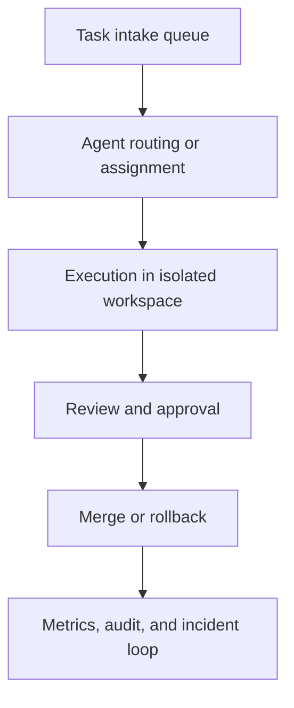

# Operating Coding Agents in Teams

Operating coding agents in teams means turning useful single-agent workflows into a governed engineering capability with queueing, ownership, budgets, auditability, and reviewer trust.

> [!INFO] Core idea
> A coding agent becomes a team capability only when someone owns its quality, its failures are reviewable, and its costs and permissions stay inside explicit limits.

## Why It Matters
An individual agent session can look impressive while the team around it absorbs hidden costs: noisy PRs, stale branches, unclear ownership, review fatigue, secret sprawl, and expensive retry loops. Team operations make those costs visible and controllable.

## Team Operating Map

> [!IMPORTANT] Ownership is a real interface
> If no person or team owns the prompts, tools, budgets, incidents, and rollout policy, the agent is not a dependable team system no matter how good the demos look.

## Operating Dimensions
| Dimension | What Teams Need To Decide |
| :--- | :--- |
| intake | which task types the agents may accept |
| ownership | who is accountable for failures and changes |
| budget | cost, latency, and concurrency limits |
| review policy | what always needs human approval |
| audit retention | how long traces, logs, and artifacts persist |
| incident response | how to pause, investigate, and recover |

## Team Controls
| Control | Why It Matters | Example |
| :--- | :--- | :--- |
| queue discipline | keeps work from expanding into unsuitable tasks | only bug fixes and CI triage enter automation lane |
| workspace hygiene | prevents stale branches and conflicting state | prune old worktrees and expired tasks |
| budget caps | controls runaway retries and expensive loops | max concurrent agents or token budget per task |
| approval policy | preserves human control on risky actions | no merge or deploy without review |
| audit trail | supports incident analysis and trust | retain traces, diffs, and approvals |

### Team Metrics
| Metric | What It Signals |
| :--- | :--- |
| reviewer acceptance rate | whether the agent output is actually useful |
| queue throughput | whether the workflow saves time at team level |
| stale task count | whether background work is drifting |
| incident rate | whether autonomy is outrunning controls |
| cost per successful task | whether the operating model is sustainable |

> [!WARNING] Local success does not guarantee team value
> A coding agent can solve isolated tasks well and still fail at team scale if it overwhelms reviewers, accumulates stale work, or burns budget on retries the team never would have accepted manually.

## Design Rules
- assign an owner for prompts, tools, and runtime policy
- define which task classes are eligible before scaling intake
- track reviewer burden, not only task success
- retain enough artifacts to debug incidents and regression drift
- make pause and rollback actions routine, not exceptional

## Failure Modes
- rolling out to too many task classes at once
- no one owning stale branches, traces, or broken automations
- optimizing for benchmark wins while reviewers lose trust
- treating budget as an afterthought until costs spike
- leaving incident response ambiguous because “the agent was experimental”

> [!TIP] Practical default
> Start with one owned queue, one narrow task class, one review policy, and one metric pack. Expand only after the team can explain both the gains and the costs.

## Related Notes
- Prerequisites: [[Software Engineering Agents]], [[Long-Running and Background Coding Agents]]
- Related: [[Evaluating Software Engineering Agents]], [[CI, Pull Requests, and Human Review for Coding Agents]], [[Proposal-to-Production for Agent Systems]]

## Sources
- [Introducing the Codex app | OpenAI](https://openai.com/index/introducing-the-codex-app/)
- [Introducing upgrades to Codex | OpenAI](https://openai.com/index/introducing-upgrades-to-codex/)
- [Demystifying evals for AI agents | Anthropic](https://www.anthropic.com/engineering/demystifying-evals-for-ai-agents)
- [How we built our multi-agent research system | Anthropic](https://www.anthropic.com/engineering/multi-agent-research-system)
- [Managed Agents | Anthropic](https://www.anthropic.com/engineering/managed-agents)
- See [[Agentic Systems Sources and Research Log]]

## Last Reviewed
- 2026-04-18
