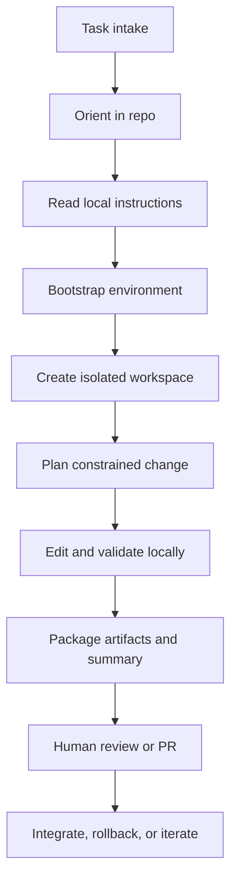

# Repo Operating Model for Coding Agents

A repo operating model defines how a coding agent should enter, understand, modify, validate, and hand off work inside a real repository without creating chaos.

> [!INFO] Core idea
> A software agent fails less often when the repository gives it a disciplined path: task intake, repo orientation, environment bootstrap, isolated execution, validation, and human handoff.

## Why It Matters
Many coding-agent failures are not failures of reasoning. They are operating-model failures: the agent starts coding before it understands the repo, edits the wrong layer, runs the wrong checks, or leaves unclear artifacts for the reviewer. A repo operating model turns “go fix this” into a repeatable lifecycle.

## Lifecycle Map

> [!IMPORTANT] Repositories are part of the prompt
> `AGENTS.md`, `CLAUDE.md`, test commands, code-owner rules, and local scripts are not decoration. They are the operating contract that lets the agent work without guessing.

## Operating Stages
| Stage | What The Agent Must Resolve | Good Output |
| :--- | :--- | :--- |
| Task intake | what is being asked, what counts as done, what is out of scope | short task brief with success criteria |
| Repo orientation | where the change probably lives, which modules and conventions matter | affected paths and constraints |
| Local instructions | which repo-specific rules override generic behavior | explicit command and policy checklist |
| Environment bootstrap | how to install, build, test, and find dependencies | working local command set |
| Isolation | where to work without damaging the main state | branch, worktree, sandbox, or cloud copy |
| Change planning | smallest meaningful patch and validation path | edit plan with stop conditions |
| Local validation | what must pass before asking for review | test, lint, typecheck, or targeted check results |
| Handoff | what a reviewer needs to judge the change quickly | diff, summary, open questions, and evidence |

## Repository Readiness Checklist
| Area | What Helps An Agent | Why It Matters |
| :--- | :--- | :--- |
| Instructions | `AGENTS.md`, `CLAUDE.md`, or equivalent repo notes | reduces hidden workflow assumptions |
| Fast validation | scoped test commands and smoke checks | avoids guessing which checks matter |
| Searchability | stable paths, obvious module boundaries, grep-friendly docs | speeds file discovery and impact analysis |
| Environment parity | setup script, devcontainer, or bootstrap command | lowers environment drift |
| Safe fixtures | non-production datasets, mocks, and local secrets handling | keeps validation realistic and safe |
| Artifact norms | commit style, PR template, reviewer expectations | makes agent output easier to inspect |

### Environment Contract
| Area | What The Repo Should Declare | Why The Agent Needs It |
| :--- | :--- | :--- |
| bootstrap | install or setup command | avoids inventing environment setup |
| toolchain | language versions, package manager, runtime, and build entrypoints | prevents mismatched local assumptions |
| monorepo boundaries | package, app, or service ownership and workspace commands | narrows search and validation scope |
| isolation | devcontainer, worktree, sandbox, or cloud workspace expectation | clarifies where writes and installs are safe |
| search and indexing | preferred repo search commands or index files | improves file discovery on large codebases |
| fixtures and mocks | approved local datasets and test doubles | keeps validation realistic without using production data |
| secrets handling | local env conventions and forbidden credential paths | stops unsafe credential guessing |

### Working Agreements
- define a small success condition before editing
- prefer repo-local commands over generic assumptions
- stop and escalate when required dependencies or permissions are missing
- keep the patch narrow unless the task explicitly asks for restructuring
- package uncertainty explicitly instead of hiding it in the diff

> [!WARNING] Coding too early is a real failure mode
> If the agent edits before resolving where the change belongs and how the repo validates work, it often produces a plausible patch in the wrong place.

## Isolation Strategy
| Isolation Choice | Use It When | Main Tradeoff |
| :--- | :--- | :--- |
| Local branch | one supervised task in a trusted repo | easier to collide with local state |
| Worktree | multiple concurrent tasks on the same repo | extra workspace management |
| Sandbox or container | dependency risk or untrusted commands are high | more setup cost |
| Cloud repo copy | long-running or parallel work needs durability | slower human feedback loop |

## Handoff Artifacts
| Artifact | What It Should Contain |
| :--- | :--- |
| Change summary | what changed, why, and what was intentionally not changed |
| Validation evidence | tests run, logs, screenshots, or CI references |
| Reviewer guidance | risky files, assumptions, edge cases, and follow-up questions |
| Rollback hint | how to revert or disable if the change misbehaves |

> [!TIP] Practical default
> Treat repo orientation and environment bootstrap as mandatory before the first edit. That discipline usually improves reliability more than adding another planning prompt.

## Failure Modes
- skipping repo-local instructions and inventing a workflow
- assuming a global test command when only scoped checks are affordable
- editing shared state without worktree or branch isolation
- shipping a patch with no reviewer-oriented summary
- hiding missing permissions or environment failures until the end

## Related Notes
- Prerequisites: [[010 Software Engineering Agents|Software Engineering Agents]], [[050 Tool Ecosystems and Harness Engineering|Tool Ecosystems and Harness Engineering]]
- Related: [[030 Approvals, Permissions, and Sandboxing for Coding Agents|Approvals, Permissions, and Sandboxing for Coding Agents]], [[040 CI, Pull Requests, and Human Review for Coding Agents|CI, Pull Requests, and Human Review for Coding Agents]], [[060 Building Coding Agent Harnesses|Building Coding Agent Harnesses]], [[070 Long-Running and Background Coding Agents|Long-Running and Background Coding Agents]]

## Sources
- [Introducing Codex | OpenAI](https://openai.com/index/introducing-codex/)
- [Introducing the Codex app | OpenAI](https://openai.com/index/introducing-the-codex-app/)
- [Unlocking the Codex harness: how we built the App Server | OpenAI](https://openai.com/index/unlocking-the-codex-harness/)
- [Building Effective AI Agents | Anthropic](https://www.anthropic.com/engineering/building-effective-agents)
- [Claude Code overview](https://code.claude.com/docs/en/overview)
- [Claude Code settings](https://code.claude.com/docs/en/settings)
- See [[010 Agentic Systems Sources and Research Log|Agentic Systems Sources and Research Log]]

## Last Reviewed
- 2026-04-18
