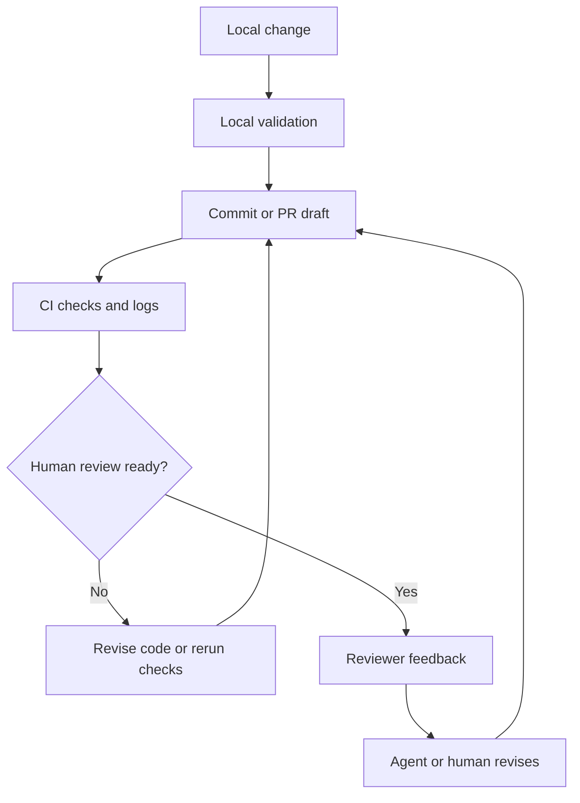

# CI, Pull Requests, and Human Review for Coding Agents

CI, pull requests, and human review are the collaboration layer that turns a coding agent from a patch generator into a reviewable engineering participant.

> [!INFO] Core idea
> A strong coding agent does not end with “tests passed locally.” It packages its work into artifacts that other humans and systems can inspect, challenge, and either promote or reject.

## Why It Matters
Most real software teams do not integrate code straight from a terminal session. They work through pull requests, CI checks, review comments, code-owner approval, merge queues, and sometimes incident follow-up. A coding agent that ignores that layer is incomplete.

## Delivery Loop

> [!IMPORTANT] PRs are not just transport
> A pull request is the main review interface for most teams. The agent should therefore optimize not only for code correctness, but for diff clarity, reviewer context, and tractable follow-up.

## PR Artifact Checklist
| Artifact | Why Reviewers Need It |
| :--- | :--- |
| concise summary | tells the reviewer what changed and why |
| validation evidence | shows which checks actually ran |
| scoped diff | reduces uncertainty about unrelated changes |
| assumptions and open questions | surfaces what the agent could not prove |
| rollback note | makes failure recovery faster |

## CI Failure Triage
| Failure Type | What The Agent Should Do First | Common Trap |
| :--- | :--- | :--- |
| unit or integration test failure | local repro and inspect affected files | patching symptoms without root cause |
| lint or format failure | run the repo-standard formatter or linter command | inventing style fixes manually |
| type error | resolve contract or import drift | editing unrelated files to satisfy the checker |
| flaky test | inspect rerun behavior and historical context | treating noise as a product bug |
| environment or dependency failure | separate infra issue from code regression | looping forever on a broken environment |
| permission or auth failure | escalate as an access problem | hacking around missing access with unsafe changes |

### Human Review Checklist
| Reviewer Question | What The Agent Should Make Easy |
| :--- | :--- |
| is the change in the right place? | clear affected paths and rationale |
| did the right checks run? | explicit command list and outcomes |
| is anything risky or ambiguous? | uncertainty callouts and rollback note |
| are follow-up tasks obvious? | open questions and deferred scope |
| does the diff respect repo norms? | commit hygiene and clean artifact boundaries |

### Review Discipline
| Practice | Why It Helps |
| :--- | :--- |
| draft PR by default on uncertain tasks | separates exploration from merge-ready change |
| explicit merge boundary | keeps proposal, approval, and merge authority distinct |
| code-owner handoff | preserves local ownership of sensitive modules |
| reviewer-first artifact bundle | reduces time spent reconstructing the agent's intent |
| “agent proposes, human approves” rule | avoids accidental promotion of unreviewed autonomy |

> [!WARNING] Passing CI is not the same as passing review
> CI catches only the subset of correctness that the automation already knows how to check. Architecture fit, product intent, security posture, and maintainability still need human judgment.

## Design Rules
- keep PRs narrow enough to review, even when the agent could change more
- prefer PR drafts for uncertain tasks or incomplete validation
- make rerun strategy explicit for flaky or infra-dependent checks
- separate “the agent proposes” from “the system merges”
- preserve review threads and comments as part of the agent’s working context

## Failure Modes
- creating a technically correct patch that reviewers cannot understand quickly
- rerunning failing CI with no hypothesis about the failure
- treating code-owner or security review as optional after passing tests
- mixing unrelated changes into one agent-produced PR
- hiding uncertainty until after a reviewer requests changes

> [!TIP] Practical default
> Ask the agent to optimize for reviewer throughput: smallest coherent diff, explicit validation, visible assumptions, and a clear next step if the PR is not ready.

## Related Notes
- Prerequisites: [[020 Repo Operating Model for Coding Agents|Repo Operating Model for Coding Agents]], [[010 Software Engineering Agents|Software Engineering Agents]]
- Related: [[030 Approvals, Permissions, and Sandboxing for Coding Agents|Approvals, Permissions, and Sandboxing for Coding Agents]], [[050 Evaluating Software Engineering Agents|Evaluating Software Engineering Agents]], [[050 Proposal-to-Production for Agent Systems|Proposal-to-Production for Agent Systems]], [[080 Operating Coding Agents in Teams|Operating Coding Agents in Teams]]

## Sources
- [Introducing Codex | OpenAI](https://openai.com/index/introducing-codex/)
- [Introducing upgrades to Codex | OpenAI](https://openai.com/index/introducing-upgrades-to-codex/)
- [Introducing the Codex app | OpenAI](https://openai.com/index/introducing-the-codex-app/)
- [Raise the bar on SWE-bench Verified with Claude 3.5 Sonnet | Anthropic](https://www.anthropic.com/engineering/swe-bench-sonnet)
- [Demystifying evals for AI agents | Anthropic](https://www.anthropic.com/engineering/demystifying-evals-for-ai-agents)
- See [[010 Agentic Systems Sources and Research Log|Agentic Systems Sources and Research Log]]

## Last Reviewed
- 2026-04-18
