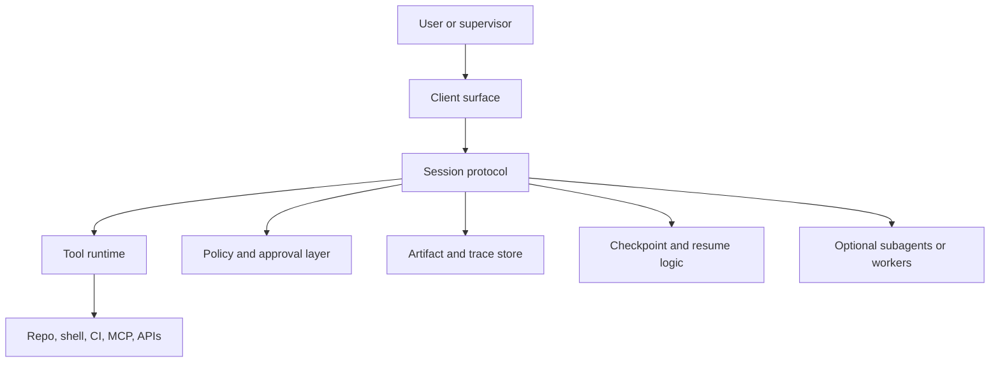

# Building Coding Agent Harnesses

Building a coding agent harness means designing the runtime around the model: session semantics, tool contracts, execution substrate, artifact handling, checkpoints, and the surfaces through which humans supervise work.

> [!INFO] Core idea
> If you want to build a coding agent yourself, the hard part is rarely “call the model.” The hard part is building a harness that lets the model act safely, resumably, and reviewably over real codebases.

## Why It Matters
Modern coding agents do not behave like single prompts. They run loops, call tools, manage diffs, wait on CI, produce artifacts, and sometimes delegate. Without a harness, even a capable model becomes brittle and hard to supervise.

## Minimal Harness Architecture

> [!IMPORTANT] Start with a bounded harness
> A coding harness should begin with one repo, one session model, a small tool surface, and explicit approvals. Parallel workers, IDE sync, and background automation come later.

## Core Components
| Component | What It Must Do | Common Mistake |
| :--- | :--- | :--- |
| session protocol | carry threads, turns, progress, and approval pauses | collapsing everything into one stateless prompt |
| file-edit primitives | make changes with clear diff semantics | using vague text edits that are hard to review |
| shell execution | run commands predictably with captured output | exposing arbitrary shell with weak policy |
| artifact store | preserve diffs, logs, summaries, and checkpoints | treating outputs as disposable chat text |
| policy layer | decide allow, ask, deny, and sandbox scope | embedding policy only in prompt instructions |
| checkpointing | resume long tasks without losing context | forcing every interruption to restart from scratch |
| delegation model | run scoped workers when specialization helps | creating nested workers with unclear ownership |

## Build Path
| Stage | What To Build First | What To Defer |
| :--- | :--- | :--- |
| bounded prototype | repo read, file edit, trusted test commands, diff output | multi-agent delegation and background runs |
| supervised repo agent | approvals, worktree isolation, PR artifact packaging, trace store | broad external integrations |
| async or multi-surface agent | checkpoints, resume, background mode, richer UI events | autonomous deploy or wide fleet management |

### Design Decisions
| Decision | Preferred Early Default | Why |
| :--- | :--- | :--- |
| execution location | isolated local or cloud workspace | limits blast radius |
| state model | durable thread plus artifact log | supports supervision and recovery |
| tool surface | narrow explicit tools plus shell for trusted commands | easier to grade and secure |
| delegation | optional subagents with clear scope | avoids premature orchestration complexity |
| external protocols | MCP for reusable integrations, custom session layer for rich runtime semantics | keeps interoperability and harness needs separate |

### Reference Harness Blueprint
| Layer | Minimum V1 Choice | Why It Matters |
| :--- | :--- | :--- |
| session model | durable thread with explicit turns and progress events | gives the runtime resumable state |
| event stream | structured lifecycle events for tool call, approval pause, failure, and completion | keeps humans and clients synchronized |
| checkpoint store | persisted task state plus artifact pointers | makes long-running work recoverable |
| artifact bundle | diff, logs, summaries, reviewer notes, and validation evidence | turns output into reviewable engineering work |
| policy layer | allow, ask, deny rules outside the model prompt | keeps authority separate from reasoning |

> [!WARNING] Tool abundance is not the same as harness quality
> Adding more tools often makes the agent look more capable while actually reducing reliability if the session, artifact, and approval model remain weak.

## Build-Your-Own Checklist
- define the session and trace model before exposing many tools
- design diffs, logs, and reviewer summaries as first-class artifacts
- choose worktree, container, or sandbox isolation before enabling writes
- support cancellation and resume if tasks may exceed one interaction
- keep the first worker or subagent model simple and explicit

## Failure Modes
- building around free-form chat instead of explicit session events
- using shell access as a substitute for good tool contracts
- skipping artifact persistence, so runs cannot be audited later
- adding subagents before the main loop is reliable
- mixing MCP interoperability concerns with harness-specific session design

> [!TIP] Practical default
> Build the first useful harness around one strong workflow: inspect repo, edit files, run trusted validation, and emit a reviewer-ready artifact bundle.

## Related Notes
- Prerequisites: [[050 Tool Ecosystems and Harness Engineering|Tool Ecosystems and Harness Engineering]], [[010 Software Engineering Agents|Software Engineering Agents]]
- Related: [[020 Repo Operating Model for Coding Agents|Repo Operating Model for Coding Agents]], [[030 Approvals, Permissions, and Sandboxing for Coding Agents|Approvals, Permissions, and Sandboxing for Coding Agents]], [[050 Evaluating Software Engineering Agents|Evaluating Software Engineering Agents]], [[070 Long-Running and Background Coding Agents|Long-Running and Background Coding Agents]]

## Sources
- [Agents SDK | OpenAI API](https://platform.openai.com/docs/guides/agents-sdk/)
- [Agent Builder | OpenAI API](https://platform.openai.com/docs/guides/agent-builder)
- [Background mode | OpenAI API](https://platform.openai.com/docs/guides/background)
- [Unlocking the Codex harness: how we built the App Server | OpenAI](https://openai.com/index/unlocking-the-codex-harness/)
- [Create custom subagents | Claude Code Docs](https://code.claude.com/docs/en/sub-agents)
- [Extend Claude with skills | Claude Code Docs](https://code.claude.com/docs/en/skills)
- See [[010 Agentic Systems Sources and Research Log|Agentic Systems Sources and Research Log]]

## Last Reviewed
- 2026-04-18
