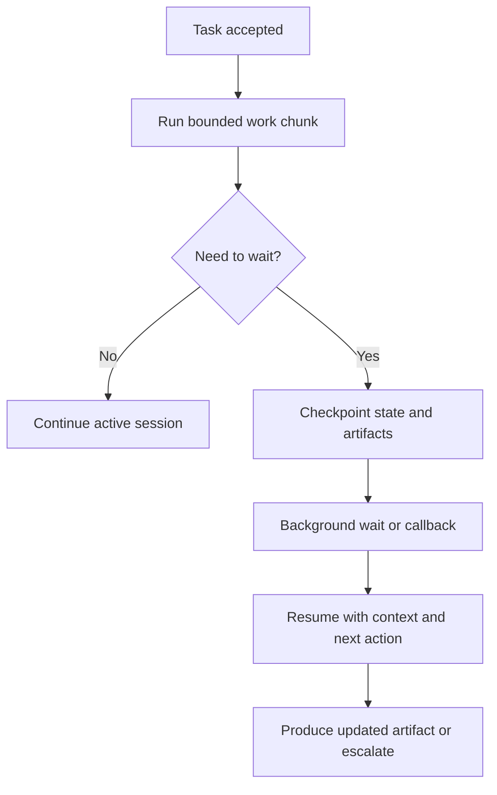

# Long-Running and Background Coding Agents

Long-running and background coding agents are software agents designed to keep working across waits, interruptions, approvals, CI delays, and multi-session handoffs without losing the task state or confusing the reviewer.

> [!INFO] Core idea
> A coding task stops being a short interactive loop once it depends on CI, humans, external systems, or long validation runs. At that point, resumability and artifact continuity become part of the design.

## Why It Matters
Short coding loops can survive inside a terminal session. Real engineering work often cannot. Agents wait on flaky CI, package installs, review feedback, merge queues, or long-running test suites. If the system cannot checkpoint and resume, it either restarts wastefully or leaves the work in an opaque half-finished state.

## Runtime Flow

> [!IMPORTANT] Waiting is a first-class state
> A background agent should not pretend it is “still thinking” while blocked on CI or human review. It should checkpoint, declare the wait reason, and resume explicitly.

## When Background Execution Is Justified
| Signal | Why It Pushes Toward Background Mode |
| :--- | :--- |
| test or build times exceed one interaction | interactive supervision becomes inefficient |
| work depends on CI or external callbacks | the session must survive idle time |
| approval latency is expected | human review cannot block the whole runtime |
| multiple tasks run in parallel | isolated workers need durable state |
| artifacts must remain inspectable between sessions | reviewers need continuity |

## Core Design Elements
| Element | What It Must Preserve | Common Failure |
| :--- | :--- | :--- |
| checkpoint | current plan, file state, tool outputs, and unresolved questions | resuming with a vague summary only |
| wait reason | why the agent paused and what event will wake it up | resuming with no explicit dependency |
| artifact continuity | diff, logs, summaries, and reviewer notes across sessions | losing traceability after resume |
| cancellation path | how to stop safely without orphaned state | leaving stale branches or hanging jobs |
| resume policy | what must be revalidated before continuing | assuming old context is still trustworthy |

### Good Background Artifacts
- progress summary with current status
- open blockers and owner of the blocker
- latest diff or artifact bundle
- next action on resume
- rollback or cleanup hint if the task is cancelled

> [!WARNING] Background is not autonomy by default
> Long-running execution extends duration, not authority. Agents that can resume later still need the same approval and policy boundaries they had at launch.

## Design Rules
- checkpoint before long waits, not after they become confusing
- revalidate critical assumptions when resuming after environment drift
- separate active work, waiting state, and cancelled state explicitly
- keep artifact and trace continuity across resumes
- treat stale workspaces and stale branches as a maintenance problem, not an afterthought

## Failure Modes
- restarting from scratch after every wait
- resuming after CI or human feedback without reconciling changed context
- background branches or worktrees accumulating with no owner
- letting a resumed task inherit permissions that no longer match the current risk
- producing no clear progress artifact while the task is idle

> [!TIP] Practical default
> Put only the long or blocked part of the workflow in background mode. Keep task launch, risky approvals, and final review in explicit human-visible checkpoints.

## Related Notes
- Prerequisites: [[060 Building Coding Agent Harnesses|Building Coding Agent Harnesses]], [[020 Repo Operating Model for Coding Agents|Repo Operating Model for Coding Agents]]
- Related: [[080 Operating Coding Agents in Teams|Operating Coding Agents in Teams]], [[050 Proposal-to-Production for Agent Systems|Proposal-to-Production for Agent Systems]], [[030 Approvals, Permissions, and Sandboxing for Coding Agents|Approvals, Permissions, and Sandboxing for Coding Agents]]

## Sources
- [Background mode | OpenAI API](https://platform.openai.com/docs/guides/background)
- [Introducing upgrades to Codex | OpenAI](https://openai.com/index/introducing-upgrades-to-codex/)
- [Introducing the Codex app | OpenAI](https://openai.com/index/introducing-the-codex-app/)
- [Effective harnesses for long-running agents | Anthropic](https://www.anthropic.com/engineering/effective-harnesses-for-long-running-agents)
- [Managed Agents | Anthropic](https://www.anthropic.com/engineering/managed-agents)
- See [[010 Agentic Systems Sources and Research Log|Agentic Systems Sources and Research Log]]

## Last Reviewed
- 2026-04-18
