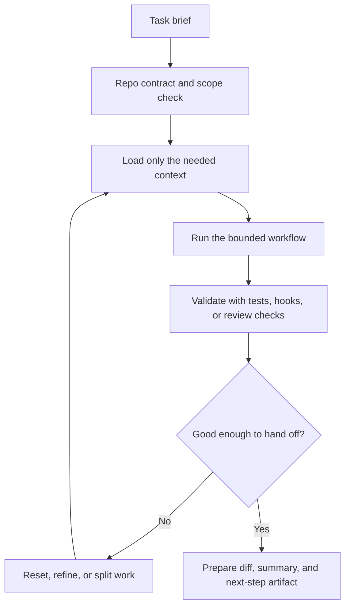

# Operating Agentic Coding Environments

Operating an agentic coding environment means turning a model into a reliable working surface over a real repository: repo contracts, runtime policy, reusable workflows, session hygiene, parallel execution, and evaluation discipline.

> [!INFO] Core idea
> Good agentic coding is rarely about one magic prompt. It comes from a stable operating environment: the right repo contract, the right defaults, the right workflow reuse layer, and the right review boundaries.

## Why It Matters
Most teams do not fail with coding agents because the model is too weak. They fail because the working environment is vague: instructions are duplicated, approvals are inconsistent, sessions sprawl, skills drift, and parallel work collides at merge time.

## Operating Stack
| Layer | Main Question | Healthy Default |
| :--- | :--- | :--- |
| repo contract | what should the agent always know about this repo? | keep core invariants in `AGENTS.md` or `CLAUDE.md`, not in ad hoc prompts |
| runtime policy | what can it do without asking? | narrow write scope, explicit approval posture, deny-lists for secrets and prod |
| workflow reuse | what should be packaged instead of re-explained? | skills, hooks, scripts, and short playbooks |
| session hygiene | what stays in context and what gets dropped? | short briefs, just-in-time loading, explicit resets, artifact summaries |
| parallel execution | when should work split across sessions or agents? | use worktrees and file-scope ownership before adding more workers |
| eval and review | how do you know the setup is actually helping? | repo-local checks, trace review, and human acceptance criteria |

> [!IMPORTANT] Treat the environment as part of the system
> A coding agent is not only the model plus tools. The repo contract, worktree layout, approval posture, session policy, and validation workflow are part of the capability surface.

## Practical Ladder
| Stage | What To Set Up | What To Avoid Too Early |
| :--- | :--- | :--- |
| first useful environment | repo contract, safe write scope, test commands, one review path | agent teams, broad tool catalogs, autonomous merge or deploy |
| reliable operator setup | skills or commands, hooks, session reset rules, worktrees | many overlapping instructions and uncontrolled long sessions |
| team-grade environment | local environment bootstrap, role split, eval hygiene, audit-ready traces | treating benchmark wins as production evidence |

## Default Working Loop

## Operator Playbooks In This Track
| Question | Best Note |
| :--- | :--- |
| how should I set up the practical surface? | [[090 Operating Agentic Coding Environments\|Operating Agentic Coding Environments]] |
| how do I set up Claude Code well? | [[100 Claude Code Setup and Repo Contracts\|Claude Code Setup and Repo Contracts]] |
| how do I set up Codex well? | [[110 Codex Setup and Repo Contracts\|Codex Setup and Repo Contracts]] |
| how do I set up OpenCode well? | [[115 OpenCode Setup and Repo Contracts\|OpenCode Setup and Repo Contracts]] |
| what belongs in repo instruction files? | [[120 Writing Effective CLAUDE and AGENTS Contracts\|Writing Effective CLAUDE and AGENTS Contracts]] |
| when do I use skills, commands, or hooks? | [[130 Skills, Commands, and Hooks in Practice\|Skills, Commands, and Hooks in Practice]] |
| how do I build a good Claude skill end to end? | [[135 Building Effective Skills for Claude\|Building Effective Skills for Claude]] |
| how do I keep sessions and context healthy? | [[140 Context Engineering and Session Hygiene for Coding Agents\|Context Engineering and Session Hygiene for Coding Agents]] |
| how do I run several sessions safely? | [[150 Parallel Sessions, Worktrees, and Multi-Agent Workflows\|Parallel Sessions, Worktrees, and Multi-Agent Workflows]] |
| how do I design better tool surfaces? | [[160 Tool Design and MCP Integration in Practice\|Tool Design and MCP Integration in Practice]] |
| how do I evaluate the whole setup without fooling myself? | [[170 Eval Hygiene for Agentic Coding Systems\|Eval Hygiene for Agentic Coding Systems]] |

## Bridge Back Into The Main Track
| If You Need More Foundation In... | Read This First |
| :--- | :--- |
| repo workflow shape and environment assumptions | [[020 Repo Operating Model for Coding Agents\|Repo Operating Model for Coding Agents]] |
| permission posture and sandbox design | [[030 Approvals, Permissions, and Sandboxing for Coding Agents\|Approvals, Permissions, and Sandboxing for Coding Agents]] |
| PR and human review flow | [[040 CI, Pull Requests, and Human Review for Coding Agents\|CI, Pull Requests, and Human Review for Coding Agents]] |
| evaluation design before operator-specific traps | [[050 Evaluating Software Engineering Agents\|Evaluating Software Engineering Agents]] |
| harness architecture and artifact design | [[060 Building Coding Agent Harnesses\|Building Coding Agent Harnesses]] |

> [!WARNING] Tool power does not replace workflow discipline
> Stronger tools often make a weak setup look impressive for a few demos. The failure only appears later as context drift, unsafe commands, merge conflicts, or reviewer mistrust.

## Good Defaults
- keep the repo contract short, specific, and versioned with the codebase
- isolate secrets, prod actions, and dangerous paths behind explicit approvals
- package repeated workflows into skills, commands, hooks, or scripts
- reset long sessions before they become implicit memory dumps
- use worktrees or isolated branches before running several coding agents in parallel
- judge the environment by reviewer trust and repeatability, not only raw benchmark scores

> [!TIP] Best first target
> The first mature environment is not “fully autonomous coding.” It is a bounded repo workflow that produces trustworthy diffs, readable validation output, and a clean handoff for review.

## Failure Modes
- letting local prompt habits replace a versioned repo contract
- mixing permanent instructions, temporary context, and runtime policy in one place
- adding many skills or hooks without ownership and maintenance rules
- treating worktrees as enough, without role ownership or handoff discipline
- optimizing for raw output speed while ignoring reviewer burden

## Related Notes
- Prerequisites: [[010 Software Engineering Agents|Software Engineering Agents]], [[050 Tool Ecosystems and Harness Engineering|Tool Ecosystems and Harness Engineering]]
- Related: [[020 Repo Operating Model for Coding Agents|Repo Operating Model for Coding Agents]], [[030 Approvals, Permissions, and Sandboxing for Coding Agents|Approvals, Permissions, and Sandboxing for Coding Agents]], [[050 Evaluating Software Engineering Agents|Evaluating Software Engineering Agents]], [[100 Claude Code Setup and Repo Contracts|Claude Code Setup and Repo Contracts]], [[110 Codex Setup and Repo Contracts|Codex Setup and Repo Contracts]], [[115 OpenCode Setup and Repo Contracts|OpenCode Setup and Repo Contracts]], [[120 Writing Effective CLAUDE and AGENTS Contracts|Writing Effective CLAUDE and AGENTS Contracts]], [[130 Skills, Commands, and Hooks in Practice|Skills, Commands, and Hooks in Practice]], [[135 Building Effective Skills for Claude|Building Effective Skills for Claude]], [[140 Context Engineering and Session Hygiene for Coding Agents|Context Engineering and Session Hygiene for Coding Agents]], [[150 Parallel Sessions, Worktrees, and Multi-Agent Workflows|Parallel Sessions, Worktrees, and Multi-Agent Workflows]], [[160 Tool Design and MCP Integration in Practice|Tool Design and MCP Integration in Practice]], [[170 Eval Hygiene for Agentic Coding Systems|Eval Hygiene for Agentic Coding Systems]]

## Sources
- [Claude Code: Best practices for agentic coding | Anthropic](https://www.anthropic.com/engineering/claude-code-best-practices?curius=1527)
- [Introducing the Codex app | OpenAI](https://openai.com/index/introducing-the-codex-app/)
- [Unlocking the Codex harness: how we built the App Server | OpenAI](https://openai.com/index/unlocking-the-codex-harness/)
- [OpenCode Intro](https://opencode.ai/docs/)
- [OpenCode Config](https://opencode.ai/docs/config/)
- [Building Effective AI Agents | Anthropic](https://www.anthropic.com/engineering/building-effective-agents)
- [Effective context engineering for AI agents | Anthropic](https://www.anthropic.com/engineering/effective-context-engineering-for-ai-agents)
- See [[010 Agentic Systems Sources and Research Log|Agentic Systems Sources and Research Log]]

## Last Reviewed
- 2026-04-21
